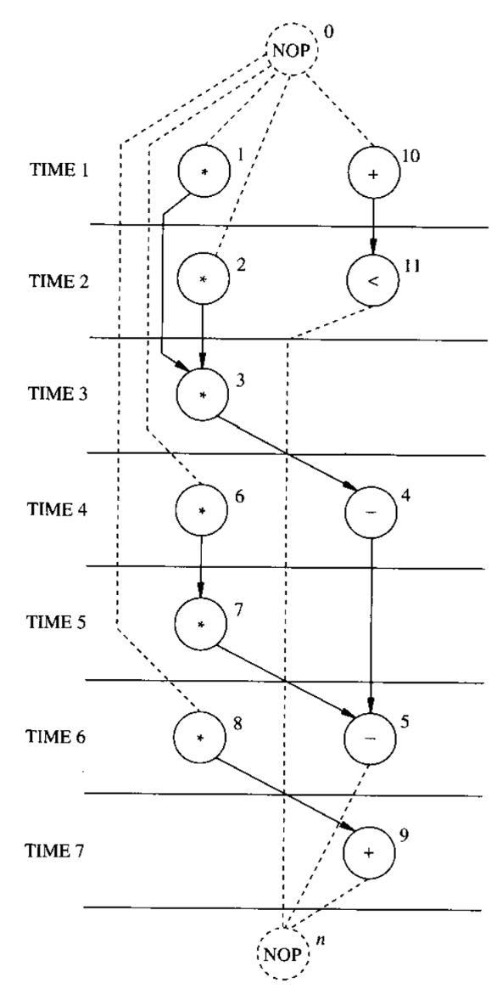
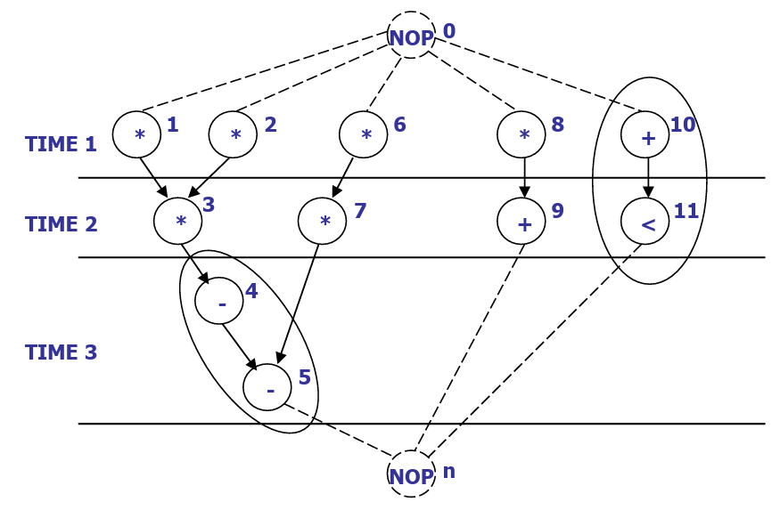
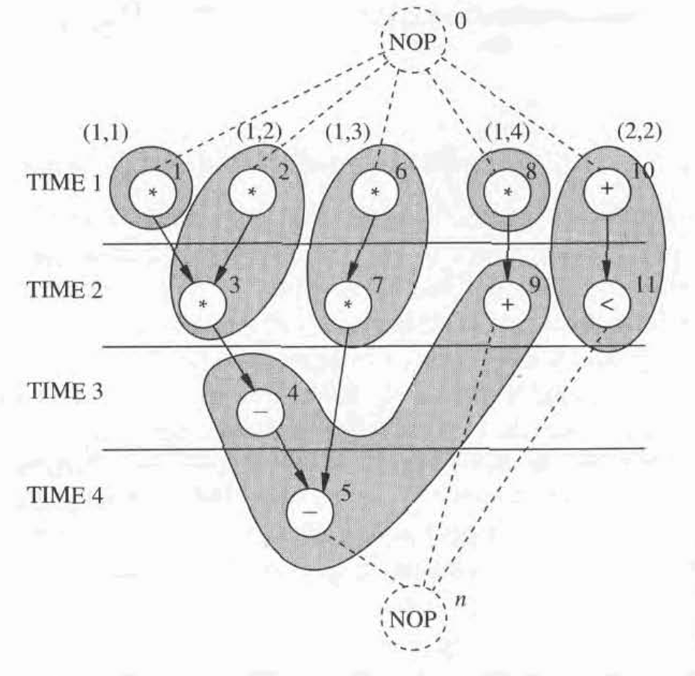
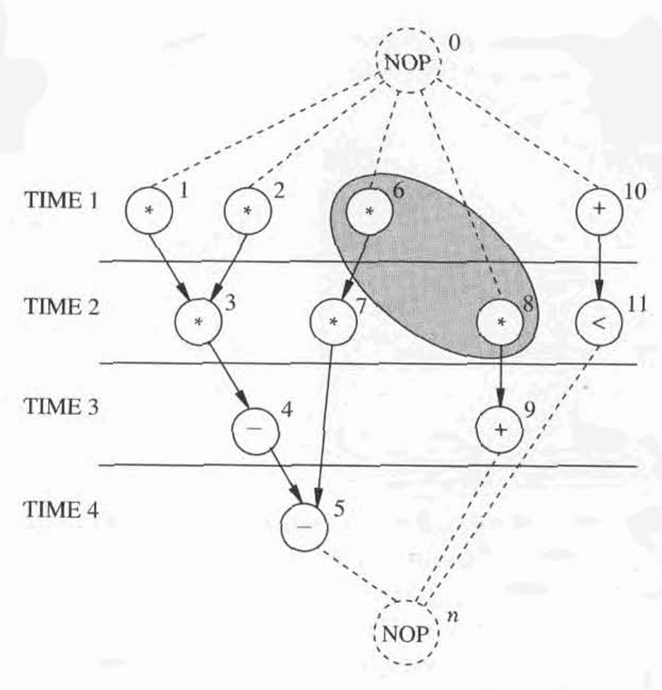

# The Fundamental Architectural Synthesis Problems

We now consider the fundamental problems in **architectural synthesis** and **optimization**. We assume that a circuit is specified by:

* A **sequencing graph**.
* A set of **functional resources**, fully characterized in terms of **area** and **execution delays**.
* A set of **constraints**.

**Architectural synthesis** and **optimization** consists of two stages.

1. First, **placing the operations in time and space**, i.e., determining the **time interval** for their execution and their **binding to resources**. This is know as **binding** and **scheduling**.
2. Second, determining the detailed interconnections of the **data path** and the logic-level specifications of the **control unit**. This is know as the **data-path** and **control unit synthesis.**

We now show that the first **stage** is equivalent to **annotating** the **sequencing graph** with additional **information** about the scheduling and binding.


Usually, **scheduling** is done first and then is **binding**. More specifically,

* In **resource-dominated circuits**, **scheduling** is performed before **binding**.
* In **non-resource-dominated circuits**, **binding** is performed before **scheduling**.


## The Temporal Domain: Scheduling

**Scheduling** is the task of

1. Associating a **start-time** with each operation
2. Determining **latency** and parallelism of the implementation

To formally define what the **scheduling** is, let's make some notation conventions.

1. We denote the **vertices** in the sequencing graphs as a set $$V=\{v_i,i=0,1,\dots,n\}$$. Each vertex represents one operation.
2. We denote the **execution delays** of the operations by the set $$D=\{d_i,i=0,1,\dots,n\}$$. The unit here is **clock cycle**.
3. We define the **start time** of an operation as the time at which the operation starts its execution. It is represented by the set $$T=\{t_i,i=0,1,\dots,n\}$$.
4. Using the above three definitions, we can find out that the **latency**, which is denoted by $$\lambda$$, is just $$\lambda=t_n-t_0$$.


In a sequencing graph, $$v_0$$ denotes the **source** node while $$v_n$$ denotes to **sink** node. The set $$E$$ denotes all the **edges** in the sequencing graph.


Now, let's give a **formal definition** of **schedule**:

> A **schedule** of a sequencing graph is a function $$\phi:V\to Z^+$$, where $$\phi(v_i)=t_i$$ denotes the operation start time such that $$t_i\geq t_j+d_j$$, $$\forall(i,j):(v_i,v_j)\in E$$. ($$t_i\geq t_j+d_j$$ is called the **precedence constraint**)

Thus, a more formal definition of **scheduling** will be

> **Scheduling** is the task of determining the start time, subject to **precedence constraints** specified by the sequencing graph.

To get a glimpse of how scheduling works, let's see some examples!

### Normal Scheduling

Here, we will look at two examples of scheduling under **no constraint**.

Example of Unconstrained Scheduling

In the **unconstrained scheduling**, which means any number of any type of resources is allowed to use, the scheduling can be done as follows:

<figure><picture><source srcset="../../.gitbook/assets/unconstrained-scheduling-dark.png" media="(prefers-color-scheme: dark)"></picture><figcaption>
Figure 4.3 Unconstrained scheduling sequence graph
</figcaption></figure>

The latency of this schedule is $$\lambda=t_n-t_0=5-1=4$$.


The source ($$v_0$$) always starts at **cycle 1** while the sink ($$v_n$$) always starts at the (**last cycle + 1**).


Example of Constrained Scheduling

If we are constrained to use 1 [function unit](#user-content-fn-1)[^1] per type (e.g., 1 adder and 1 multiplier). Our scheduling will look like as follows:

<figure><picture><source srcset="../../.gitbook/assets/constrained-scheduling-dark.png" media="(prefers-color-scheme: dark)"></picture><figcaption>
Figure 4.4 Constrained scheduling sequenc graph
</figcaption></figure>

In this case, our latency is $$\lambda=t_n-t_0=8-1=7$$

### Scheduling with Chaining

The scheduling formulation can be extended by considering the **propagation delays** of the **combinational resources** instead of the integer execution delays. Thus, two (or more) combinational operations in a sequence can be chained in the same **execution cycle** if their overall **propagation delay** **does not exceed** **the** **cycle-time**. This approach can be further extended to chains of resources whose overall delay spans more than one cycle.


**Scheduling with chaining** can provide **tighter schedules** in some cases, but constrained schedules are harder to compute.


Example of Scheduling with Chaining

Let's assume our multiplication takes 35ns and others take 25ns and our cycle time is 50ns. We can **chain** the operation 4 and 5 in Figure 4.3 to happen in one clock cycle! This will give us a sequence graph shown as follows:

<figure><picture><source srcset="../../.gitbook/assets/schedule-chain-dark.png" media="(prefers-color-scheme: dark)"></picture><figcaption>
Schedule with chaining sequence graph
</figcaption></figure>

In this case, we reduce our latency to 3 as now $$\lambda=t_n-t_0=4-1=3$$.

## The Spatial Domain: Binding

**Binding** specifies which **resource** implements an operation.

1. We define the type of **operation** as the type of computation it performs. e.g., addition, multiplication, etc.
2. A **resource type** can implement **more than one operation type**. e.g., the resource type ALU may cover operation {addition, subtraction, comparison}.

Now, we can define the **resource types** mathematically:

> We call a **resource-type set** the set of **resource types**. For the sake of **simplicity**, we identify the **resource-type set** with its **enumeration**. Thus, assuming that there are $$n$$ **resource types**, we denote the **resource-type set** by $$(1,2,\dots,n_{\text{res}})$$. The **function** $$\Tau:V\to\{1,2,\dots,n_{\text{res}}\}$$ denotes the **resource type** that can implement an **operation**.


It is interesting to note that there may be more than one operation of the **same** **type**. In this case, **resource sharing** may be applied, as described later in this section. Conversely, the **binding problem** can be extended to a **resource selection** (or **module selection**) problem by assuming that there may be more than one **resource** applicable to an operation (e.g., a ripple-carry and a carry-look-ahead adder for an addition). In this case, $$\Tau$$ is a **one-to-many mapping**.


Now, we can look at the formal mathematical definition of **binding**

> A **resource binding** is a **mapping** $$\beta : V \to R \times \mathbb{Z}^+$$, where $$\beta(v_i) = (t, r)$$ denotes that the operation corresponding to $$v_i \in V$$, with **type** $$\Tau(v_i) = t$$, is implemented by the $$r$$-th **instance** of **resource type** $$t \in R$$, for each $$i = 1, 2, …, n_{\text{ops}}$$.

Common **constraints** on binding are upper bounds on the **resource usage** of each type, denoted by $$\{a_k; k = 1,2, \dots, n\}$$. These bounds represent the allocation of instances for each resource type. A resource binding satisfies **resource bounds** $$\{a_k; k = 1,2, \dots, n\}$$ when $$\beta(v_i) = (t, r) \text{ with } r \le a_t$$ for each operation $$v_i, i = 1, 2, \dots, n$$.

### Dedicated Binding

A simple case of binding is a **dedicated resource**. Each operation is bound to **one** **resource**, and the resource binding function $$\beta$$ is a **one-to-one function**.

One example of dedicated resource binding, is shown in [Figure 4.3](the-fundamental-architectural-synthesis-problems.md#example-of-unconstrained-scheduling) above.

### Resource-Sharing Binding

A **resource binding** may associate **one** **instance** of a **resource type** to **more than** one operation. In this case, that particular resource is shared, and the binding function $$\beta$$ is a **many-to-one function**.


A necessary condition for a resource binding to produce a valid circuit implementation is that the operations corresponding to a **shared resource** do not **execute concurrently**.


Example of Resource-Sharing Binding

It is obvious that the resource usage of [Figure 4.3](the-fundamental-architectural-synthesis-problems.md#example-of-unconstrained-scheduling) is **not** **efficient**. Indeed, only four multipliers and two ALUs are required by the scheduled sequencing graph of Figure 4.3. This is shown in Figure 4.5.

<figure><picture><source srcset="../../.gitbook/assets/resource-binding-example-dark.png" media="(prefers-color-scheme: dark)"></picture><figcaption>
Figure 4.5 Scheduled sequencing graph with resource binding
</figcaption></figure>

The tabulation of the binding is as follows:

|     Expression    |   Value   |
| :---------------: | :-------: |
|   $$\beta(v_1)$$  | $$(1,1)$$ |
|   $$\beta(v_2)$$  | $$(1,2)$$ |
|   $$\beta(v_3)$$  | $$(1,2)$$ |
|   $$\beta(v_4)$$  | $$(2,1)$$ |
|   $$\beta(v_5)$$  | $$(2,1)$$ |
|   $$\beta(v_6)$$  | $$(1,3)$$ |
|   $$\beta(v_7)$$  | $$(1,3)$$ |
|   $$\beta(v_8)$$  | $$(1,4)$$ |
|   $$\beta(v_9)$$  | $$(2,1)$$ |
| $$\beta(v_{10})$$ | $$(2,2)$$ |
| $$\beta(v_{11})$$ | $$(2,2)$$ |


Remember the meaning of $$\beta(v_i) = (t, r)$$ we mentioned above. For example, $$\beta(v_2)=(1,2)$$ indicates that the operation 2 will be implemented by tje 2-nd instance of resource type 1 (multiplier).


### Partial Binding

> We have seen partial binding in the [earlier section](https://wenbo-notes.gitbook.io/ee4218-hsd-notes/textbook-micheli/architectural-synthesis/circuit-specifications-for-architectural-synthesis#partial-binding).

When **binding constraints** are specified, a resource binding must be **compatible** with them. In particular, a **partial binding** may be part of the original specification, as described in the earlier section. This corresponds to specifying a binding for a subset of the operations $$U \subseteq V$$.

Example of Partial Binding

Consider again the sequencing graph we've used throughout this section. A hypothetical **partial binding** requires that operation**s** $$v_6$$​ and $$v_8$$​ be performed by the same **multiplier**. Then, the operations $$v_6$$​ and $$v_8$$ cannot execute concurrently, and the corresponding schedule differs from that shown in [Figure 4.5](the-fundamental-architectural-synthesis-problems.md#example-of-resource-sharing-binding). The **partial binding** and the corresponding schedule are shown in Figure 4.6.

<figure><picture><source srcset="../../.gitbook/assets/partial-binding-dark.png" media="(prefers-color-scheme: dark)"></picture><figcaption>
Figure 4.6 Example of partial binding of operations v6 and v8 to a single resource
</figcaption></figure>


In general, **scheduling** and **binding** are **interrelated problems**, and **constraints** may complicate the **search for a solution**.


[^1]: We will see later this is called **resource type**.
