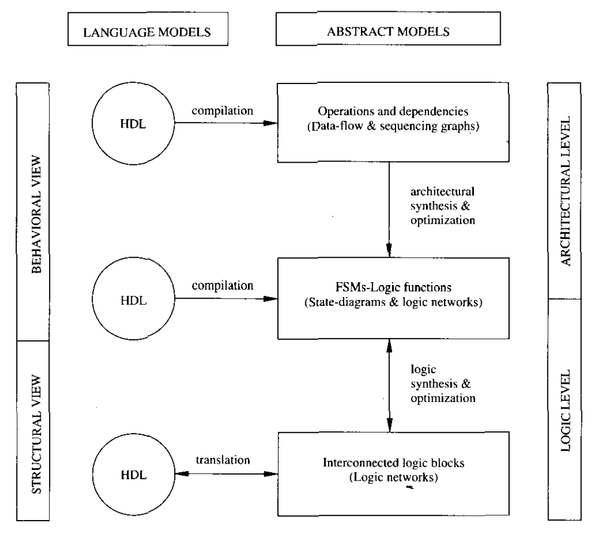

# Hardware Modeling

A model of a circuit is an **abstraction**, i.e., a representation that shows relevant features without associated details. **Models** are used to specify circuits, to reason about their properties and as means of transfening the information about a design among humans as well as among humans and computer-aided design tools.

What is a circuit specification?

Circuit specifications are **models** describing circuits to be implemented, which are often accompanied by **constraints** on the desired realization, e.g., performance requirements.

A circuit can be modeled differently according to&#x20;

1. the desired **abstraction level** (e.g., architectural, logic, geometric),
2. **view** (e.g., behavioral, structural, physical), and
3. the **modeling means** being used (e.g., language, diagram, mathematical model).

Abstraction levels and views were described in [computer-aided-synthesis-and-optimization.md](../introduction/computer-aided-synthesis-and-optimization.md "mention"). We comment now on the **modeling means**.

This book does not advocate the use of any specific hardware language. The synthesis techniques that we present have **general value** and are not related to the specifics of any particular language. For this reason, we shall consider also **abstract models** for circuits at both the **architectural** and **logic levels**.

**Abstract models** are **mathematical models** based on **graphs** and **Boolean algebra**.

* They are **powerful** enough to capture the **essential features described by HDL and diagram models**.
* At the same time, they are **simple** enough that properties of circuit transformations can be proven.


Perhaps the two bullet points above are the most important **intuitions** from this section.


We show in the Figure 1.20 (we have seen this at the [introduction](../introduction/ "mention") chapter) relations among HDL models, abstract models, and the synthesis tasks.

<figure><figcaption>
Figure 1.20 Circuit models, synthesis and optimization: a simplified view
</figcaption></figure>
