# Abstract Models

We present in this section some abstract models that are used to represent different circuits views at the logic and architectural levels. They are based on **graphs**.

## Structure

Structural representations can be modeled in terms of **incidence** structures. An incidence structure consists of

1. a set of **modules/pins**
2. a set of **nets**, and
3. an incidence relation among modules and nets

For example, the following figures  shows an incidence structure

<figure>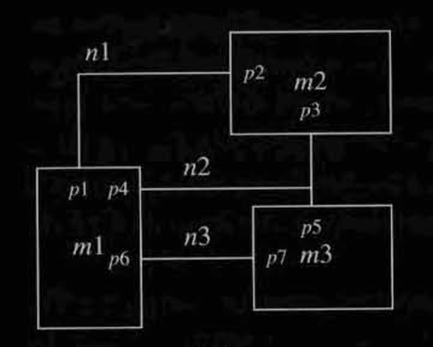<figcaption>
Figure 3.5(a) Modules, nets and pins
</figcaption></figure>

We have three **abstract models** to model this incidence stucutre.

The Hierarchy of Incidence Structures

Incidence structures can be made hierarchical in the following way.

* A **leaf** module is a primitive with a set of pins.
* A **non-leaf** module consists of a set of modules, called its _submodules_, a set of nets, and an incidence structure relating the nets to the pins of the module itself and to those of the submodules.

For example, let's say the module `m2` in Figure 3.5(a) has **submodules**, the details of `m2` can be shown as follows,

<figure>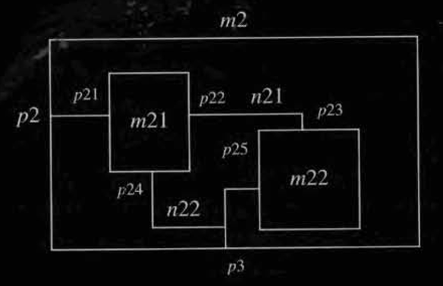<figcaption></figcaption></figure>

So, our incidence structure in Figure 3.5(a) will be something like as follows:

<figure>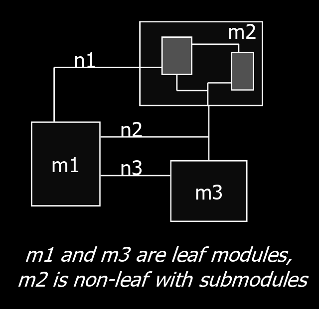<figcaption></figcaption></figure>

### Incidence Matrix/Netlist

The module-net incidence matrix or module-oriented netlist to model Figure 3.5(a) are shown as follows:

<figure>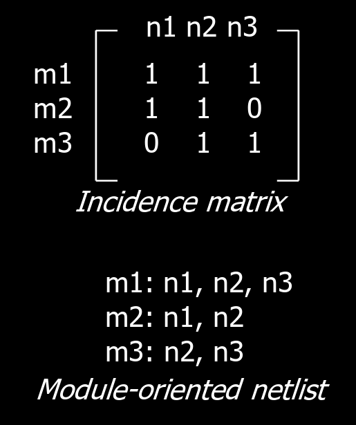<figcaption></figcaption></figure>

### Hypergraph

The hypergraph model of Figure 3.5(a) can be shown as follows:

<figure>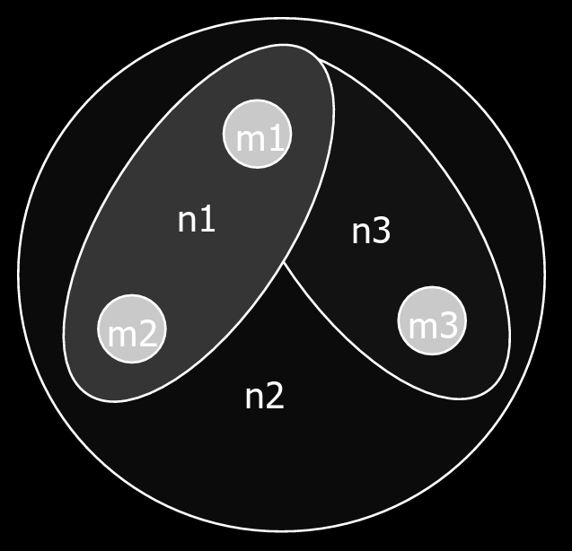<figcaption></figcaption></figure>

### Bipartite Graph

The bipartite graph is **equivalent** to a hypergraph. Similarly, the bipartite graph model of Figure 3.5(a)  is shown as follows:

<figure>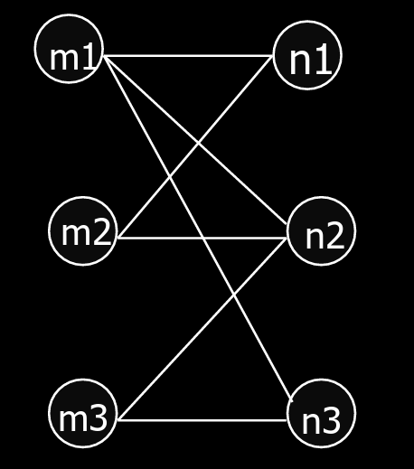<figcaption></figcaption></figure>

## Logic Networks

A generalized logic network is a structure in which each leaf module is associated with a **multiple-input and single output** combinational or sequential logic function.

<figure>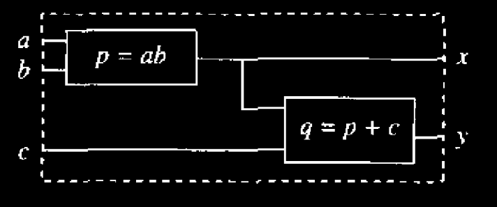<figcaption>
Figure 3.7 Example of a logic network
</figcaption></figure>

Logic networks are usually represented by **graphs**.

<figure>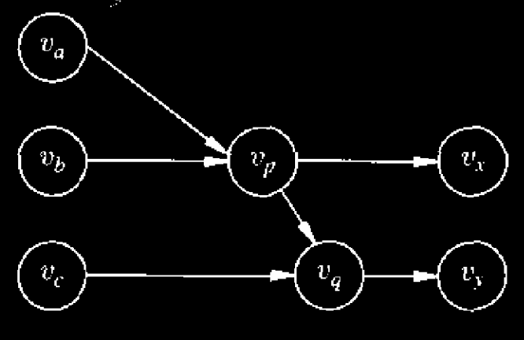<figcaption>
Figure 3.8 Example of a logic network graph
</figcaption></figure>


Logic networks is a **hybrid structural/behavioral** representation.


### Mapped Network

This is the special case when the **vertex/blocks** of a logic network corresponds to **library elements** — standard cells provided by foundry of primitives.


Mapped networks are **purely combinational**.


## State Diagrams

The **behavioral view** of **sequential circuits** at the **logic level** can be expressed by **finite-state machine** transition diagrams. A finite-state machine can be described by:

* a set of primary input patterns, ($$X$$);
* a set of primary output patterns, ($$Y$$);
* a set of states, ($$S$$);
* a state transition function, ($$S : X \times S \rightarrow S$$);
* an output function,
  * ($$A : X \times S \rightarrow Y$$) for Mealy models or
  * ($$A : S \rightarrow Y$$) for Moore models; and
* an initial state.

The **state transition table** is a tabulation of the state transition and output functions. Its corresponding graph-based representation is the **state transition diagram**.

<figure>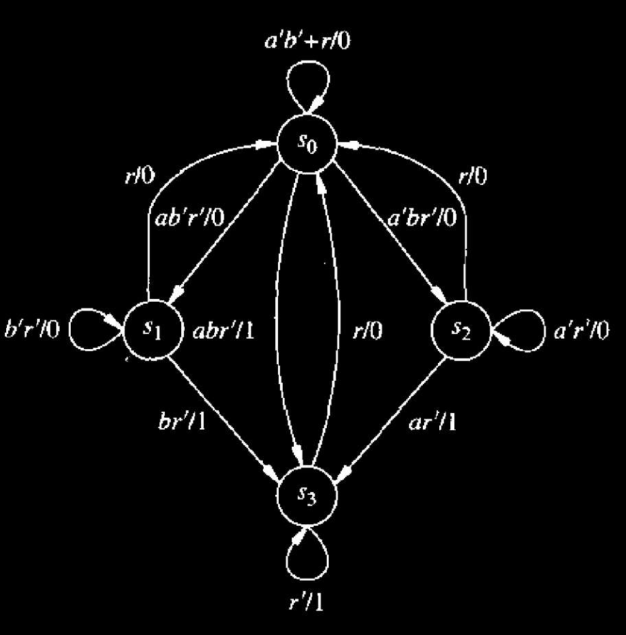<figcaption>
Figure 3.9 Example of a state transition diagram
</figcaption></figure>

### Hierarchical State Diagram

It is sometimes convenient to represent finite-state machine diagrams **hierarchically** by splitting them into subdiagrams. An example is shown as follows:

<figure>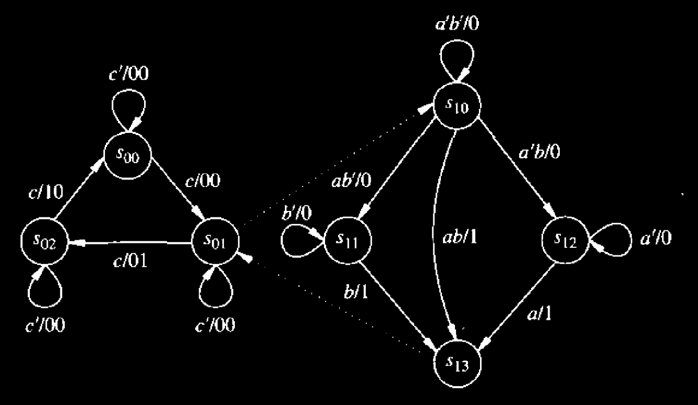<figcaption>
Figure 3.10 Example of a hierarchical state transition diagram.
</figcaption></figure>

There are two levels in the diagram:

1. the top level has three states, and
2. the lower level has four.&#x20;

A transition into the calling state ($$s_{01}$$) is equivalent to a transition to the entry state of the lower level of the hierarchy, i.e., into ($$s_{10}$$). Transitions into ($$s_{13}$$) correspond to a transition back to ($$s_{01}$$). In simple terms, the dotted edges of the diagram are traversed immediately.


The normal and hierarchical state diagrams are both **behavioral**.


## Data-flow and Sequencing Graphs

We consider here models that abstract the information represented by procedural HDLs with imperative semantics.

### Data-Flow Graphs

Data-flow graphs represent operations and data dependencies.

<figure>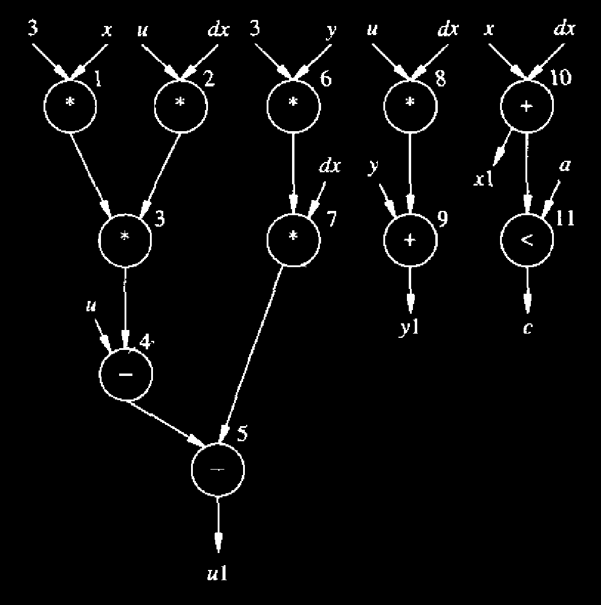<figcaption>
Figure 3.11 Example of a data flow graph
</figcaption></figure>

### Sequencing Graphs

The sequencing graphs are an **extension** of the data graphs. They are useful to represent data path and control. (a control/data-flow graph (CDFG)). A sequencing graph is/has

1. Hierarchy
2. Control-flow commands such as branching and iteration
3. Two extra vertices called **source** and **sink** which always model NOPs.
4. Often shown without data annotations, especially when doing scheduling and binding

<figure>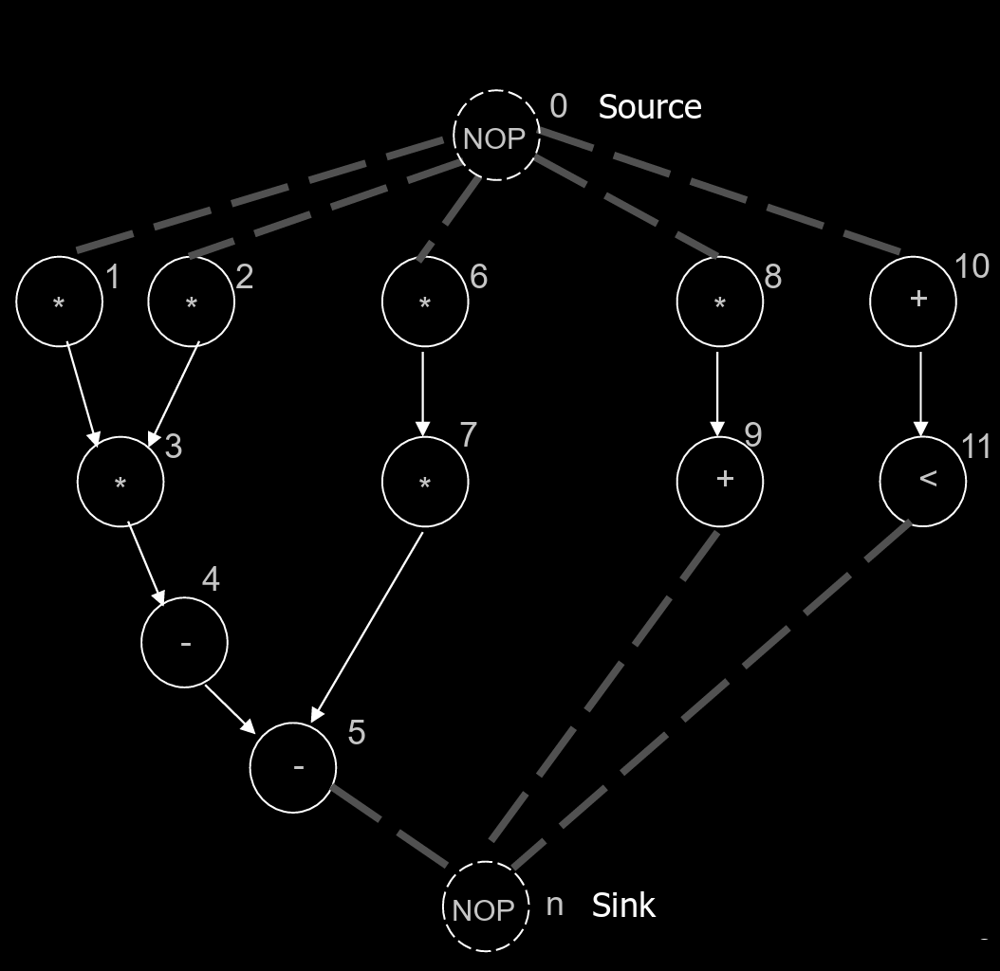<figcaption>
Figure 3.12 Example of a sequencing graph
</figcaption></figure>

#### Types of Sequencing Graphs



#### Hierarchical Sequencing Graph

<figure>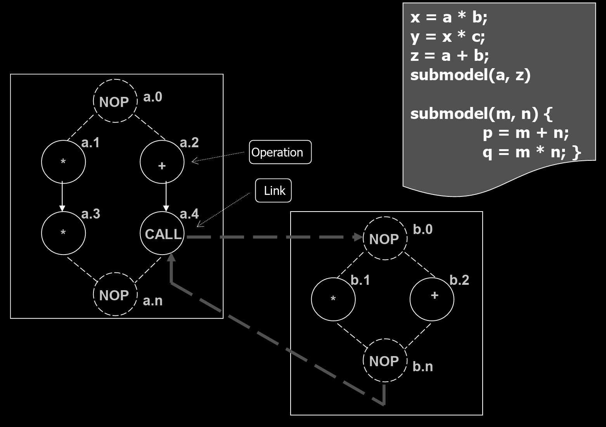<figcaption></figcaption></figure>



#### Branching Sequencing Graph

<figure>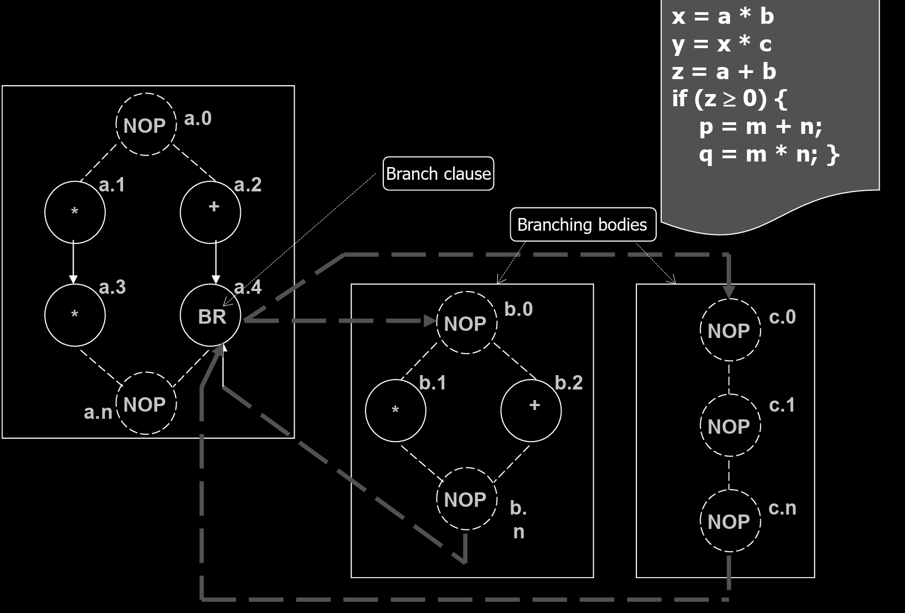<figcaption></figcaption></figure>



#### Iteration Sequencing Graph

<figure>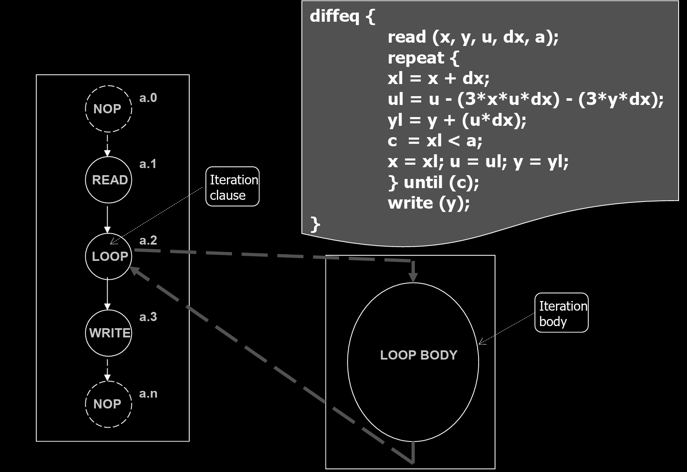<figcaption></figcaption></figure>



#### Semantics of Sequencing Graphs

The semantic interpretation of the sequencing graph model requires the notion of **marking the vertices**. A marking denotes the **state of the corresponding operation**, which can be

1. waiting for execution,
2. executing, or
3. having completed execution.

**Firing** an operation means starting its execution. The semantics of the model is as follows:

> an operation can be **fired** as soon as all its direct predecessors have completed execution.

#### Vertex Attributes and Estimates

The vertex attributes can be used to represent

* **Area Cost**: The physical silicon area required for the operation.
* **Delay Cost**:
  * **Propagation Delay**: Time for signals to travel through logic.
  * **Execution Delay**: Time to complete the operation. Can be data-dependent:
    * _Bounded:_ Fixed upper limit (e.g., branching/if-else).
    * _Unbounded:_ No fixed limit (e.g., `while` loops, synchronization waits).

Based on that, we can have two estimates

* **Area Estimate (Worst-Case)**:
  * _Assumption:_ No Resource Sharing (every operation gets its own dedicated hardware unit).
  * _Calculation:_ $$\sum$$ (Area of all vertices).
* **Delay Estimate / Latency (Best-Case)**:
  * _Assumption:_ No Resource Sharing (unlimited resources allow maximum parallelism).
  * _Calculation:_ Length of the longest path (critical path) from source to sink.
