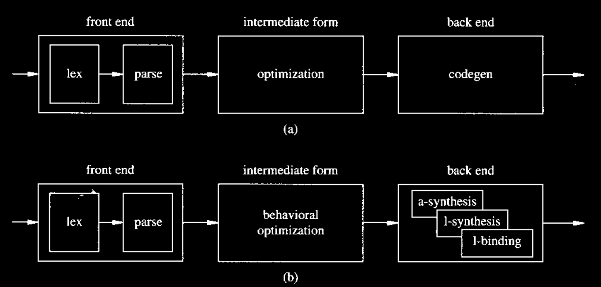
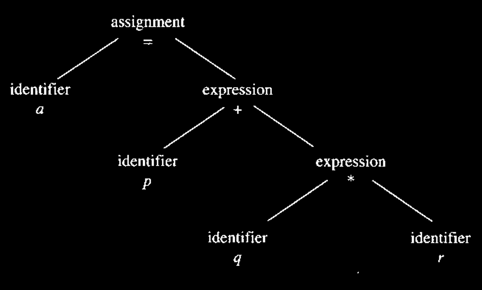
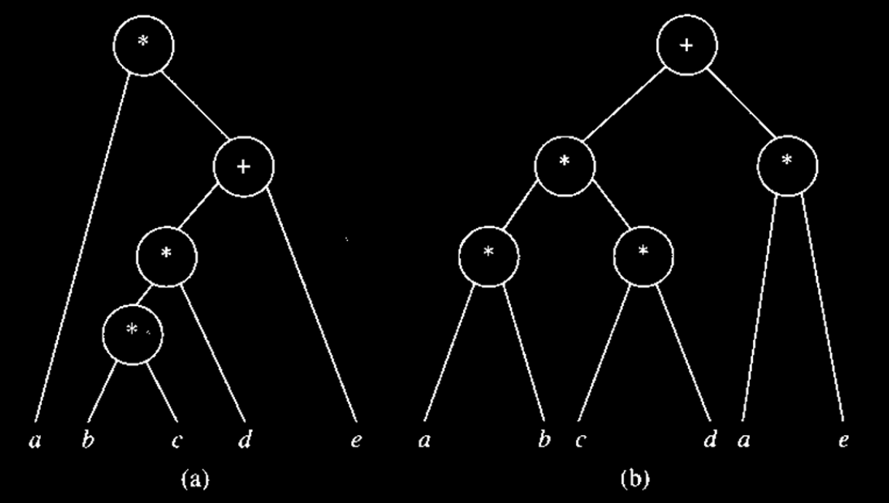

# Compilation and Behavioral Optimization

We explain in this section how **circuit models**, described by **HDL programs**, can be transformed into the **abstract models** that will be used as a starting point for **synthesis** in the following chapters. Most **hardware compilation techniques** have analogues in **software compilation**. Since **hardware synthesis** followed the development of **software compilers**, many techniques were borrowed and adapted from the rich field of **compiler design**. Nevertheless, some **behavioral optimization techniques** are applicable only to **hardware synthesis**. We shall briefly survey general issues on **compilation**, where the interested reader can find a wealth of literature, and we shall concentrate on the specific **hardware issues**.

A **software compiler** consists of

1. a **front end** that transforms a program into an **intermediate form** and
2. a **back end** that translates the intermediate form into the **machine code** for a given **architecture**.

The **front end** is **language dependent**, and the **back end** varies according to the **target machine**. Most modern **optimizing compilers** improve the **intermediate form**, so that the **optimization** is neither **language dependent** nor **machine dependent**.

Similarly, a **hardware compiler** can be seen as consisting of a **front end**, an **optimizer**, and a **back end** (Figure 3.16).

<figure><figcaption><p>Figure 3.16 Anatomies of software and hardware compilers.</p></figcaption></figure>

The **back end** is much more complex than a **software compiler**, because of the requirements on **timing** and **interface** of the internal operations. The **back end** exploits several techniques that go under the generic names of:

* **architectural synthesis**,
* **logic synthesis**, and
* **library binding**.

We describe the **front end** and the **optimization techniques** in this section. The **back end** is described in the different parts in this note. Overall, applying these three stages in software compilation, high-level synthesis, and RTL/HDL synthesis will result in:



#### Software Compilation

**Front end:** Compile program into intermediate representation (IR).

**Optimisation**: Optimise IR.

**Back-end**: Generate target code for an architecture (ISA).



#### High-level Synthesis

**Front end**: Compile High-Level model into **sequencing graph.**

**Optimisation**: Optimise the sequencing graph.

**Back end**: Generate the RTL or gate-level interconnection for a technology library.



#### RTL/HDL Synthesis

**Front end**: Parse RTL description into a **synchronous logic network**.

**Optimisation**: Optimise combinational and sequential logic.

**Back-end**: Generate gate-level netlist for a technology library.




The **optimizations** are similar across these three compiling techniques, but their **back-ends** differ significantly.


## Compilation Techniques

The **front end** of a **compiler** is responsible for **lexical analysis**, **syntax analysis**, **parsing**, and creation of the **intermediate form**.

### Lexical Analyzer

A **lexical analyzer** is a component of a compiler that reads the **source model** and produces as output a set of **tokens** that the **parser** then uses for **syntax analysis**. A **lexical analyzer** may also perform ancillary tasks, such as **stripping comments** and **expanding macros**. **Metavariables** can be resolved at this point.

### Parser

A **parser** receives a set of **tokens**. Its first task is to verify that they satisfy the **syntax rules** of the **language**. The parser has knowledge of the **grammar** of the language and generates a set of **parse trees**, which are **tree-like representations** of the **syntactic structure** of a language (an example is shown in Figure 3.17).

<figure><figcaption><p>Figure 3.17 Example of a parse tree for the statement a = p + q * r.</p></figcaption></figure>

**Syntactic errors**, as well as some **semantic errors** (such as an operator applied to an incompatible operand), are detected at this stage. The **error recovery policy** depends on the **compiler** and on the **gravity of the error**. **Software tools** can be used to create **lexical analyzers** and **parsers**, such as **lex** and **yacc**, commonly provided with the **UNIX operating system**.


Whereas the **front ends** of a compiler for **software** and **hardware** are very similar, the subsequent steps may be fairly different. In particular, for **hardware languages**, diverse **strategies** are used according to their **semantics** and **intent**.


The **semantic analysis** of the **parse trees** leads to the creation of the **intermediate form**, which represents the implementation of the original **HDL program** on an **abstract machine**. Such a machine is identified by a set of **operations** and **dependencies**, and it can be represented graphically by a **sequencing graph**. The **hardware model** in terms of an **abstract machine** is **virtual**, in the sense that it does not distinguish the **area** and **delay costs** of the operations. Therefore, **behavioral optimization** can be performed on such a model while **abstracting** the underlying **circuit technological parameters**.

## Optimization Techniques

**Behavioral optimization** is a set of **semantic-preserving transformations** that minimize the amount of **information** needed to specify the **partial order of tasks**. No knowledge about the **circuit implementation style** is required at this stage. The **latitude** of applying such optimization depends on the **freedom to rearrange the intermediate code**. Therefore, models that are highly constrained to adhere to a **time schedule** or to an **operator binding** may benefit very little from these techniques.


We consider here these transformations as applied to sequences of statements, e.g., as **program-level** transformations.


### Data-Flow-Based Transformations

These **transformations** are dealt with in detail in most books on **software compiler design**.

#### Tree Heigh Reduction

This **transformation** applies to **arithmetic expression trees** and strives to split expressions into **two-operand expressions**, so that the **parallelism** available in **hardware** can be exploited optimally. It can be seen as

1. a **local transformation**, applied to each **compound arithmetic statement**, or
2. as a **global transformation**, applied to all compound arithmetic statements in a **basic block**.

Enough **hardware resources** are postulated to exploit all **parallelism**; if this is not the case, the **gain** of applying the transformation is obviously reduced.

<details>

<summary>Example of optimization to fully utilise parallelism</summary>

Consider the following **arithmetic assignment**:

```
x = a + b + c + d;
```

This can be trivially split as:

```
x = a + b;
x = x + c;
x = x + d;
```

which requires **three additions in series**. Alternatively, the split:

```
p = a + b;
q = c + d;
x = p + q;
```

allows the first two additions to be performed in **parallel** if enough **hardware resources** (in this case, **two adders**) are available. The **second choice** is better than the first because its **implementation cannot be inferior** for any possible **resource availability**.

</details>

**Tree-height reduction** was studied in depth as an **optimization scheme** for **software compilers**. It is used in **hardware compilers** mainly as a **local transformation**, due to the limited **parallelism** in **basic blocks**. **Tree-height reduction** exploits properties of **arithmetic operations** to **balance the expression tree** as much as possible. In the best case, the **tree height** is  $$O(\log n_{ops})$$) for ($$n_{ops}$$) operations, and the height is proportional to a **lower bound** on the overall **computation time**.



#### Commutativity and Associativity

The simplest **reduction algorithm** uses the **commutativity** and **associativity** of **addition** and **multiplication**. It **permutes the operands** to form subexpressions with the same **operator**, which can then be **reduced** using the **associative property**.

<details>

<summary>Example of using commutativity and associativity</summary>

Consider the following **arithmetic assignment**:

```
x = a + b * c + d;
```

By using the **commutativity of addition**, we get:

```
r = a + d + b * c;
```

and by **associativity**:

```
x = (a + d) + b * c;
```

This **transformation** is illustrated in **Figure 3.18**. A further **refinement** can be achieved by exploiting the **distributive property**.

<figure><figcaption><p>Figure 3.18 Example of tree-height reduction using commutavity and distributivity.</p></figcaption></figure>

</details>



#### Distributivity

A further refrinement can be achieved by exploring the distributive propery, possibly at the expense of adding an operation.

<details>

<summary>Example of using distributivity</summary>

Consider the following **arithmetic assignment**:

```
x = a * (b * c * d + e);
```

Using the **commutativity of addition**, no **reduction in tree height** is possible. By using the **distributive property**, we can write:

```
x = a * b * c * d + a * e;
```

which has a **tree height of 3** and **one additional operation**. This **transformation** is shown in **Figure 3.19**. Note that **two multipliers** are necessary to reduce the **computation time** with this transformation.

<figure><figcaption><p>Figure 3.19 Example of tree-height reduction using distributive property.</p></figcaption></figure>

</details>


