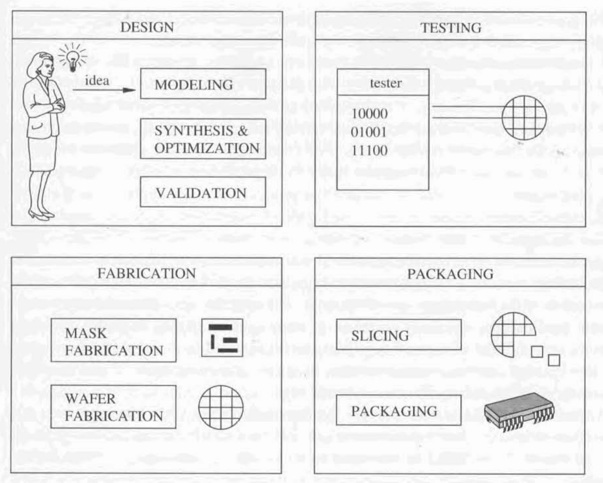

# Design of Microelectronic Circuits

There are **four stages** in the creation of an **integrated circuit**: **design**, **fabrication**, **testing**, and **packaging** (Figure 1.7). We shall consider here the **design stage** in more detail, and we divide it into **three major tasks**:

* Computation and modeling
* Synthesis & Optimization
* Validation

<figure><figcaption>
Figure 1.7 The four phases in creating a microelectronic chip
</figcaption></figure>

## Modeling

> Modelling consists of **casting an idea into a model**, which captures the **function** that the **circuit** will perform.&#x20;

**Circuit models** are used to **represent ideas**.

* Today, most **modeling** is done using **Hardware Description Languages (HDLs)**.
* **Graphic models** are also used, such as **flow diagrams**, **schematic diagrams**, and **geometric layouts**.

The **very large-scale nature** of the problem forces the **modeling style**, both **textual** and **graphical**, to support **hierarchy** and **abstractions**. These allow a **designer** to **concentrate** on a **portion of the model** at any given time.

## Synthesis & Optimization

### Synthesis

> **Synthesis** consists of **refining the model**, from an **abstract** one to a **detailed** one, that has all the **features required for fabrication**.

The overall goal of **circuit synthesis** is to generate a **detailed model** of a **circuit**, such as a **geometric layout**, that can be used for **fabricating the chip**. This objective is achieved by means of a **stepwise refinement process**, during which the original **abstract model** provided by the **designer** is **iteratively detailed**.

As **synthesis** proceeds in **refining the model**, more **information** is needed regarding the **technology** and the desired **design implementation style**. Indeed, a **functional model** of a **circuit** may be fairly **independent** from the **implementation details**, while a **geometric layout model** must incorporate all **technology-dependent specifics**, such as, for example, **wire widths**.

### Optimization

> An **objective of design** is to **maximize** some **figures of merit** of the **circuit** that relate to its **quality**.

The role of **optimization** is to **enhance the overall quality** of the **circuit**. We explain now in more detail what **quality** means.

#### Performance

First of all, it refers to **circuit performance**. **Performance** relates to the **time required** to **process information**, as well as to the **amount of information** that can be **processed in a given time period**. **Circuit performance** is essential to **competitive products** in many **application domains**.

#### Area

Second, **circuit quality** relates to the **overall area**. An objective of **circuit design** is to **minimize the area** for many reasons:

* **Smaller circuits** allow **more circuits per wafer**, resulting in **lower manufacturing cost**.
* **Manufacturing yield** decreases with an **increase in chip area**.
* **Large chips** are more **expensive to package**.


The **yield** is the **percentage of manufactured chips** that **operate correctly**. In general, when **fabrication faults** relate to **spots**, the [**defect**](#user-content-fn-1)[^1] **density per unit area** is **constant** and **typical** of a **manufacturing plant** and **process**. Therefore, the **probability** that one **spot** makes the **circuit function incorrectly** **increases with the chip area**.


#### Testability

Third, **circuit quality** relates to **testability**, i.e., the **ease of testing** the **chip** after **manufacturing**. For some applications, the **fault coverage** is an important **quality measure**, which indicates the **percentage of faults** of a given type that can be **detected** by a set of **test vectors**. It is obvious that **testable chips** are **desirable**, because **earlier detection** of **malfunctions** in **electronic systems** relates to **lower overall cost**.


More details on synthesis & optimization are provided later in the next [section](computer-aided-synthesis-and-optimization.md).


## Validation

> **Validation** consists of **verifying the consistency**.

**Circuit validation** consists of acquiring a **reasonable certainty** that a **circuit** will **function correctly**, under the assumption that **no manufacturing fault** is present. It can be performed by **simulation** and by **verification methods**.

[^1]: Think of it as bad or not-working.
