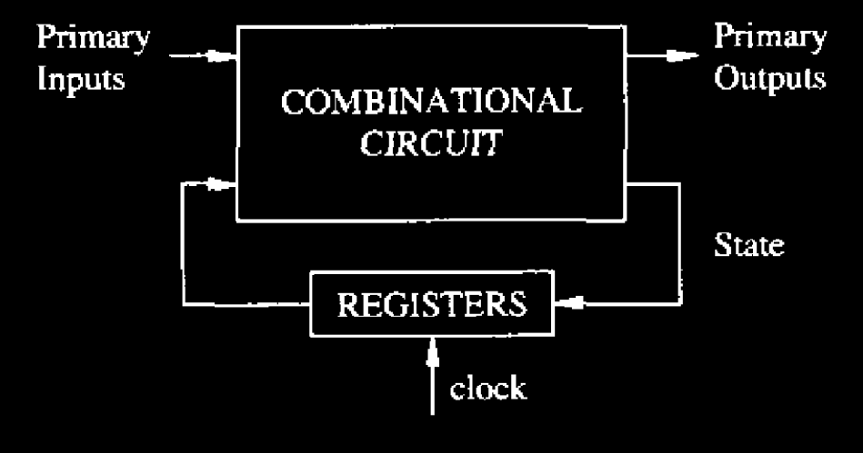
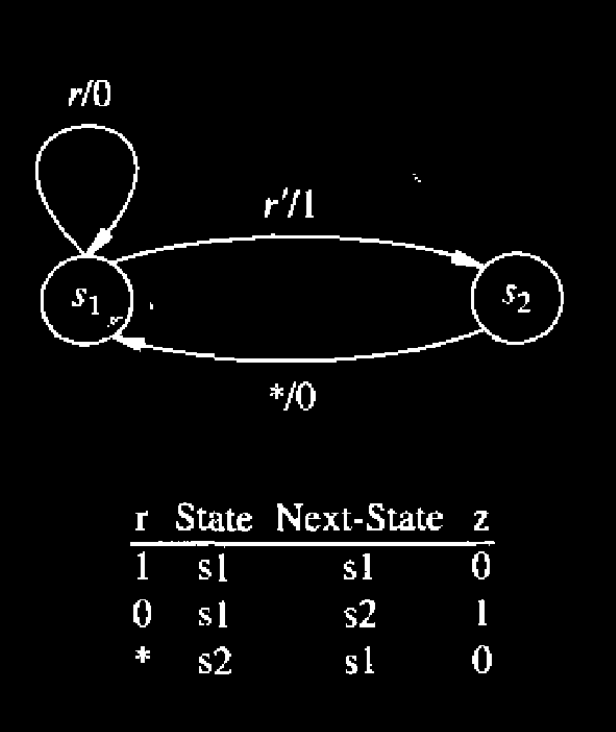

# Introduction

We consider in this chapter the optimization of sequential circuits modeled by finite-state **machines** at the logic level. We restrict our attention to synchronous models that operate on a [single-phase clock](#user-content-fn-1)[^1]. From a circuit standpoint, they consist of **interconnections** of combinational logic gates and registers. Thus, synchronous sequential circuits are often modeled by a combinational circuit component and registers, as shown in Figure 9.1.

<figure><figcaption>
Figure 9.1 Block diagram of a finite-state machine implementation.
</figcaption></figure>


We assume here, for the sake of simplicity, that registers are edge-triggered and store 1 bit of information. **This assumption allows us to model each register as a binary state element.**


The sequential circuit model may have either a **behavioral** or a **structural** flavor, or a combination of both. Whereas the behavior of combinational logic circuits can be expressed by **logic functions**, the behavior of sequential circuits can be captured by _**traces**_, i.e., by input and output sequences. In this section, we will introduce two ways to represent the **synchronous circuit behavior.**



### State Transition Diagram

A convenient way to express the circuit behavior is by means of **finite-state machine models**, e.g., **state transition diagrams**, as shown in Figure 9.2 (a). **State transition diagrams** encapsulate the **traces** that the corresponding circuit can **accept** and **produce**. Thus, **state-based representations** have a **behavioral flavor**.

<figure><figcaption>
Figure 9.2(a) State transition diagram
</figcaption></figure>


In the diagram above, just treat r as 1 and r' as 0, this will make the state transition diagram easier to be understodd. This image above is actually composed of one state transition diagram and its corresponding state transition table.


While many optimization techniques have been proposed, this **finite-state machine representation** **lacks** a **direct relation** between **state manipulation** (e.g., state minimization) and the corresponding **area and delay variations**. In general, those optimization techniques **yield** a reduction in **model complexity** that correlates well with **area reduction**, but not necessarily with **performance improvement**.


This model can be called as **state-based models**.




### Synchronous Logic Network

An alternative representation of the circuit behavior is by means of **logic expressions** in terms of **time-labeled variables**. As in the case of **combinational circuits**, it is often convenient to express the **input/output behavior** by means of a set of **local expressions** with **mutual dependencies**. This leads to circuit representations in terms of **synchronous logic networks** that express the interconnection of **combinational modules** and **registers**, as shown in Figure 9.2 (b).

<figure><figcaption>
Figure 9.2(b) Synchronous Logic Network
</figcaption></figure>

**Synchronous logic networks** have a **structural flavor** when the combinational modules correspond to **logic gates**. They are **hybrid structural/behavioral views** of the circuit when the modules are associated with **logic functions**. Some recent **optimization algorithms for sequential circuits** use the **network representation**, such as **retiming**. In this case, there is a **direct relation** between **circuit transformations** and **area and/or performance improvement**.


This model can be called as **structural model**.




**State transition diagrams** can be transformed into **synchronous logic networks** by **state encoding** and can be recovered from synchronous logic networks by **state extraction**.



#### State Encoding

**State encoding** defines the **state representation** in terms of **state variables**, thus allowing the description in terms of **networks**. **Unused state codes** are **don’t care conditions** that can be used for **network optimization**.



#### State Extraction

The major task in **state extraction** is to determine the **valid states** (e.g., those **reachable from the reset state**) among those identified by all possible **polarity assignments** to the **state variables**.&#x20;



**Design systems for sequential optimization** leverage **optimization methods** in **both representation domains**.

[^1]: This means that the entire digital circuit is synchronized by just **one** global clock.
