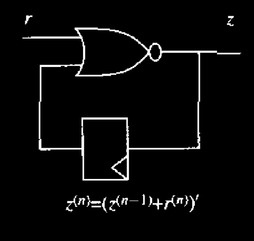
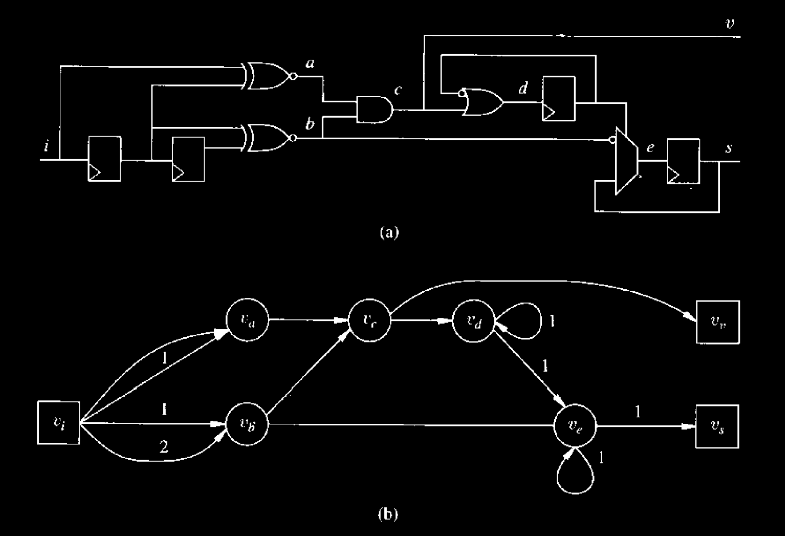
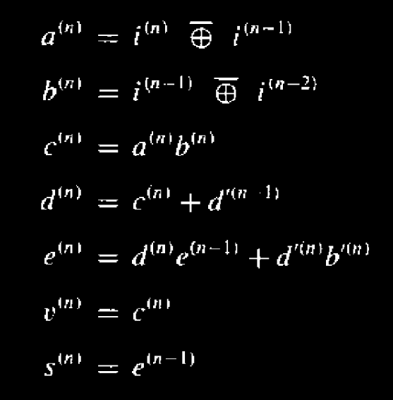
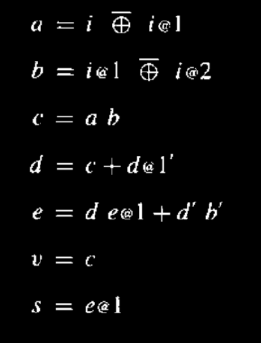
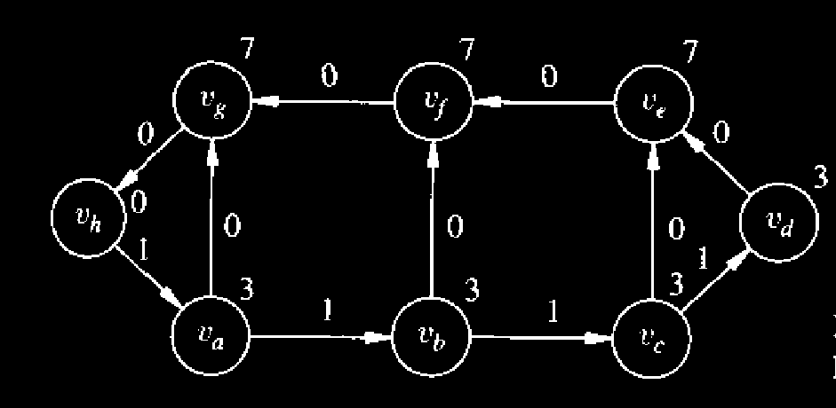
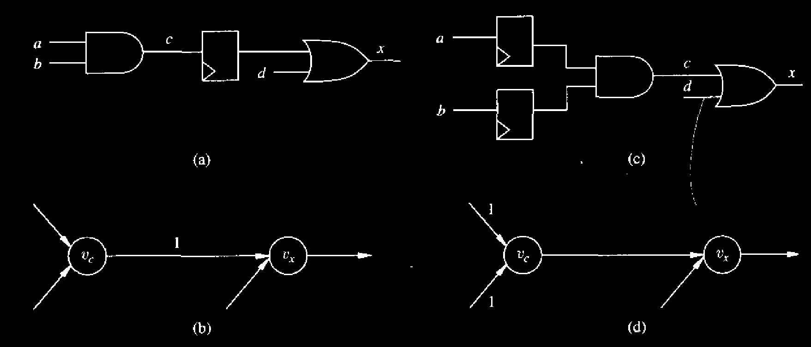
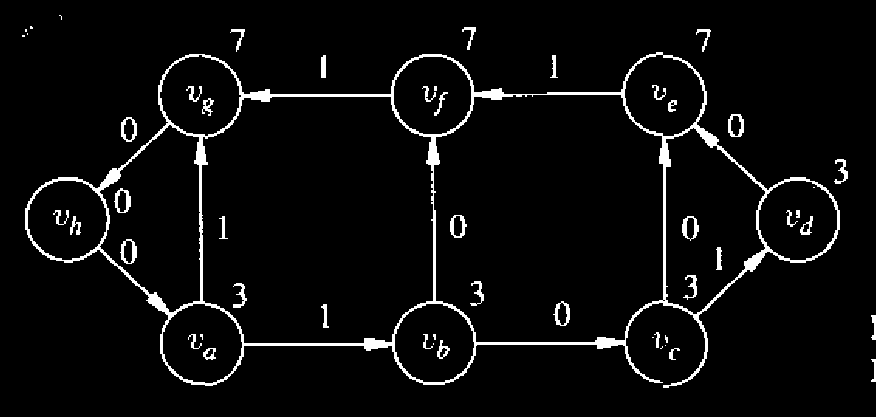
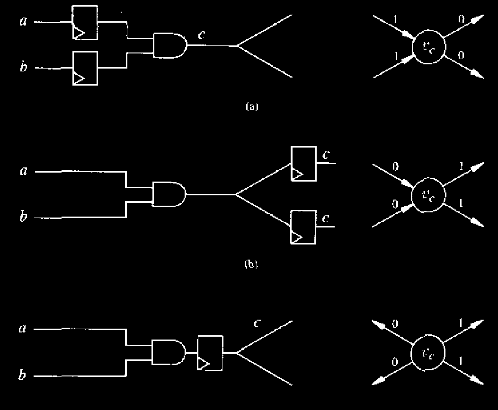

# Sequential Circuit Optimization using Network Models

We already mentioned in the [**introduction**](introduction.md) **to this chapter** that the **behavior of sequential circuits** can be described by **traces**, i.e., by **sequences of inputs and outputs**.

* These sequences correspond to those that the related **finite-state machine models** can **accept and generate**.

We recall that we restrict our attention to **synchronous circuits** with **single-phase edge-triggered registers** for the sake of **simplicity**.

* For this reason, it is convenient to **discretize time** into an **infinite set of time points** corresponding to the **set of integers** and to the **triggering conditions of the registers**.

We assume that the observed **operation of the network** begins at time $$n = 0$$ after an appropriate **initializing (or reset) sequence** is applied.

* By this choice, the **reset inputs** are applied at some time point $$n \le 0$$.

#### Some Notations

Now are introduce two notations that will be used in representing the **network models** as logic expressions



#### Normal Notation

We denote sequences by **time-labeled variables**.

* For example, $$x(n)$$ denotes **variable x at time n**.
* A sequence of values of variable $$x$$ is denoted by $$x^{(n)}\forall n$$ in an **interval of interest**.



#### Shorthand Notation

It is convenient sometimes to have a **shorthand notation for variables**, without explicit dependency on time but just marking the **synchronous delay offset** with respect to a **reference time point**.

* We represent this by appending to the variable the **reserved symbol @** and the **offset** when this is different from zero.
* Hence, $$x@k = x^{(n-k)}$$ and $$x = x@0$$.

**Circuit equations** in the shorthand notation are **normalized** by assuming that the **left-hand side has zero offset**.

* For example, $$x^{(n+1)} = y^{(n)}$$ is translated to $$x=y@1$$.



Example of using logic expression to represent network models

Consider the **circuit of Figure 9.2(b)**, which provides an **oscillating sequence** when input **r** is **FALSE**.

<figure><figcaption>
Figure 9.2(b)
</figcaption></figure>

Its **behavior** can be expressed as $$z^{(n)} = (z^{(n-1)} + r^{(n)})'$$, for all $$n \ge 0$$. Input **r** is a **reset condition**. Using the **shorthand notation**, the circuit can be described by the expression $$z = (z@1 + r)'$$.

#### Unbound and Bound Networks

**Network models for synchronous circuits** are **extensions** of those used for describing **multiple-level combinational circuits**. In particular, **logic networks** where **modules can represent storage elements** can be used to represent both **bound** and **unbound networks**:

* **Bound networks** represent **gate-level implementation**.
  * It uses **library cells**.
* **Unbound networks** associate **internal modules** with **logic expressions** in terms of **time-labeled variables**, representing a **structured way** of describing **circuit behavior**.


We consider **unbound networks** in this section.


#### Definition of the synchronous logic network

As in the case of **combinational synthesis**, we restrict our attention to **non-hierarchical logic networks**, and we assume that the **interconnection nets** are split into sets of **two-terminal nets**. In addition, we represent the **registers implicitly**, by **positive weights** assigned to the **nets** (and to the **edges** in the corresponding **graph**), where the weights denote the corresponding **synchronous delays**:

* A **direct connection** between two **combinational modules** has **zero weight**.
* A **connection through a register** has **unit weight**.
* A **connection through a k-stage shift register** has weight **k**.
* **Zero weights** are sometimes omitted in the **graphical representations**.

We define a **path weight** as the **sum of the edge weights** along that path.

* _(Path weights should not be confused with **path delays**, which are the **composition of vertex propagation delays**.)_

When compared to **combinational logic networks**, **synchronous networks** differ in:

* Being **edge-weighted**.
* Not being restricted to **acyclic graphs**.

Nevertheless, the **synchronous circuit assumption** requires each **cycle** to have **positive weight** to **disallow direct combinational feedback**. We summarize these considerations by refining the earlier **definition of logic network**.

> **Definition 9.3.1.** A **non-hierarchical synchronous logic network** is:
>
> * A **set of vertices** $$V$$ partitioned into three subsets:
>   * **Primary inputs** $$V^I$$​
>   * **Primary outputs** $$V^O$$​
>   * **Internal vertices** $$V^G$$
> * Each **vertex** is assigned to a **variable**.
> * A **set of scalar combinational Boolean functions** associated with the **internal vertices**.
>   * The **support variables** of each **local function** are **time-labeled variables** associated with **primary inputs** or other **internal vertices**.
>   * The **dependency relation** of the support variables corresponds to the **edge set** $$E$$ and the **synchronous delay offsets**, i.e., differences in **time labels** correspond to the **edge weights** $$W$$.
> * A **set of assignments of the primary outputs** to **internal vertices**, denoting which **variables** are directly **observable from outside the network**.

A **synchronous logic network** can be represented using the following two ways



#### Multi-graph

Note that a **local function** may depend on the value of a **variable** at **different instances of time**.

* In this case, the model requires **multiple edges** between the corresponding **vertices** with the appropriate **weights**.
* Thus, a **synchronous network** is modeled by a **multi-graph**, denoted by $$G_{sn} = (V, E, W)$$.

Note that **synchronous logic networks** **simplify** to **combinational networks** when **no registers** are present.

Example of using multi-graph to represent a synchronous logic model

An example of a **synchronous circuit** and its **network model** are shown in **Figure 9.7**.

<figure><figcaption>
Figure 9.7 Synchronous circuit and synchronous logic network
</figcaption></figure>

The **circuit** decodes an **incoming data stream** coded with **bi-phase marks**, as produced by a **compact-disk player**. The **network model** is a **multi-graph**. For example, there are **two edges** between $$u_1$$ and $$v_1$$​, with **zero** and **unit weight**. Note that **zero weights** are not shown. There are **two unit-weighted cycles**.




#### Logic Equations

As in the case of **combinational networks**, an **alternative representation** is possible in terms of **logic equations**, whose **support** consists of **variables with explicit dependence on time**.

Example of using logic expressions to represent a synchronous logic model

Consider the **network of Figure 9.7**. It can be described by the following **set of equations**:

<figure><figcaption></figcaption></figure>

or equivalently, using the shorthand notation,

<figure><figcaption></figcaption></figure>




There are different approaches to optimizing synchronous networks



#### Combinational Optimization

The **simplest** approach is to **ignore the registers** and to **optimize the combinational component** using **techniques of combinational logic synthesis**. This is equivalent to **deleting the edges with positive weights** and **optimizing the corresponding combinational logic network**. Needless to say, the **removal of the registers** from the **network** **segments the circuit** and **weakens the optimality**.



#### Retiming

A **radically different approach** is **retiming**. By **retiming a network**, we **move the position of the registers only**; hence, we do **not change the graph topology**, but we **modify the weight set** $$W$$. **Leiserson and Saxe** presented **polynomially bounded algorithms** for finding the **optimum retiming**, which **minimizes the circuit cycle-time or area**. **Unfortunately, retiming** may **not lead to the best implementation**, because **only register movement** is considered.



#### Network Transformation

The **most general approach** to **synchronous logic optimization** is to perform **network transformations** that **blend retiming** with **combinational transformations**. Such transformations can have an **algebraic** or **Boolean flavor**. In the latter case, the concept of **don’t-care conditions** must be **extended to synchronous networks**.



We present **retiming** first. Then we survey **recent results** on **synchronous logic transformations** as well as on **enhancements** to the original **retiming method**. We conclude this section by describing the **specification of don’t-care conditions** for **optimizing synchronous networks**.


The combination of **retiming** and **network transformation** is combined into one thing call "[RTL Transformation](https://app.gitbook.com/s/Sp0XaarBjbEX3JIMrRaR/lecture/lec-02/lec-02b-rtl-transformations)" which is introduced in NUS EE4415.


## Retiming

**Retiming algorithms** address the problem of minimizing the **cycle-time** or the **area** of **synchronous circuits** by changing the **position of the registers**. Recall that the **cycle-time** is bounded from below by the **critical path delay** in the **combinational component** of a synchronous circuit, i.e., by the **longest path between a pair of registers**. Hence, **retiming** aims at placing the **registers** in appropriate positions so that the **critical paths** they embrace are as **short as possible**.

Moving the registers may **increase or decrease** the **number of registers**. Thus, **area minimization by retiming** corresponds to minimizing the **overall number of registers**, because the **combinational component** of the circuit is **not affected**.

### Modeling and Assumptions for Retiming

We describe first the original **retiming algorithms** of **Leiserson and Saxe**, using a **graph model** that abstracts the **computation performed at each vertex**. Indeed, **retiming** can be applied to **networks** that are more general than **synchronous logic networks**, where **any type of computation** is performed at the **vertices** (e.g., **arithmetic operations**).

#### Modeling

When modeling circuits for **retiming**, it is convenient to represent the **environment** around a **logic circuit** within the **network model**. Hence, we assume that **one or more vertices** perform **combined input/output operations**.


With this model, **no vertex** is a **source** or **sink** in the **graph**.


Because of the **generality of the model**, we shall refer to it as a **synchronous network** and denote it by $$G_{sn}(V, E, W)$$. We shall **defer to a later section** a discussion of **specific issues** related to **modeling the environment**, such as representing **distinguished primary input and output ports** (e.g., **Figure 9.7**).

Example of a modeling of a synchronous network

A **synchronous network** is shown in **Figure 9.8**. The **numbers above the vertices** represent the **propagation delays**.

<figure><figcaption>
Figure 9.8 Example of synchronous network
</figcaption></figure>


The **retiming algorithms** proposed by **Leiserson and Saxe** assume that **vertices** have **fixed propagation delays**. Unfortunately, this is a **limitation** that may lead to **inaccurate results**. When **registers** have **input loads** different from other **gates**, shifting the **registers** in the circuit may indeed **affect the propagation delays**.


#### Math Notations

By using the retiming algorithms proposed by Leiserson and Saxe, we need to know the following notations first



#### The Path Delay

We consider **topological critical paths** only. Hence, the **path delay** between two **registers** (identified by **non-zero weights** on some edges) is the **sum of the propagation delays** of the **vertices** along that path, **including the extremal vertices**. For a given **path** $$(v_i, \ldots, v_j)$$, we define the **path delay** as:

$$
d(v_i, \dots, v_j) = \sum_{\substack{k \\ v_k \in (v_i, \dots, v_j)}} d_k
$$



#### The Path Weight

Note that the **path delay** is defined **independently** of the presence of **registers** along that path. The **path delay** must not be confused with the **path weight**, which relates to the **register count** along that path. For a given **path** $$(u_i, \ldots, u_j)$$, we define the **path weight** as:

$$
w(v_i, \dots, v_j) = \sum_{\substack{k,l \\ (v_k, v_l) \in (v_i, \dots, v_j)}} w_{kl}
$$



#### The Retiming of a Vertex

**Retiming a vertex** means moving **registers** from its **outputs** to its **inputs**, or vice versa. When this is possible, the **retiming** of a **vertex** is an **integer** that measures the amount of **synchronous delays** that have been moved.

* A **positive value** corresponds to shifting **registers** from the **outputs** to the **inputs**,
* a **negative value** corresponds to shifting them in the **opposite direction**.

For example, consider the **circuit fragment** shown in **Figure 9.9(a)**, whose **network** is shown in **Figure 9.9(b)**. A **retiming** of **vertex** $$v_c$$**​** by **1** leads to the **circuit fragment** of **Figure 9.9(c)**, whose **network** is shown in **Figure 9.9(d)**.

<figure><figcaption>
Figure 9.9 Retiming a vertex
</figcaption></figure>



#### The Retiming of a Network

The **retiming of a network** is represented by a **vector** $$r$$, whose elements are the **retiming values** for the corresponding **vertices**. **Retiming** can be formally defined as follows.

> A **retiming** of a **network** $$G_{sn}(V, E, W)$$ is an [**integer-valued vertex labeling**](#user-content-fn-1)[^1] $$r: V \to \mathbb{Z}$$ that **transforms** $$G_{sn}(V, E, W)$$ into $$\tilde{G}_{sn}(V, E, \tilde{W})$$, where for each **edge** $$(v_i,v_j)\in E$$, the **weight after retiming** $$\tilde{w_{ij}}$$ is equal to $$\tilde{w_{ij}}=w_{ij}+r_j-r_i$$.

Consider the **network fragment** shown in **Figures 9.9(b) and (d)**. The **weight** $$w_{cx}=1$$ **before retiming**. Since $$r_c=1$$ and $$r_x=0$$, the **weight after retiming** is $$\tilde{w_{cx}}=1+0-1=0$$.


#### Notes

* The number of **elements** in the retiming vector depends on the **number of vertices** in the network.
* We only need to write the $$r$$ vector **after** we do the retiming (See more from [#example-of-a-legal-retiming-of-a-network](sequential-circuit-optimization-using-network-models.md#example-of-a-legal-retiming-of-a-network "mention")).
* The use of writing out a **retiming vector** is to help us calculate the **new edge weight** of the retimed network.




#### The property of path weight

It is simple to show that the **weight on a path** depends only on the **retiming of its** [**extremal vertices**](#user-content-fn-2)[^2], because the **retiming of the internal vertices** moves **registers within the path itself**. Namely, for a given **path** $$(v_i,\dots,v_j)$$:

$$
\tilde{w}(v_i,\dots,v_j)=w(v_i,\dots,v_j)+r_j-r_i
$$

As a consequence, **weights on cycles** are **invariant under retiming**. Note that the **path delay** is **invariant with respect to retiming** by definition.



#### The Legality of Retiming

A **retiming** is said to be **legal** if the **retimed network** has **no negative weights**. **Leiserson and Saxe** proved formally that **networks obtained by legal retiming** are **equivalent** to the **original ones**. Moreover, they also showed that **retiming** is the **most general method** for **changing the register count and position** without knowing the **functions performed at the vertices**. Hence, the **family of networks equivalent** to the **original ones** can be **characterized** by the **set of legal retiming vectors**.

Example of a legal retiming of a network

Consider the **network of Figure 9.8**. An **equivalent network** is shown in **Figure 9.10**, corresponding to the **retiming vector**

r=-[11222100]^T

where the **entries** are associated with the **vertices** in [**lexicographic**](#user-content-fn-3)[^3] **order,** which means $$r_a=-1,r_b=-1,\dots$$

<figure><figcaption>
Figure 9.10 Retimed network
</figcaption></figure>

To verify this retiming by hand, let's take edge $$v_a\to v_b$$ for example,

\tilde{w_{ab}}=w_{ab}+r_b-r_a=1+(-1)-(-1)=1

### Cycle-Time Minimization

**Retiming** a circuit affects its **topological critical paths**. The goal of this section is to show how an **optimum retiming vector** can be determined that **minimizes the length of the topological critical path** in the network.

Example of the topological critical path

Consider the network of [Figure 9.8](sequential-circuit-optimization-using-network-models.md#example-of-a-modeling-of-a-synchronous-network). The **topological critical path** is $$(v_d, v_e, v_f, v_g, v_h)$$, whose **delay** is **24 units**. Consider instead the network of [Figure 9.10](sequential-circuit-optimization-using-network-models.md#example-of-a-legal-retiming-of-a-network). The **topological critical path** is $$(v_b, v_c, v_e)$$, whose **delay** is **13 units**.

#### Math Notations

Before we move on, let's define some math notations that will be used in the following section



#### Path Weight and Delay

We have see the difference between path weight and path delay from [above](sequential-circuit-optimization-using-network-models.md#definition-of-the-synchronous-logic-network), now let's give them a formal definition.

* **Path Weight** ($$W(v_{i}, v_{j})$$) :For each ordered vertex pair $$v_{i}, v_{j} \in V$$, we define $$W(v_{i}, v_{j}) = \min w(v_{i}, \dots, v_{j})$$ over all paths from $$v_{i}$$ to $$v_{j}$$.
* **Path Delay** ($$D(v_i,v_j)$$): Similarly, we define $$D(v_{i}, v_{j}) = \max d(v_{i}, \dots, v_{j})$$ over all paths from $$v_{i}$$ to $$v_{j}$$ with weight $$W(v_{i}, v_{j})$$.


The quantity $$D(v_{i}, v_{j})$$ is the **maximum delay** on a path with **minimum** register count between two vertices.




#### Time Feasibility for a Network

For a given cycle-time $$\phi$$, we say that the network is **timing feasible** if it can operate correctly with a cycle-time $$\phi$$, i.e., its **topological critical path** has delay $$\phi$$ or less.

* This condition can be restated by saying that the circuit operates correctly if any path whose delay is larger than $$\phi$$ is "broken" by **at least one register**, or equivalently its weight is larger than or equal to 1.
* This[^4] can be shown to be equivalent to saying that the circuit operates correctly if and only if $$W(v_{i}, v_{j}) \geq 1$$ for all pairs $$v_{i}, v_{j} \in V$$ such that $$D(v_{i}, v_{j}) > \phi$$.

The usefulness of relating the retiming theory to the quantities $$W(v_{i}, v_{j})$$ and $$D(v_{i}, v_{j})$$ is that

* they are **unique** for **each vertex pair** and capture the most stringent timing requirement between them.
* In addition, $$\tilde{W}(v_{i}, v_{j}) = W(v_{i}, v_{j}) + r_{j} - r_{i}$$ and $$\tilde{D}(v_{i}, v_{j}) = D(v_{i}, v_{j})$$. These quantities can be computed by using an all-pair shortest/longest path algorithm, such as Warshall-Floyd.

We denote by $$W$$ and $$D$$ the **square matrices** of size $$|V|$$ containing these elements. This means that we have 2 VxV square matrices which are used to store the path weight and delay of every "possible" edge in the network.


We say that a **retiming vector** is feasible if it is **legal** and the **retimed network** is **timing feasible** for a given cycle-time $$\phi$$.




#### Leriserson and Saxe Algorithm

Before we look at the algorithm, let's first look at the Lerserson an Saxe Theorem

> **Theorem 9.3.1.** Given a network $$G_{sn}(V, E, W)$$ and a cycle-time $$\phi$$, $$r$$ is a feasible retiming if and only if:
>
> 
\begin{align} r_i - r_j &#x26;\leq w_{ij}    &#x26;\quad \forall (v_i, v_j) \in E \tag{9.4} \\ r_i - r_j &#x26;\leq W(v_i, v_j) - 1    &#x26;\quad \forall v_i, v_j : D(v_i, v_j) > \phi \tag{9.5} \end{align}

Proof of the Lerserson and Saxe Algorithm

A retiming is legal if and only if $$\tilde{w}_{i,j} = w_{i,j} + r_j - r_i \ge 0$$, which can be recast as inequality (9.4). Given a legal retiming, the topological critical path delay is less than $$\phi$$ if and only if the path weight after retiming is larger than or equal to 1 for all those paths with extremal vertices $$v_i, v_j$$ where $$d(v_i, \dots, v_j) > \phi$$. This is equivalent to saying that $$\tilde{W}(v_i, v_j) \ge 1$$ for all vertex pairs $$v_i, v_j \in V$$ such that $$\tilde{D}(v_i, v_j) > \phi$$ and eventually to stating inequality (9.5), because $$\tilde{W}(u_i, u_j) = W(v_i, v_j) + r_j - r_i$$ and $$\tilde{D}(v_i, v_j) = D(v_i, v_j)~\forall v_i, v_j \in V$$.

The goal of Leriserson and Saxe Algorithm is to find the minimum possible clock period ($$\phi$$) for a circuit and the retiming configuration vector ($$r$$) to achieve it.


Since we cannot solve for minimum $$\phi$$ directly, we use **Binary Search** over all possible **path delays** in the circuit. For each candidate $$\phi$$, we check if a valid retiming exists.


The **steps** for this algorithm are

* **Map Delays (Matrix D)**: Calculate the delay between every pair of nodes in the circuit. These are the only possible values for the critical path. This is stored in the Matrix D.
* **Sort & Search**: Sort these delays. Pick the middle value as our "Target Cycle Time" ($$\phi$$).
* **Feasibility Check (The Constraint Graph)**: Construct a graph where edges represent inequalities:
  * **Legality Constraints (Solid Edges)**: $$r_i - r_j \le w_{ij}$$. Ensures no wire ends up with negative registers.
  * **Timing Constraints (Dotted Edges)**: If the combinational delay between $$i$$ and $$j$$ is greater than Target $$\phi$$, add a constraint $$r_i - r_j \le W_{ij} - 1$$. This forces a register onto this long path.
* **Solve (Bellman-Ford)**: Run Bellman-Ford on the constraint graph.
  * **No Positive Cycles**: The Target $$\phi$$ is feasible. Try a smaller $$\phi$$.
  * **Positive Cycle Detected:** The Target $$\phi$$ is impossible (constraints contradict). Try a larger $$\phi$$.

> TODO: Learn some graph theory and then go back check this.

The **complexity** of this algorithm is $$O(|V|^3 \log |V|)$$.

* The $$|V|^3$$ comes from Bellman-Ford (or all-pairs calculation), and
* the $$\log |V|$$ comes from the binary search.

#### Relaxation-Based Retiming (FEAS)

Even though the Leriserson and Saxe method has polynomial-time compiexity, its run time may he high. Computing matrices W and D may require large storage for graphs with many vertices. Most large networks are **sparse**, i.e., the number of edges is much smaller than the vertex pairs. Some retiming algorithms exploit the sparsity of the network and are more efficient for large networks. We review here a **relaxation method** that can be used to check the existence of a feasible retiming for a given cycle-time $$\phi$$. It is called **FEAS** and it can replace the Bellman-Ford algorithm.

The **goal** of FEAS is to check if a specific clock period ($$\phi$$) is feasible without building the large constraint matrices required by Bellman-Ford. It is more memory-efficient for sparse networks. The FEAS algorithm uses the notion of the **data-ready time**, $$t_i$$.

* $$t_i$$ represents the arrival time of the signal at vertex $$v_i$$, measured from the nearest preceding register.
* If $$t_i > \phi$$, the setup time is violated.

The steps for this algorithm are:

* **Initialize:** Start with $$r_v = 0$$ for all nodes.
* **Compute Timing:** Calculate $$t_i$$ (Data Ready Time) for **all vertices** based on the current register positions.
* **Check for Violations:**
  * Identify all vertices where $$t_i > \phi$$ (the signal is too slow).
* **Relax (Fix)**:
  * For every "slow" vertex $$v_i$$, increment its retiming value: $$r_v \leftarrow r_v + 1$$.
  * _Physical meaning:_ This moves registers from the output of $$v_i$$ to the inputs of $$v_i$$, effectively cutting the long path that caused the delay.
* **Iterate:**
  * Repeat the computation and check steps.
  * Success: If no vertices have $$t_i > \phi$$, the retiming is valid. Return TRUE.
  * Failure: If the loop runs $$|V|$$ times (number of gates) and violations still exist, the target $$\phi$$ is impossible. Return FALSE.

> TODO: Pay attention to the example here.

### Area Minimization

Retiming may affect the **circuit area**, because it may **increase or decrease the number of registers** in the circuit. Since retiming does **not affect the functions associated with the vertices of the network**, the variation of the **number of registers** is the **only relevant factor** as far as **area optimization by retiming** is concerned.

#### Register Sharing

Before explaining the method, let us recall that the **synchronous network model** splits **multi-terminal nets** into **two-terminal** ones. As a result, **synchronous delays** are modeled by **weights on each edge**. Consider a **vertex** with **two (or more) fanout stems**. From an **implementation standpoint**, there is **no reason** for having **independent registers** on **multiple fanout paths**. **Registers can be shared**, as shown in **Figure 9.13 (c)**.

<figure><figcaption>
Figure 9.13 (a) Circuit and network fragment (b) Retiming without register sharing. (c) Retiming with register sharing
</figcaption></figure>

> TODO: For the maths part on the method to do area minimization, it is not discussed in EE4218. SO, FYI, can read the textbook.

[^1]: Can think of it as a transformation which transforms a vertex into an integer.

[^2]: **Extremal vertices** are the **first and last vertices** of a path in a network.

[^3]: alphabetical

[^4]: The first bullet point.
