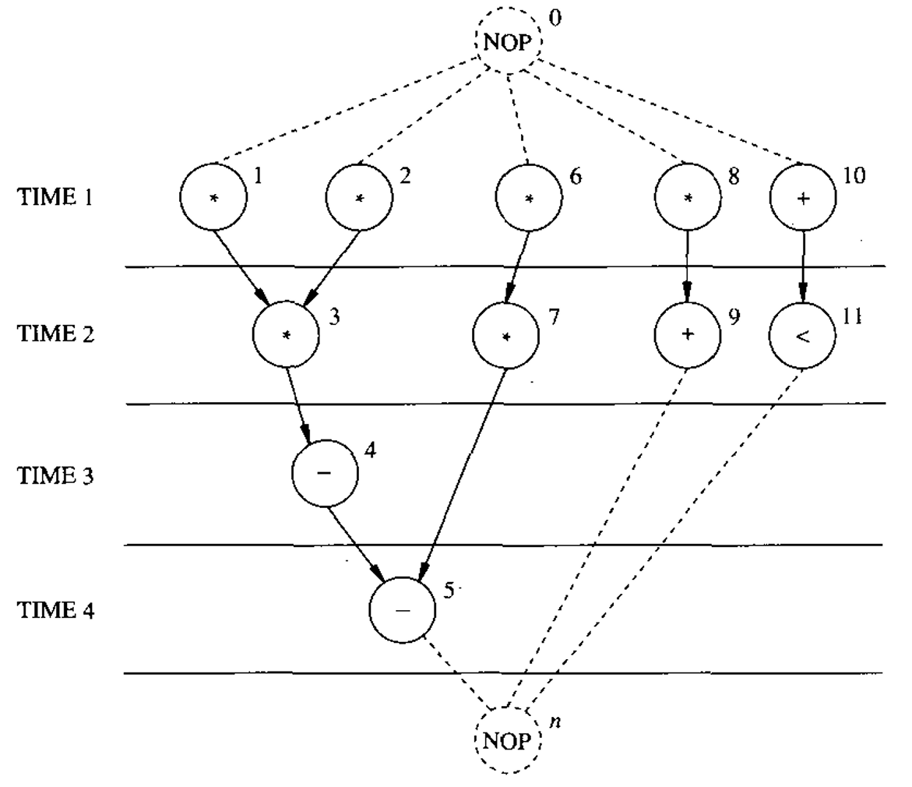

# Area and Performance Estimation

Accurate **area** and **delay estimation** is not a simple task. On the other hand, the solutions to architectural synthesis and optimization problems require estimating **area** and **performance variations** as a result of architectural-level decisions.

* A **schedule** provides the latency $$\lambda$$ of a circuit for a given cycle time, while
* a **binding** provides information about the area of the circuit.

Therefore, these two objectives — **area** and **performance** — can be evaluated for **scheduled** and **bound sequencing graphs**. Unfortunately, measures of area and performance are also needed while computing a **schedule** and a **binding**. Therefore, it is important to be able to forecast, with some degree of accuracy, the impact of scheduling decisions and binding decisions on **area** and **performance**.


Estimation is much simpler in the case of **resource-dominated circuits**, which we consider next.


## Resource-Dominated Circuits

In the [**resource-dominated circuits**](circuit-specifications-for-architectural-synthesis.md#resource-dominated-circuits), the **area** and the **delay** of the resources are known and dominate the overall design. The parameters of the other components can be neglected or considered as a **fixed overhead**.

* **Area** = sum of the areas of the resources bound to the operations.
* **Latency** = start time of the **sink** operation (minus start time of the **source** operation)


In resource-dominated circuits, we assume that both **area** and **timing** are dominated by the **functional resources**.


## General Circuits

In general circuits, such as [non resource-dominated circuits](circuit-specifications-for-architectural-synthesis.md#non-resource-dominated-circuits), the **area estimate** is the sum of the areas of the **bound resource instances** plus the area of the **steering logic**, **registers** (or **memories**), **control unit**, and **wiring area**. All these components depend on the **binding**, which in turn depends on the **schedule**.


The paragraph above is really important as it serves as a bridge for us to know how binding and scheduling can affect the area estimation!


The **latency** of the circuit still depends on the **schedule**, which in turn must take into account the **propagation delays** on paths between **register boundaries**. Thus, **performance estimation** requires more detailed information. We consider the components of the **data path** first, and then we comment on the **control unit**.

### Registers

All **data** transferred from one **resource** to another across a **cycle boundary** must be stored in some **register**.

<figure><picture><source srcset="../../.gitbook/assets/unconstrained-scheduling-dark.png" media="(prefers-color-scheme: dark)"></picture><figcaption></figcaption></figure>

For example, in the figure above we have seen, from opertion 1 to 3, as it crosses a cycle boundary, a register is needed there.

An **upper bound** on the **register usage** can then be derived by examining a **scheduled sequencing graph**. This bound is, in general, **loose**, because the number of registers can be minimized. The **binding information** is needed for evaluating and/or performing the **register optimization**. Therefore, accurate estimation of the number of registers requires both **scheduling** and **binding**.


We will se how to do the **register optimization** in [problem set 1](https://app.gitbook.com/s/08HOWaEgI5q3ZZTecFRP/tutorial/problem-set-1#id-04.-combine-everything)!


### Steering Logic

**Steering logic** affects both the **area** and the **propagation delay**.

#### Multiplexers

While the **area of multiplexers** can be easily evaluated, determining their number requires knowledge of the **binding**. Similarly, multiplexers add propagation delays to the resources.

#### Buses

**Buses** can also be used to steer data. In general, circuits may have a fixed number of buses that can support several multiplexed data transfers. Hence, there are two components to take into account in the **area** and **delay estimation**:

* The first component corresponds to the **buses themselves**, which can be considered as a **fixed overhead**.
* The second component relates to the **bus drivers and receivers**, which can be thought of as distributed multiplexers and modeled accordingly.

### Wires

**Wiring** contributes to the overall **area** and **delay**. The **wiring area overhead** can be estimated from the structure, once a **binding** is known, by using models that are appropriate for the physical design style of the implementation. The **propagation delay** on the **wires** may not be negligible, and it is proportional to the **wiring length**.


We can link it to the [wire-load models](/broken/spaces/Sp0XaarBjbEX3JIMrRaR/pages/yiHeUDckY82hF8wEj6os#wire-load-models) used in Synopsys tool suite we have learned in EE4415!


Unfortunately, estimating the **wiring area** and **length** requires knowledge of both the structure (i.e., the **binding**) and the **placement** of the physical implementation of the resources. Fast floor planners, statistical placement models, and statistical wiring models have been used for this purpose.

In **statistical wiring models**, it has been shown that the **average interconnection length** is proportional to the **total number of blocks** raised to the power $$\alpha$$ ( $$\text{\#blocks}^\alpha$$), where $$0\le\alpha\le1$$. Both the **wiring delay** and **wiring area** scale with the average interconnection length.

### Control Unit

The **control unit** contributes significantly to the overall area and delay in control-dominated circuits because some control signals can be part of the **critical path**.

The estimation is very much **implementation dependent**. For example, we have seen that a [**control unit**](https://wenbo-notes.gitbook.io/ee4218-hsd-notes/textbook-micheli/architectural-synthesis#control-unit) can be

1. Hardwired, or
2. Microprogrammed

And the **logic optimization** for these two implementations can affect the area and delay significantly.


**Logic optimization** is part of the **logic synthesis**. As we have seen in the [first chapter](../introduction/computer-aided-synthesis-and-optimization.md#synthesis), the logic synthesis comes after the **architectural synthesis**.

