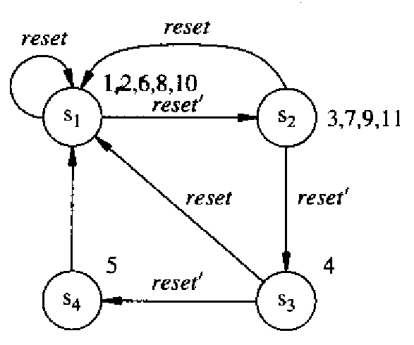
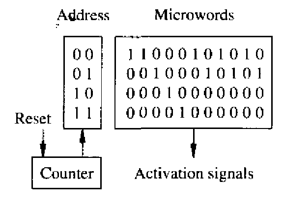
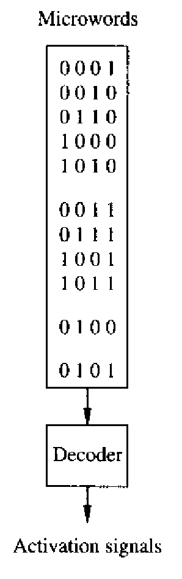
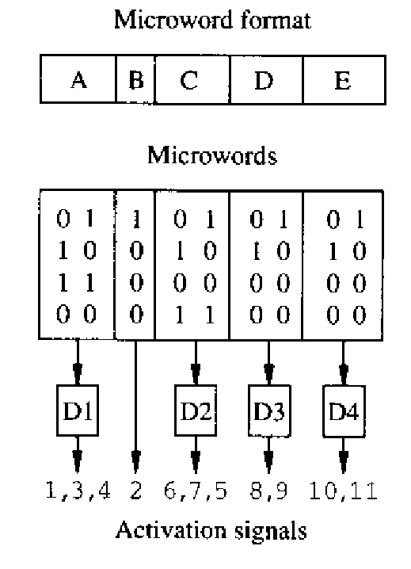

# Control-Unit Synthesis

We consider in this section the **synthesis of control units**. We assume that there are $$n_{\text{act}}$$ **activation signals** to be issued by the **control unit**, and we do not distinguish among their specific functions (e.g., **register enable**, **multiplexer control**, etc.).

From a **circuit implementation** point of view, the **control-unit model** can be classified as either **microcode-based** or **hardwired**:

* In the **microcode-based implementation**, the **control information** is stored in a **read-only memory (ROM)** array addressed by a **counter**.
* In the **hardwired implementation**, the control unit is realized as a **sequential circuit** consisting of an interconnection of a **combinational circuit** and **registers**. For example, this is the normal FSM we have seen in [DDCA](https://app.gitbook.com/s/jTJFBPtKk6NwweAooH53/lec/lec-02-digital-system-design-and-verilog#finite-state-machines).

From a logic standpoint, the synchronous implementation of control can be modeled as a **finite-state machine (FSM)**.


It is important to remark that a synthesized **microcoded control unit** is **not reprogrammable**, that is, the **microcode-based implementation** is simply a method of storing the **control information** in an organized fashion (e.g., in a **memory array**) **without** providing support for modifying it.


## Hard-wired Control Synthesis

As we already have our scheduled and bound sequence graph, the hard-wired control synthesis is nothing but to generate a **state-transition diagram** for the control unit. For example, suppose we are using the following sequence diagram and we are using a **dedicated binding**,

<figure><picture><source srcset="../../.gitbook/assets/unconstrained-scheduling-dark.png" media="(prefers-color-scheme: dark)"></picture><figcaption></figcaption></figure>

Then the state-transition diagram, which is the result of our control-unit synthesis, will be shown as follows:

<figure><picture><source srcset="../../.gitbook/assets/control-unit-synthesis-state-tran-light.png" media="(prefers-color-scheme: dark)"></picture><figcaption></figcaption></figure>

This state-transition diagram basically means when the FSM is in S1, its output will be 1, 2, 6, 8, 10, which are equivalent to activate the $$v_1,v_2,v_6,v_8$$ and $$v_{10}$$ operations. And similar for the rest 3 states.


Here, for simplicity, we omit the IDLE state and assume that these 4 cycles are repeated **continuously**.


## Microcoded Control Synthesis

A **microcoded implementation** can be achieved by using a **memory** that has as many **words** as the **latency** $$\lambda$$. Each word corresponds one-to-one with a **schedule step**. Therefore, the **ROM** must have as many **address bits** as $$n_{\text{bit}} = \lceil \log_2 \lambda \rceil$$. A **synchronous counter** with ($$n_{\text{bit}}$$) bits is used to address the **ROM**.

The **counter** has a **reset signal** that clears it so that it addresses the first word in memory, corresponding to the first operations to be executed. When the **sequencing graph** models a set of operations that must be **iterated**, the last word of the schedule clears the counter. The counter runs on the **system clock**.

The only **external control signal** provided by the **environment** is the **counter reset**. By raising this signal, the overall circuit **halts and resets**. By lowering it, the circuit starts execution from the **first operation**.

There are different ways to implement a microcoded memory array, and here we will introduce two methods:

1. Horizontal Microcode
2. Vertical Microcode

### Horizontal Microcode

The simplest approach is to associate the **activation signal** of each **resource** with one **bit** of the **memory word**. This scheme is called **horizontal microcode**, because the **word length** ($$n_{\text{act}}$$) is usually much larger than the **latency** $$\lambda$$, and therefore the **ROM** has a **width** greater than its **height**.

Example of Horizontal Microcode

Consider the **scheduled sequencing graph** we've seen in the [#hard-wired-control-synthesis](control-unit-synthesis.md#hard-wired-control-synthesis "mention") and assume a **binding** with **dedicated resources** and **registers**. Hence, the **activation signals** control the **register enable signals**. (The **ALU control signals** are fixed because the **resources** are **dedicated**.) Therefore, we can assume that there are as many **activation signals** as **operations**, that is, ($$n_{\text{act}} = n_{\text{ops}} = 11$$).

Thus, a **2-bit counter** driving a **ROM** with **four words** of **11 bits** is sufficient, as shown in Figure 4.13.

<figure><picture><source srcset="../../.gitbook/assets/horizontal-microcode-example-dark.png" media="(prefers-color-scheme: dark)"></picture><figcaption>
Figure 4.13 Example of horizontal microcode
</figcaption></figure>

### Vertical Microcode

A fully **vertical microcode** corresponds to encoding the ($$n_{\text{act}}$$) **activation signals** with ($$\lceil \log_2 n_{\text{act}} \rceil$$) **bits**. This choice drastically reduces the **width of the ROM**. Two problems arise when adopting a **vertical microcode scheme**:

1. **Decoding requirement**: **Decoders** are needed at the **ROM output** to reconstruct the **activation signals**. Such decoders can themselves be implemented using additional **ROMs**, and the scheme is then referred to as a **two-stage control store** (i.e., **micro-ROM** and **nano-ROM**).
2. **Operation concurrency**: A word corresponding to a **schedule step** may need to activate two or more **resources** concurrently. However, this may be impossible to decode unless **code words** are reserved for all possible **n-tuples of concurrent operations**.

Vertical control schemes can be implemented either by **lengthening the schedule** (i.e., renouncing some **concurrency**) or by assuming that multiple **ROM words** can be read within each **schedule step**.

Example of Vertical Microcode

Consider again the **scheduled sequencing graph** we've seen in the [#hard-wired-control-synthesis](control-unit-synthesis.md#hard-wired-control-synthesis "mention") and assume a **dedicated binding**. For the sake of simplicity, assume that there are as many **activation signals** as **operations**, and that they are encoded using the **4-bit binary encoding** of the **operation identifier**.

<figure><picture><source srcset="../../.gitbook/assets/vertical-microcode-example-dark.png" media="(prefers-color-scheme: dark)"></picture><figcaption>
Figure 4.14 Example of vertical microcode
</figcaption></figure>

Figure 4.14 can be interpreted in two ways:

1. **Serialized execution**: The **operations** are **serialized**, and the **latency** becomes **11**, since each operation is activated in a separate **control step**.
2. **Parallel word access**: Multiple **ROM words** can be read within a single cycle. For example, the first five words could be read during the first control step, allowing multiple operations to be activated concurrently.

In this vertical microcode, the first few rows contain the **encoded activation signal** and the job of the decoder is to decode these rows and then activate the corresponding operations.

#### Vertical Microcode with Grouping

It is possible to encode the **activation signals** in ways that span the spectrum between the **horizontal microcode** and **vertical microcode** schemes. A common **microcode optimization** approach is to search for the **shortest encoding** of the **microcode words** such that full **concurrency** is preserved. This problem is referred to as the **microcode compaction problem**, and it is **intractable**.

A practical approach to this problem is to partition the **microcode words** into **fields**, and to partition the **operations** into corresponding **groups** (i.e., each group is assigned to one field). The **operations** in each group are then **vertically encoded**. The partitioning is performed so that no pair of **operations** within the same group is **concurrent**. Therefore, full **concurrency** is preserved while still achieving **local vertical encoding** and reducing the overall **microcode width**.

Example of Vertical Microcode with Grouping

Consider again the **scheduled sequencing graph** of Figure 4.3 and assume a **dedicated binding** with as many **activation signals** as **operations**. Let us partition the **micro-word** into five **fields** and the **operations** into five **groups**:

* $$\{v_1, v_3, v_4\}$$
* $$\{v_2\}$$
* $$\{v_6, v_7, v_5\}$$
* $$\{v_8, v_{9}\}$$
* $$\{v_{10}, v_{11}\}$$

Note that the operations within each **group** are **not concurrent**. Therefore, each group can be **vertically encoded**, as shown in Figure 4.15.

<figure><picture><source srcset="../../.gitbook/assets/optimize-microcode-dark.png" media="(prefers-color-scheme: dark)"></picture><figcaption></figcaption></figure>

In this scheme, **null fields** (e.g., all-zero entries within a field) indicate that no **operation** in that group is activated during the corresponding **control step**.

This encoding requires 9 bits — instead of 11 bits for the **horizontal encoding** and **4 bits** for the fully vertical encoding — while still preserving full concurrency.

## Summary

In the control unit synthesis, the main problem is to assign the **activation signals** ($$n_{\text{act}}$$) to different resources at **each clock cycle**. To architect a system that can issue these activation signals at each clock cycle, we can use two methods:

1. A FSM (Hard-wired Control Synthesis)
2. A memory (Micro-coded Control Synthesis): More specifically, we are talking about the horizontal mode here.

In both ways, the **number of state** or the **number of memory addresses** are equal to the latency of the circuit, which is $$\lambda$$. And the content of the state or the content in one memory address corresponds to the activation signals in that specific cycle.


In the vertical mode of micro-coded control synthesis, life is a bit different.

