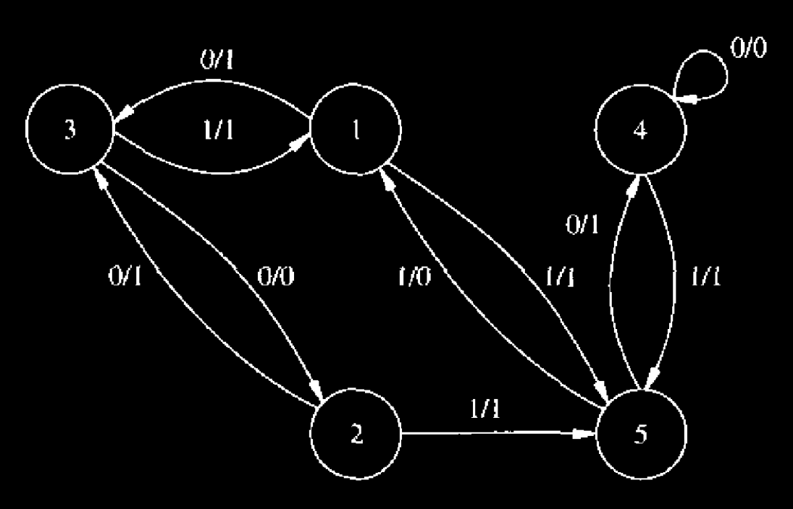
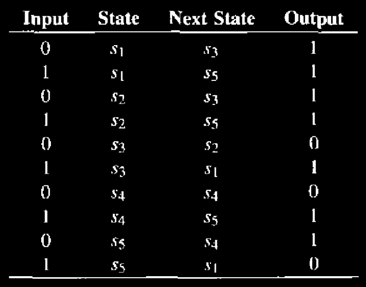
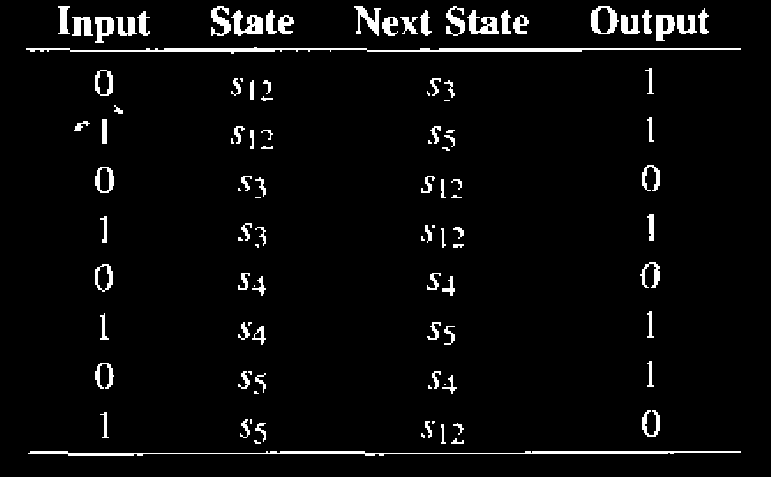
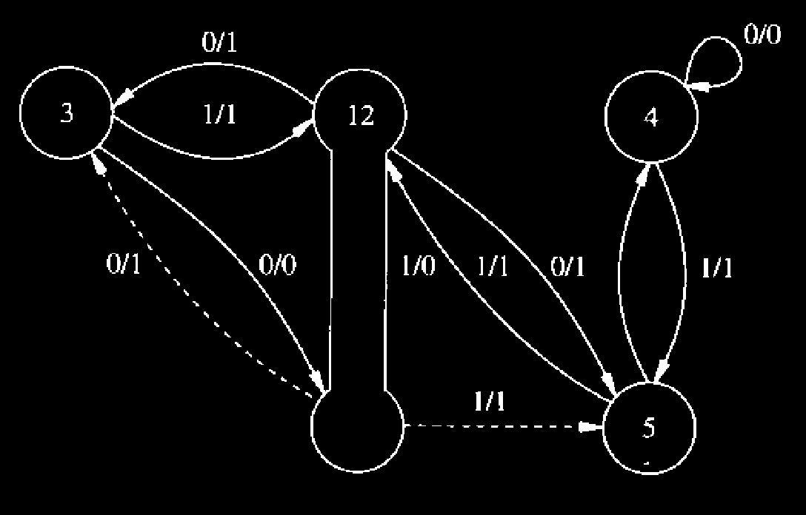
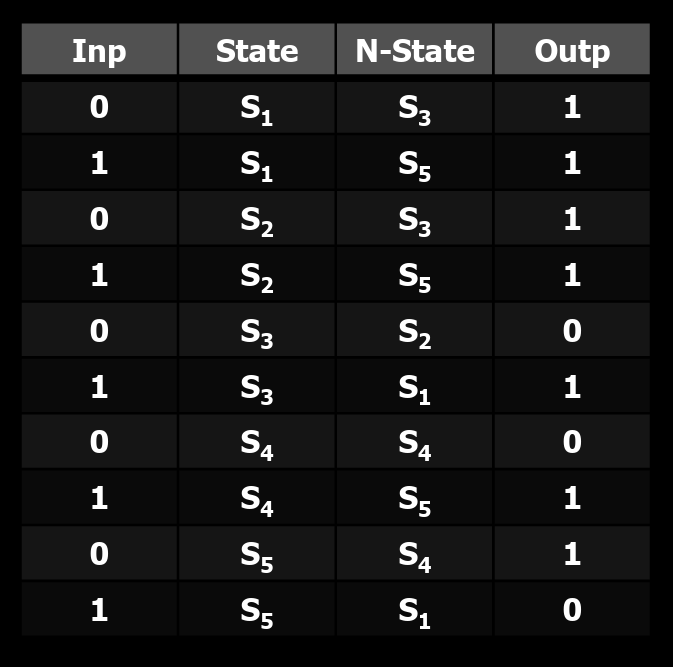
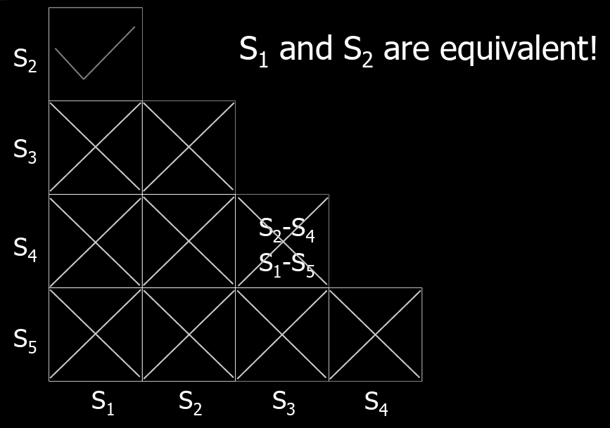
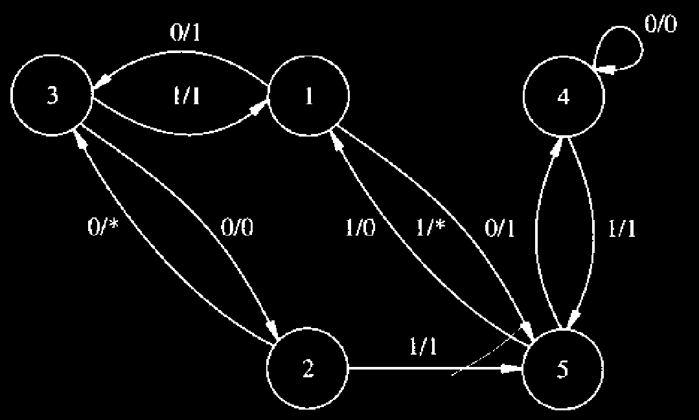
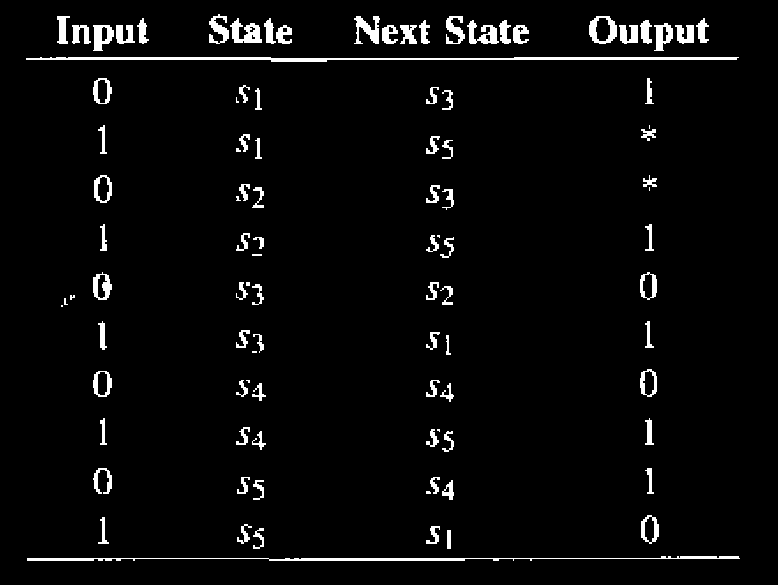
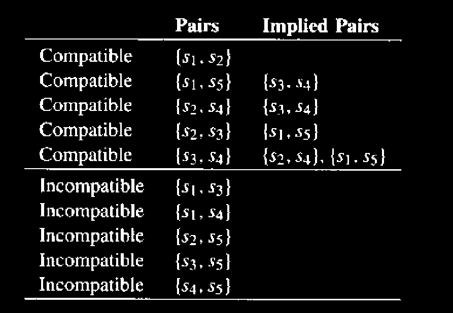
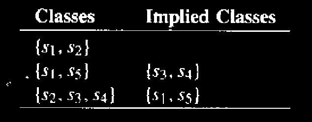

# Synchronous Circuit Optimization using State-Based Models

We consider in this section algorithms for sequential optimization using **state-based models** as well as transformations into and from **structural models**. We consider **Mealy-type finite-state machines**, defined by the quintuple $$X, Y, S, \delta, \lambda$$, as introduced earlier. We denote $$|S|$$ (the size of the states) by $$n_s$$, in the rest of this section.

> \[_From the earlier section_]: A **finite-state machine** can be described by:
>
> * A set of **primary input patterns**, $$X$$.
> * A set of **primary output patterns**, $$Y$$.
> * A set of **states**, $$S$$.
> * A **state transition function**, $$\delta: X \times S \to S$$.
> * An **output function**, $$\lambda: X \times S \to Y$$ for **Mealy models** or $$\lambda: S \to Y$$ for **Moore models**.
> * An **initial state**​.


The state minimization skill that we learned here **cannot be done** by the EDA tool! This must be done manually!


## State Minimization

The **state minimization problem** aims at reducing the number of **machine states**. This leads to a reduction in the size of the **state transition graph**. **State reduction** may correlate to a reduction of the number of **storage elements**. (When states are **encoded** with a **minimum number of bits**, the number of **registers** is the **ceiling** of the logarithm of the number of states.) The reduction in **states** correlates to a reduction in **transitions**, and hence to a reduction of **logic gates**.


In Harris and Harris [DDCA](https://wenbo-notes.gitbook.io/ddca-notes/textbook/sequential-logic-design/finite-state-machines#example-fsm-state-encoding), we have seen that using one-hot encoding can reduce the logic gates used. Here, both the normal binary encoding and one-hot encoding has the **same number of** states. So, the last sentence "the reduction in states ..." still holds. We will discuss about [state encoding](synchronous-circuit-optimization-using-state-based-models.md#state-encoding) later in this section.


**State minimization** can be defined informally as deriving a finite-state machine with **similar behavior** and a **minimum number of states**.


The sentence above which is the definition of state minimization might be the most important take away from this section!


A more precise definition relies on choosing to consider **completely** (or **incompletely**) specified finite-state machines. This decision affects the formalism, the problem complexity, and the algorithms. Hence, state minimization is described separately for both cases in the following sections.

* In a **Completely Specified FSM:**
  * No Don't care conditions
  * Polynomial-time solutions
* In an **Incomplete Specified FSM:**
  * Unspecified transitions and/or outputs
  * Intractable problem

Food for thought on solving incomplete specified FSM using polynomial-time solutions

Each **don’t-care** entry can take one of two values, 0 or 1. In principle, we could expand every don’t care into both possibilities, thereby transforming an **incompletely specified FSM** into a **completely specified FSM**. Once fully specified, existing **polynomial-time algorithms** could be applied.

However, if there are $$n$$ don’t-care entries, exhaustive expansion produces $$2^n$$ additional cases. Applying a polynomial-time algorithm to this expanded FSM does not yield a polynomial-time solution overall, because the exponential blow-up occurs _before_ the polynomial step. In effect, the complexity is dominated by the expansion rather than the solving phase.

This raises a natural question: **does a meaningful trade-off exist?** Specifically, is there a threshold on $$n$$ below which full expansion remains tractable, allowing us to obtain an **exact solution** rather than relying on **heuristic methods**? Or, equivalently, can we characterize a regime where limited expansion preserves practical polynomial behavior while avoiding exponential explosion?

### Optimization for Completely Specified FSM

When considering **completely specified finite-state machines**, the transition function $$\delta$$ and the output function $$\lambda$$ are specified for each pair $$(\text{input}, \text{state}) \in X \times S$$. Two state**s** are **equivalent** if the **output sequences** of the finite-state machine, initialized in the two states, coincide for **any input sequence**. Equivalency is checked by using the result of the following theorem.

> **Theorem 9.2.1.** Two states of a finite-state machine are **equivalent** if and only if, for **any input**, they have **identical outputs** and the corresponding **next states** are **equivalent**.

Now, we will introduce three methods to do the state optimization. The goal is to find the **final partition set**.

#### Normal Method

> TODO: Missing formal notation because the lack of the following maths from Discrete Maths
>
> 1. Symmetric, reflexive, transitive
> 2. Equivalence classes.

The normal method has the following three steps:

1. **Initial partition (**$$\Pi_1$$**):** States are placed in the same block if they produce identical **outputs** for every input.
2. **Refinement step (**$$\Pi_k\to\Pi_{k+1}$$**):** States remain in the same block if they were in the same block in  $$\Pi_k$$ **and** their next states fall in the same block of $$\Pi_k$$ for all inputs.
3. **Convergence:** The refinement process terminates when $$\Pi_{k+1}=\Pi_{k}$$.

Example of using the normal method to minimize the states

<figure><figcaption>
Figure 9.3 State diagram
</figcaption></figure>

Consider the **state diagram** shown in Figure 9.3, whose state table is reported next:

<figure><figcaption></figcaption></figure>

The **state set** can be partitioned first according to the outputs, i.e.,

\Pi_1 = \bigl\{ \{s_1, s_2\}, \{s_3, s_4\}, \{s_5\} \bigr\}

Then we check each **block** of $$\Pi_1$$ to see if the corresponding **next states** are in a **single block** of $$\Pi_1$$ for any **input**. The **next states** of $$s_1$$ and $$s_2$$​ **match**. The **next states** of $$s_3$$ and $$s_4$$ are in **different blocks**. Hence, the block $$\{s_3, s_4\}$$ must be **split**, yielding:

\Pi_2 = \bigl\{ \{s_1, s_2\}, \{s_3\}, \{s_4\}, \{s_5\} \bigr\}

When checking the blocks again, we find that no **further refinement** is possible, because the **next states** of $$s_1$$​ and $$s_2$$​ **match**. Hence, there are **four classes of compatible states**. We denote $$\{s_1, s_2\}$$ as $$s_{12}$$ in the following **minimal table**:

<figure><figcaption></figcaption></figure>

The corresponding diagram is shown in Figure 9.4

<figure><figcaption>
Figure 9.4 Minimum-state diagram. (Dotted edges are superfluous)
</figcaption></figure>


The complexity of this algorithm is $$O(n_s^2)$$.


#### Hopcroft's method

In the **algorithm** described above, the **refinement of the partitions** is done by looking at the **transitions** from the **states** in the **block under consideration** to other **states**. Hopcroft suggested a **partition refinement method** where the **transitions into the states** of the **block under consideration** are considered.

Example of using the Hopcroft method to minimize the states

Consider the **table** of [**Example above**](synchronous-circuit-optimization-using-state-based-models.md#example-of-using-the-normal-method-to-minimize-the-states). The **state set** can be **partitioned** first according to the **outputs**, as in the previous case.

\Pi_1 = \bigl\{ \{s_1, s_2\}, \{s_3, s_4\}, \{s_5\} \bigr\}

Then we check each block of $$|\Pi_1|$$. Let $$A = \{s_5\}$$. Let us consider input 1. The states whose next state is $$s_5$$ are set $$P = \{s_1, s_2, s_5\}$$. Block $$A = \{s_1, s_2\}$$ is a subset of $$P$$ and requires no further split. Block $$B = \{s_1, s_4\}$$ is not a subset of $$P$$, and $$B \cap P = \{s_1\}$$. Hence, the block is split as $$\{\{s_1\}, \{s_4\}\}$$, yielding:

\Pi_2 = \bigl\{ \{s_1, s_2\}, \{s_3\}, \{s_4\}, \{s_5\} \bigr\}

No further splits are possible and $$\Pi_2$$ defines our foru classes of equivalent states.


The complexity of this algorithm is $$O(n_s\log n_s)$$.


#### Implication Chart Method

This method includes the following steps:

* **Initialization:** Construct the implication (pair) chart and cross out all state pairs that are **I/O incompatible**, i.e., they produce different **outputs** for the same input.
* **Implication generation:** For each remaining state pair, write the **equivalence conditions** implied by their next states under each input.
  * These equivalence conditions are called **implications**
  * Example, S3 and S4 are equivalent only if S2-[^1]S4 are equivalent and S1-S5 are equivalent.
* **Implication checking:** Cross out a state pair if **any** of its implied state pairs is already crossed out.
* **Iteration:** Repeat the implication checking step until no new cells can be crossed out.
* **Result:** State pairs corresponding to **uncrossed cells** in the chart are equivalent and can be merged.

Example of using the Implication Chart Method to minimize the states

Suppose that we have the following state table:

<figure><figcaption></figcaption></figure>

We can first draw an **lower-triangular** matrix like below:

<figure><figcaption></figcaption></figure>

1. We tick (<i class="fa-check">:check:</i>) the cell (S1, S2) because they are obviously equivalent.
2. Based on the **outputs**, we cross (<i class="fa-x">:x:</i>) the cell (S1, S3), (S1, S4), (S1, S5), (S2, S3), (S2, S4), (S2, S5), (S3, S5), (S4, S5). And we left with the cell (S3, S4).
3. If S3 and S4 are equivalent, S2 and S4 must be equivalent and S1 and S5 are equivalent. So, we write S2-S4 and S1-S5 in the cell first.
4. Now, we check the cell, (S1, S5) and (S2, S4). As they are crossed out already, means that there is no chance that S3 and S4 are equivalent.
5. At the end, only S1 and S2 can be merged.

### Optimization for Incompletely Specified FSM

In the case of **incompletely specified finite-state machines**, the transition function $$\delta$$ and the output function $$\lambda$$ are not specified for some (input, state) pairs. Equivalently, don’t care conditions denote the unspecified transitions and outputs.They model the knowledge that some **input patterns** cannot occur in some states, or that some **outputs** are not observed in some states under certain input conditions.

An **input sequence** is said to be **applicable** if it does not lead to any **unspecified transition**. Two **states** are **compatible** if the **output sequences** of the **finite-state machine**, initialized in the two states, **coincide** whenever both **outputs** are specified and for any **applicable input sequence**. The following theorem applies to **incompletely specified finite-state machines**.

> **Theorem 9.2.2.** Two **states** of a **finite-state machine** are **compatible** if and only if, for any **input**, the corresponding **output functions** **match** when both are specified, and the corresponding **next states** are **compatible** when both are specified.


In other words, the **compatibility rule** can be summarized as follows:

1. **Output Rule (Immediate Check):** The **outputs** produced by $$S_1$$ and $$S_2$$​ for the same **input** must not **contradict** each other. (The first number is the output of $$S_1$$ and the second number is the output of $$S_2$$)
   * **Compatible:**
     * 1 vs 1 -> outputs **match**.
     * 1 vs x -> outputs **match** (Don't Care).
   * **Incompatible:**
     * 0 vs 1 -> outputs **conflict**.
2. **Next State Rule (Future Check):** The **next states** $$N_1$$​ and $$N_2$$ that $$S_1$$​ and $$S_2$$​ transition to must form a **compatible pair**.
   * **Compatible:**
     * Both go to the **same state** (e.g., $$S_1 \to S_5$$​ and $$S_2 \to S_5$$).
     * One goes to a **Don't Care state** (e.g., $$S_1 \to S_5$$ and $$S_2 \to x(\text{Don't Care})$$ or vice versa).
     * They go to **different states**, but the **next states themselves are compatible** (e.g., $$S_1 \to S_3$$​, $$S_2 \to S_4$$​, provided $$S_3$$ and $$S_4$$​ are compatible).
   * **Incompatible:**
     * They go to **different states** that are **incompatible**.


> TODO: Lack of maths knowledge to include the formal definition here. And how to find all compatible pairs?

Compability is **not transitive**. For example, if S1 has an output 10, S2 has an output 1\*, and S3 has an output 11. S1 is compatible with S2 if their next states are compatible. S2 and S3 are compatible if their next states are compatible. **But**, S1 and S3 is **incompatible** irrespective of their next states!

#### Normal Method

The normal method includes the following steps

1. **Replace the don't cares** with 0s or 1s, make the FSM **completely specified**.
2. **Write out** all the **compatible pairs** and **incompatible pairs**.
3. **Initial partition (**$$\Pi_1$$**):** States are placed in the same block if they produce identical **outputs** for every input.
4. **Compatibility Check**: Find a **minimum** number of partition blocks such that
   1. All states are covered.
   2. All implications are satisfied (closure property)

Example to minimize the states in an incompletely specified FSM

<figure><figcaption>
Figure 9.5 (a) State diagram
</figcaption></figure>

Consider the **finite-state machine** of **Figure 9.5 (a)**, described by the following **table**, where only the **output function** $$\lambda$$ is **incompletely specified** for the sake of simplicity.

<figure><figcaption></figcaption></figure>

Note first that replacing the **don’t care entries** by 1s would lead to the **table** of [Example above](synchronous-circuit-optimization-using-state-based-models.md#example-of-using-the-normal-method-to-minimize-the-states), which can be **minimized** to **four states**. Other choices of the **don’t care entries** would lead to other **completely specified finite-state machines**. Unfortunately, there is an **exponential number** of completely specified finite-state machines corresponding to the choice of the **don’t care values**.

Let us consider **pairwise compatibility**:

* The **pair** $$\{s_1, s_2\}$$ is **compatible**.
* The **pair** $$\{s_2, s_3\}$$ is **compatible**, subject to the **compatibility** of $$\{s_1, s_5\}$$.
* The **pair** $$\{s_1, s_3\}$$ is **not compatible**.

This shows the **lack of transitivity** of the **compatibility relation**. The following **table** lists the **compatible** and **incompatible pairs**:

<figure><figcaption></figcaption></figure>

Maximal compatibility classes are the following:

<figure><figcaption></figcaption></figure>


In this case, we might find out that the partition $$\Pi=\{\{S_1,S_5\},\{S_2,S_3,S_4\}\}$$ is the **minimal partition** because only two states are needed. Any partition that is better than this can only has **1 state**, which is impossible in this case.


## State Encoding

The **state encoding (or assignment) problem** consists of determining the **binary representation of the states** of a **finite-state machine**.


In the most general case, the state encoding problem is complicated by the **choice of register type** used for storage (e.g., **D, T, JK**). We consider here only **D-type registers**, because they are the **most commonly used**.


**State encoding** affects **circuit area** and **performance**. Most known techniques for state encoding target the reduction of **circuit complexity measures** that correlate well with **circuit area** but only weakly with **circuit performance**. **Circuit complexity** is related to the number of **storage bits** $$n_b$$​ used for the **state representation** (i.e., **encoding length**) and to the size of the **combinational component**. A measure of the latter differs significantly when considering **two-level** versus **multiple-level circuit implementations**.

For this reason, **state encoding techniques** for **two-level logic** and **multiple-level logic** have been developed **independently**. We shall **survey methods** for **both cases** next.

Appreciate the complexity of state encoding

Suppose we have $$m$$ states and $$n$$ available bits to encode these states. The constraint is given as follows,

\log_2m\le n\le m

How many possible encodings can we have?

***

**Ans**: This is a classic combinatoric problem.

1. Firstly, $$n$$ bits means that we have $$2^n$$ possible encoding numbers available.
2. Secondly, the problem becomes selecting any $$m$$ different encoding numbers and use them to encode the $$m$$ states. Thus, the possible combinations will be $$2^n ~P~m=\frac{2^n!}{(2^n-m)!}$$

This huge number implies that the **state encoding** problem are NP-hard and **heuristics** are necessary for practical solutions.

### State Encoding for Two-Level Circuits

The **two-level circuits** are usually represented in the [sum-of-product](https://app.gitbook.com/s/jTJFBPtKk6NwweAooH53/textbook/combinational-logic-design/boolean-equations#sum-of-products-form) form, e.g., $$F = (A \cdot B) + (C \cdot D)$$. In Harris and Harris [DDCA](https://app.gitbook.com/s/jTJFBPtKk6NwweAooH53/textbook/digital-building-blocks/logic-arrays#programmable-logic-array), we have seen that

> _Programmble logic arrays (PLAs)_ implement two-level combinational logic in sum-of-products (SOP) form. PLAs are built from an AND array followed by an OR array

**Two-level circuits** have been the object of investigation for **several decades**. The **circuit complexity** of a **sum-of-products representation** is related to the number of **inputs**, **outputs**, and **product terms**. For **PLA-based implementations**, these quantities can be used to compute readily the **circuit area** and the **physical length of the longest path**, which correlates with the **critical path delay**.

> **Rule 1**: The number of **inputs and outputs** of the **combinational component** is equal to **twice the state encoding length** plus the number of **primary inputs and outputs**.

As we have seen in DDCA, an FSM contains two parts:

1. Memory (Implemented using registers)
2. Combinational Logic (Implemented using PLA as we suppose above)

The _quote_ above focuses on the **combinational component**, so let's consider the inputs and outputs to / from the combinational part only.

1. The **Inputs** to the Combinational Block:
   * **Primary Inputs**: The actual external signals coming into the system (e.g., a sensor or button).
   * **Present State**: Feedback from the memory registers telling the logic "where we are now."
2. The **Outputs** from the Combinational Block:
   * **Primary Outputs**: The actual signals going out to the world (e.g., an LED or motor).
   * **Next State**: Signals sent back to the registers to tell them "where to go next clock cycle."

From here, we can clearly see that the **total number of I/O** in the combinational logic is two the number of $$n_b$$ (state encoding length) plus the primary inputs and outputs.

> **Rule 2**: The number of **product terms** to be considered is the size of a **minimum (or minimal) sum-of-products representation**.

In other words, this rule is saying that: "we shouldn't just count all the possible combinations in the SOP. Instead, the actual size of the circuit is determined by the smallest possible number of terms we can reduce the equation to." Also, from [DDCA](https://app.gitbook.com/s/jTJFBPtKk6NwweAooH53/textbook/digital-building-blocks/logic-arrays#programmable-logic-array), we can clearly see that **the number of products terms** indicates **the numebr of rows** in the PLA.

> TODO: Add how many choices of encoding we have as an example. This is pure math I believe.

#### 1-hot Encoding

The **simplest encoding** is **1-hot state encoding**, where each **state** is encoded by a corresponding **code bit** set to **1**, with all others being **0**. Thus, $$n_b = n_s$$​. **1-hot encoding** requires an **excessive number of inputs/outputs**, and it was shown **not to minimize** the size of the **sum-of-products representation** of the corresponding **combinational component**.

Short Cut to calculate the number of FFs needed in a FSM

This number is dependent **purely** on the number of **state bits** we use to encode our state. For example, if we have 3 states and 2 bits available, then we need **2 FFs**.

#### The use of Minimum-Length Codes

**Early work on state encoding** focused on the use of **minimum-length codes**, i.e., using $$n_b = \lceil \log_2 n_s \rceil$$ **bits** to represent the set of states $$S$$.

#### Heuristics

Most **classical heuristic methods** for **state encoding** are based on a **reduced dependency criterion**. The **rationale** is to encode the states so that the **state variables** have the **least dependencies** on those representing the **previous states**. **Reduced dependencies** correlate **weakly** with the **minimality** of a **sum-of-products representation**.

For example, [adjacent code](#user-content-fn-2)[^2] should be used to states that share/have

1. a **common next-state**
2. a **common predecessor (ancestor) state**
3. a **common output behavior**.

However, the first and second are preferred over the third because the **next-state combinational logic** usually are more complex than the **output combinational logic.** Optimizing around the next-state logic therefore yields greater benefits in terms of timing and overall circuit reliability.


Some examples of this encoding is: [**Gray Code**](https://electronics.stackexchange.com/questions/690113/is-the-gray-code-unique) and **Johnson Code**.


> TODO: Add symbolic minimization example here.

### State Encoding for Multiple-Level Circuits

**State encoding techniques for multiple-level circuits** use the **logic network model** for the **combinational component** of the **finite-state machine**. The **overall area measure** is related to

1. the number of **encoding bits** (i.e., **registers**) and
2. to the number of [**literals**](#user-content-fn-3)[^3] in the **logic network**.

The **delay** corresponds to the **critical path length** in the network. To date, only **heuristic methods** have been developed for computing **state encodings** that optimize the **area estimate**.

> TODO: Some "state-of-art" techniques are left as FYI part and they are on the book.

[^1]: Here, it is literally just the **minus** sign.

[^2]: This means, the difference between two codes should be only 1 bit. Example, {001, 011} are considered as adjacent codes, while {001, 010} are **not adjacent.**

[^3]: A **literal** is simply an instance of a variable or its complement (inverse) appearing in a boolean equation.
