# Finite State Machines

Synchronous sequential circuits can be drawn in the forms shown in Figure 3.22. These forms are called _finite state machines_ (FSMs). They get their name because a circuit with k registers can be in one of a finite number ( $$2^k$$) of unique states (note the state symbol in the figure below).

<figure><figcaption></figcaption></figure>

An FSM has M inputs, N outputs, and k bits of state. It also receives a clock, and optionally, a reset signal. An FSM consists of two blocks of **combinational logic**, _next state logic_ and _output logic_, and a register that stores the state.

On each clock edge, the FSM advances to the next state, which was computed based on the current state and inputs. There are two general classes of finite state machines, characterized by their functional specifications.

* In _Moore machines_, the outputs depend only on the current state of the machine.
* In _Mealy machines_, the outputs depend of both current state and the current inputs.


Finite state machines provide a systematic way to design synchronous sequential circuits given a functional specification.


## FSM Design Example

Suppose now Ben Bitdiddle wants to design a traffic light controller for the following roads

<figure><figcaption></figcaption></figure>

He installs two traffic sensors, $$T_A$$ and $$T_B$$, on Academic Ave. and Bravado Blvd., respectively. Each sensor indicates TRUE if students are present and FALSE if the street is empty. He also installed two traffic lights, $$L_A$$ and $$L_B$$. Ben also provides a clock with a 5-second period. On each clock tick (rising edge), the lights may change based on the traffic sensors. He also provides a reset button so that the technicians can put the controller in a known initial state when they turn it on. Figure 3.24 shows a black box view of the state machine.

<figure><figcaption></figcaption></figure>

Now, Ben follows the following steps to systemetically implement this FSM



#### **Sktech the&#x20;**_**state transition diagram**_

After Ben's careful consideration, by analyzing the behavior of this system, he sketches the state transition diagram as follows

<figure><figcaption></figcaption></figure>


#### Notes

1. In a state transition diagram, **circles** represent states and **arcs** represent transitions between states.
2. The arc labeled **Reset** pointing from outer space into state S0 indicates that the system should enter that state upon reset, regardless of what previous state it was in.
3. If a state has multiple arcs leaving it, the arcs are labeled to show what **input** triggers each transition.
4. If a state has a **single** arc leaving it, that transition always occurs regardless of the inputs. For example, in the state transition diagram above, when the system is in state S1, it will always move to S2.
5. The value that the outputs (LA, LB) have while in a particular state are indicated in the state.




#### **Write the&#x20;**_**state transition table**_

Ben then rewrites the state transition diagram as a _state transition table_, which indicates, for each state an input, what the next state, S', should be.

<figure><figcaption></figcaption></figure>


#### Notes

1. The table uses don't care symbols (X) whenever the next state does not depend on a particular input.
2. Reset is omitted from the table. Instead, we use [resettable flip-flops](latches-and-flip-flops.md#resettable-flip-flop) that always go to state S0 on reset, independent of the inputs.




#### **Encode states and outputs**

The state transition diagram is abstract in that it uses states labeled `{S0, S1, S2, S3}` and outputs `{red, yellow, green}`. To build a real circuit, the states and outputs must be assigned _binary encodings_. Ben chooses the simple encodings in Table 3.2 and 3.3. Each state and each output is encoded with two bits: $$S_{1:0}, L_{A~1:0}$$ and $$L_{B~1:0}$$.

<figure><figcaption></figcaption></figure>


Notice that **states** are designated as S0, S1, etc. The subscripted versions, $$S_0$$, $$S_1$$ refer to the **state bits**.




#### **Calculate the next state logic**

Ben updates the state transition table to use these binary encodings, as shown in Table 3.4. The revised state transition table is a truth table specifying the next state logic. It defines next state, S', as a function of the current state, S, and the inputs.

<figure><figcaption></figcaption></figure>

From this table, we can either observe straight-forwardly or use the Karnaugh Map to get the simplest boolean equation for $$S'_{1}$$ and $$S'_{0}$$.

$$
\begin{align*}
S'_{1}&=S_1\oplus S_2 \\
S'_{0}&=\bar S_1\bar S_0\bar T_A+S_1\bar S_0\bar T_B
\end{align*}
$$

To use a K-map here,

1. The first key point is to know that we should have **two** functions/boolean equations for our "outputs" $$S'_{1}$$ and $$S'_{0}$$. Thus the content of our K-map should be the value of either these two "outputs".
2. Then, the columns and rows of the K-map should be the parameters of the function/boolean equation, which are current state and inputs.

Knowing these two points, and taking care of the don't cares carefully, we can build the K-map for $$S'_{0}$$ as follows,

| $$S_1S_0 \backslash T_AT_B$$ | 00 | 01 | 11 | 10 |
| ---------------------------- | -- | -- | -- | -- |
| **00**                       | 1  | 1  | 0  | 0  |
| **01**                       | 0  | 0  | 0  | 0  |
| **11**                       | 0  | 0  | 0  | 0  |
| **10**                       | 1  | 0  | 0  | 1  |

From the K-map table, we can easily get the boolean equation for $$S'_{0}$$. For $$S'_{1}$$, it will be similar.


In this case, we can just read from the state transition table to get the boolean equations for $$S'_{0}$$ and $$S'_{0}$$ while in normal situations, this is not that easy and we might need to use the Karnough map.




#### **Calculate the output logic**

Similarly, Ben writes an _output table_ (Table 3.5) indicating, for each state, what the output should be in that state.

<figure><figcaption></figcaption></figure>

Again, it is straightforward to read off and simplify the Boolean equations for the outputs.

$$
\begin{align*}
L_{A1}&=S_1\\
L_{A0}&=\bar S_1 S_0\\
L_{B1}&=\bar S_1\\
L_{B0}&=S_1S_0
\end{align*}
$$



#### **Sketch the circuit for FSM**

Finally, Ben sketches his Moore FSM in Figure 3.26.

<figure><figcaption></figcaption></figure>



## State Encodings

In the previous example, the **state** and **output encodings** were selected arbitrarily. A different choice would have resulted in a different circuit.

One important decision in state encoding is the choice between **binary encoding** and **one-hot encoding**.

* With _binary encoding_, as was used in the traffic light controller example, each state is represented as a binary number. Because K binary numbers can be represented by $$\log_2K$$ bits, a system with K states only needs $$\log_2K$$ bits of state.
* In _one-hot encoding_, a separate bit of state is used for each state. It is called one-hot because only one-bit is "hot" or TRUE at any time. For example, a one-hot encoded FSM with three states would have state encodings of 001, 010, and 100. Each bit of state is stored in a flip-flop, so one-hot encoding requires mroe flip-flops than binary encoding. However, with one-hot encoding, the next-state and output logic is often **simpler**, so fewer gates are required.
  * A related encoding is the **one-cold encoding**, in which K states are represented with K bits, exactly one of which is FALSE.


The best encoding choice depends on the specific FSM.


Example: FSM State Encoding

A divide-by-N counter has one output and no inputs. The output Y is HIGH for one clock cycle out of every N. In other words, the output divides the frequency of the clock by N. The waveform and state transition diagram for a divide-by-3 counter is shown in Figure 3.28. Sketch circuit designs for such a counter using binary and one-hot state encodings.

<figure>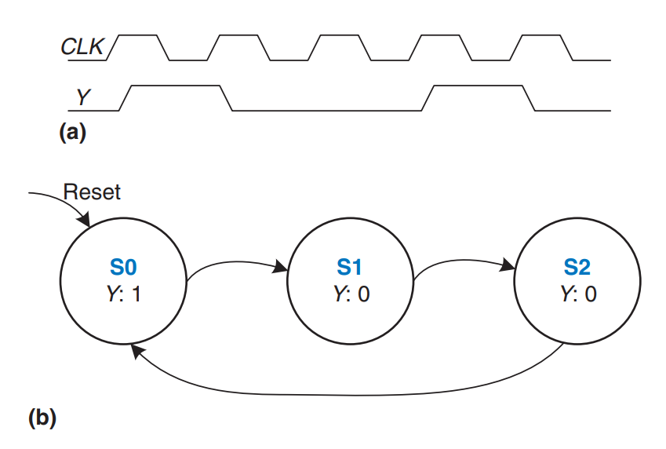<figcaption>
<strong>Figure 3.28</strong> Divide-by-3 counter (a) waveform and (b) state transition diagram
</figcaption></figure>

***

**Solution**: Tables 3.6 and 3.7 show the abstract state transition and output tables, respectively, before encoding.

<figure>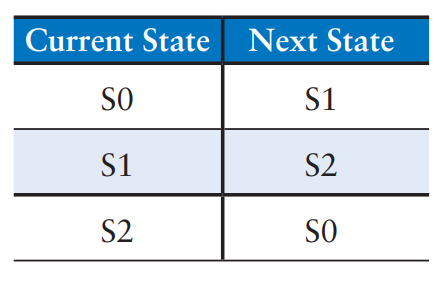<figcaption>
<strong>Table 3.6</strong> Divide-by-3 counter state transition table
</figcaption></figure> <figure>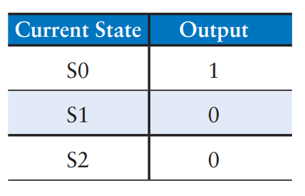<figcaption>
<strong>Table 3.7</strong> Divide-by-3 counter output table
</figcaption></figure>

Table 3.8 compares binary and one-hot encodings for the three states.

<figure>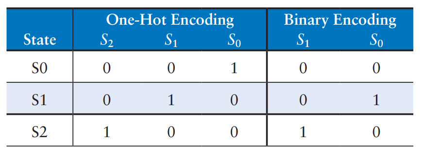<figcaption>
<strong>Table 3.8</strong> One-hot and binary encodings for divide-by-3 counter
</figcaption></figure>

The **binary encoding** uses two bits of state. Using this encoding, the state transition table and output table (combined) is shown as follows. Note that there are no inputs; the next state depends only on the current state.&#x20;

<table><thead><tr><th>Current State (S₁ S₀)</th><th>Next State (S₁' S₀')</th><th data-type="number">Output Y</th></tr></thead><tbody><tr><td>00</td><td>01</td><td>1</td></tr><tr><td>01</td><td>10</td><td>0</td></tr><tr><td>10</td><td>00</td><td>0</td></tr></tbody></table>

The next state and output equations are:

S_1'=\bar{S_1}S_0\\S_0'=\bar{S_1}\bar{S_0}\\Y=\bar{S_1}\bar{S_0}\begin{align*} S_1' &#x26;= \bar{S_1} S_0 \\ S_0' &#x26;= \bar{S_1} \bar{S_0} \\ Y &#x26;= \bar{S_1} \bar{S_0} \end{align*}\begin{align*} S_2' &#x26;= S_1 \\ S_1' &#x26;= S_0 \\ S_0' &#x26;= S_2 \\ Y    &#x26;= S_0 \end{align*}

The **one-hot encoding** uses three bits of state. The state transition table and output table (combined) for this encoding is shown as follows

<table><thead><tr><th>Current State Bits (S₂ S₁ S₀)</th><th>Next State Bits (S₂' S₁' S₀')</th><th data-type="number">Output Y</th></tr></thead><tbody><tr><td>001</td><td>010</td><td>1</td></tr><tr><td>010</td><td>100</td><td>0</td></tr><tr><td>100</td><td>001</td><td>0</td></tr></tbody></table>

The next state and output equations are as follows:

S_2'=S_1\\S_1'=S_0\\S_0'=S_2\\Y=S_0\begin{align*} S_2' &#x26;= S_1 \\ S_1' &#x26;= S_0 \\ S_0' &#x26;= S_2 \\ Y &#x26;= S_0 \end{align*}\begin{align*} S_1' &#x26;= \bar{S_1} S_0 \\ S_0' &#x26;= \bar{S_1} \bar{S_0} \\ Y &#x26;= \bar{S_1} \bar{S_0} \end{align*}

Figure 3.29 shows schematics for each of these designs.

<figure>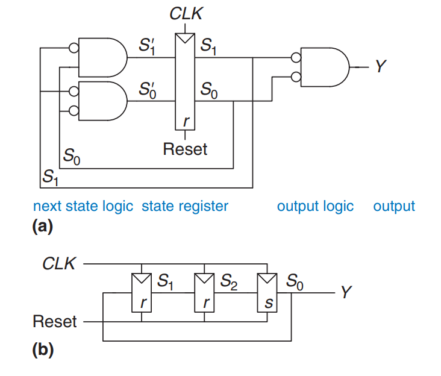<figcaption>
<strong>Figure 3.29</strong> Divide-by-3 circuits for (a) binary and (b) one-hot encodings
</figcaption></figure>

Note that the hardware for the **binary encoded design** could be optimized to share the same gate for Y and S′₀. Also, observe that **one-hot encoding** requires both [settable](latches-and-flip-flops.md#settable-flip-flop) (s) and [resettable](latches-and-flip-flops.md#resettable-flip-flop) (r) flip-flops to initialize the machine to S0 on reset.


The best implementation choice depends on the relative cost of gates and flip-flops, but the **one-hot design** is usually preferable for this specific example.


## Moore and Mealy Machines

So far, we have shown [examples of Moore machines](finite-state-machines.md#fsm-design-example), in which the **output** depends **only** on the **state** of the system. Hence, in state transition diagrams for Moore machines, the outputs are labeled in the circles. Recall that Mealy machines are much like Moore machines, but the outputs can depend on inputs as well as the current state. Hence, in state transition diagrams for Mealy machines, the outputs are labelled on the **arcs** instead of in the circles. The block of combinational logic that computes the outputs uses the current state and inputs, as was shown in Figure 3.22(b).


#### Notes

1. An easy way to remember the difference between the two types of finite state machines is that a **Moore machine** typically has _**more states**_ than a **Mealy machine** for a given problem.
2. When labelling the arcs for Mealy machines, we can use the tradition `A/Y`, where `A` is the value of the input that causes the transition, and `Y` is the corresponding output.&#x20;


Example: Moore versus Mealy Machines

Alyssa P. Hacker owns a pet robotic snail with an FSM brain. The snail crawls from left to right along a paper tape containing a sequence of 1’s and 0’s. On each clock cycle, the snail crawls to the next bit. The snail smiles when the last two bits that it has crawled over are 01. Design the FSM to compute when the snail should smile. The input A is the bit underneath the snail’s antennae. The output Y is TRUE when the snail smiles.

1. Compare Moore and Mealy state machine designs.
2. Sketch a timing diagram for each machine showing the input, states, and output as Alyssa’s snail crawls along the sequence 0100110111.

***

**Solution**: The Moore machine requires three states, as shown in Figure 3.30(a). In comparison, the Mealy machine requires only two states, as shown in Figure 3.30(b). Each arc is labeled as A/Y. A is the value of the input that causes that transition, and Y is the corresponding output.

<figure>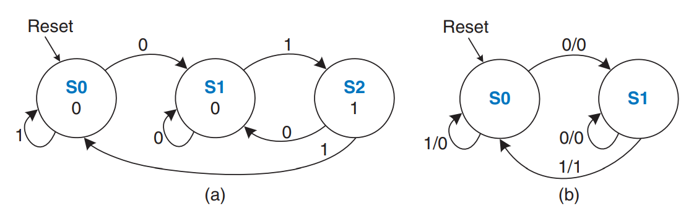<figcaption>
<strong>Figure 3.30</strong> FSM state transition diagram: (a) Moore machine; (b) Mealy machine
</figcaption></figure>

Tables 3.11 shows the state transition and output tables, respectively, for the **Moore machine**. The Moore machine requires at least two bits of state.

<figure>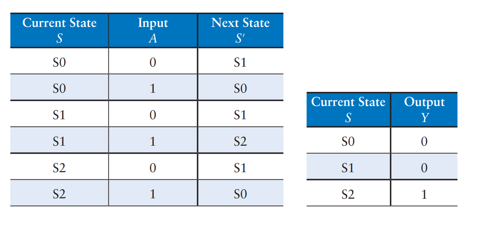<figcaption>
<strong>Table 3.11</strong> Moore state transition table and output table
</figcaption></figure>

Consider using a **binary state encoding**: S0 = 00, S1 = 01, and S2 = 10. Tables 3.12 rewrites the state transition and output tables, respectively, with these encodings.

<figure>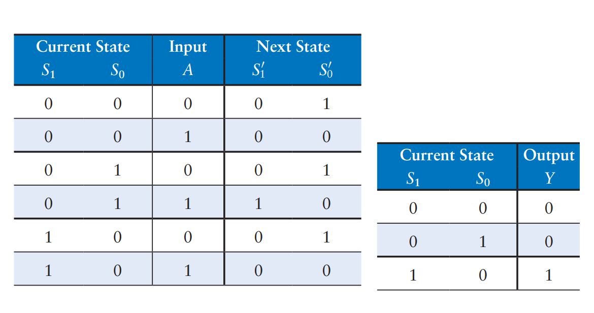<figcaption>
<strong>Table 3.12</strong> Moore state transition table and output table with sttae encodings
</figcaption></figure>

From these tables, we find the next state and output equations by inspection. Note that these equations are simplified using the fact that state 11 does not exist. Thus, the corresponding next state and output for the nonexistent state are don’t cares (not shown in the tables). We use the don’t cares to minimize our equations.

S_1'=S_0A\\S_0'=\bar{A}\\Y=S_1

Table 3.15 shows the combined state transition and output table for the **Mealy machine**. The Mealy machine requires only one bit of state. Consider using a **binary state encoding**: S0 = 0 and S1 = 1.

<figure>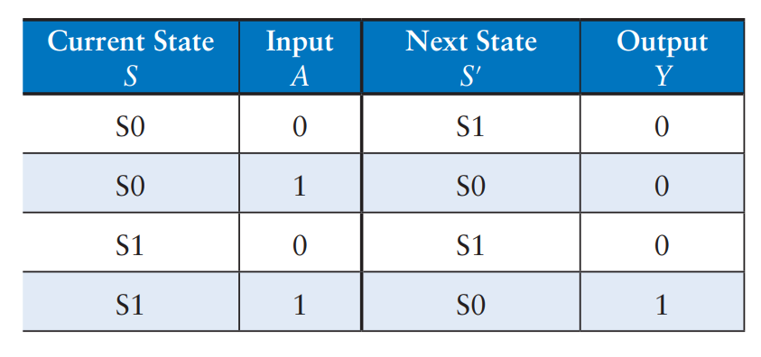<figcaption>
<strong>Table 3.15</strong> Mealy state transition and output table
</figcaption></figure>

Table 3.16 rewrites the state transition and output table with these encodings.

<figure>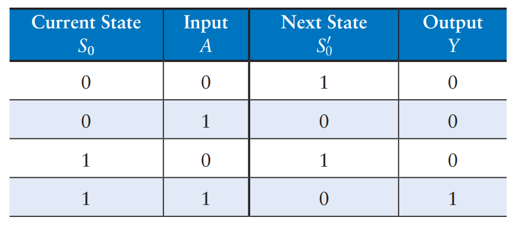<figcaption>
<strong>Table 3.16</strong> Mealy state transition and output table with state encodings
</figcaption></figure>

From these tables, we find the next state and output equations by inspection.

S_0'=\bar{A}\\Y=S_0A

The **Moore** and **Mealy** machine schematics are shown in Figure 3.31.

<figure>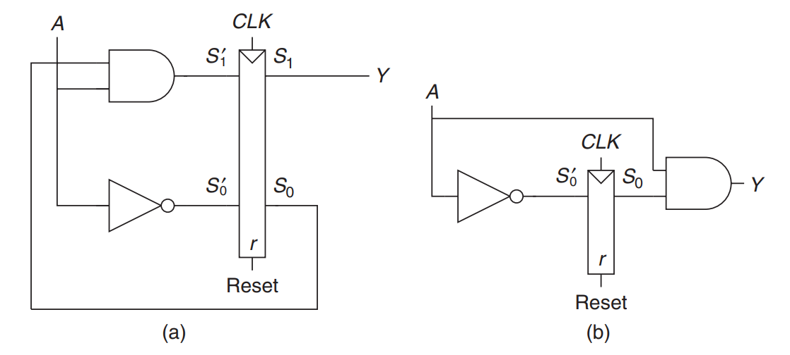<figcaption>
<strong>Figure 3.31</strong> FSM schematics for (a) Moore and (b) Mealy machines
</figcaption></figure>

The timing diagrams for each machine are shown in Figure 3.32.

<figure>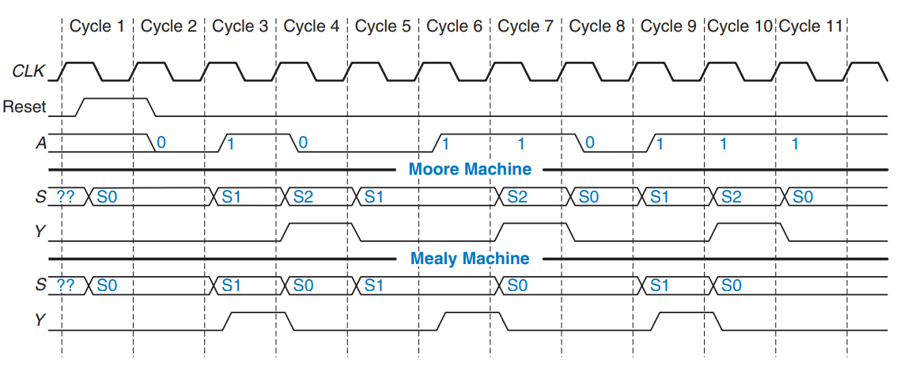<figcaption>
<strong>Figure 3.32</strong> Timing diagrams for Moore and Mealy machines
</figcaption></figure>

The two machines follow a different sequence of states. Moreover, the Mealy machine’s output rises a cycle sooner because it responds to the input rather than waiting for the state change. If the Mealy output were delayed through a flip-flop, it would match the Moore output. When choosing your FSM design style, consider when you want your outputs to respond.

## Factoring State Machines

Designing complex FSMs is often easier if they can be broken down into multiple interacting simpler state machines such that the output of some machines is the input of others. This application of hierarchy and modularity is called _factoring_ of state machines.

Example: Unfactored and Factored State Machines

Modify the traffic light controller from [above](finite-state-machines.md#fsm-design-example) to have a parade mode, which keeps the Bravado Boulevard light green while spectators and the band march to football games in scattered groups. The controller receives two more inputs: P and R. Asserting P for at least one cycle enters parade mode. Asserting R for at least one cycle leaves parade mode. When in parade mode, the controller proceeds through its usual sequence until LB turns green, then remains in that state with LB green until parade mode ends.

First, sketch a state transition diagram for a single FSM, as shown in Figure 3.33(a). Then, sketch the state transition diagrams for two interacting FSMs, as shown in Figure 3.33(b). The Mode FSM asserts the output M when it is in parade mode. The Lights FSM controls the lights based on M and the traffic sensors, TA and TB.

<figure>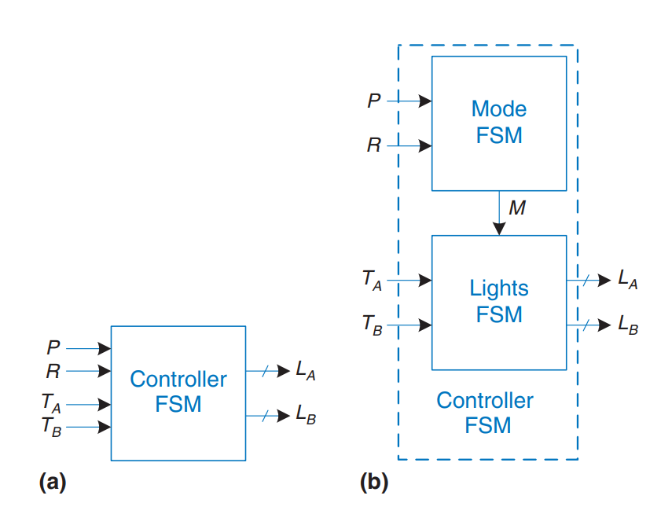<figcaption>
<strong>Figure 3.33</strong> (a) Single and (b) factored designs for modified traffic light controller FSM
</figcaption></figure>

***

**Solution**: Figure 3.34(a) shows the **single FSM design**. States S0 to S3 handle normal mode. States S4 to S7 handle parade mode. The two halves of the diagram are almost identical, but in parade mode, the FSM remains in S6 with a green light on Bravado Blvd. The P and R inputs control movement between these two halves. The FSM is messy and tedious to design.

<figure>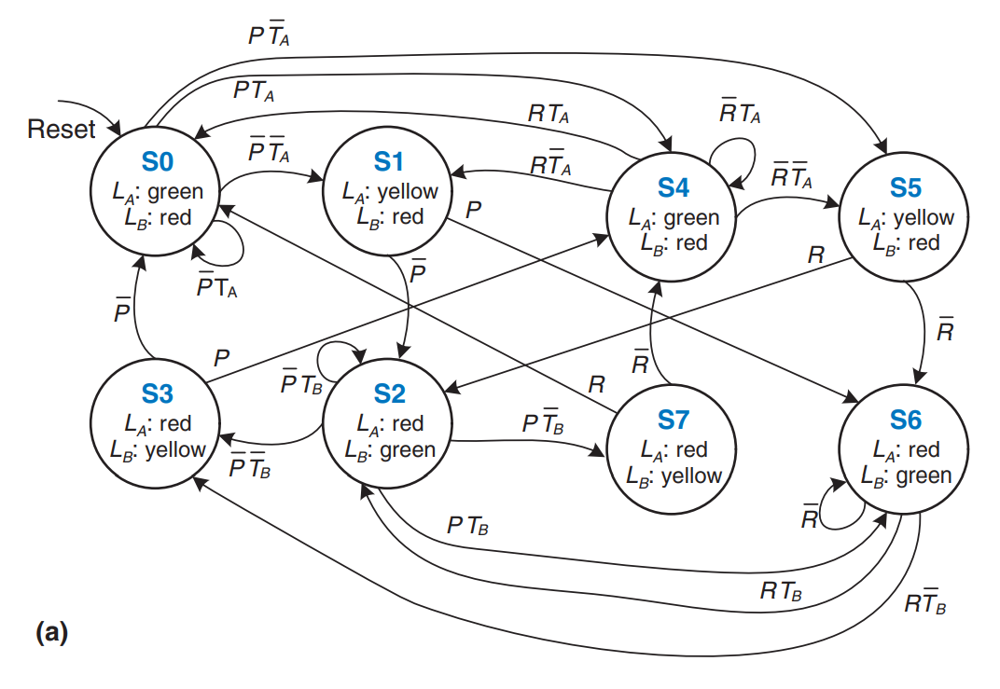<figcaption>
<strong>Figure 3.34(a)</strong> State transition diagram unfactored
</figcaption></figure>

Figure 3.34(b) shows the **factored FSM design**. The **Mode FSM** has two states to track whether the lights are in normal or parade mode. The **Lights FSM** is modified to remain in S2 while M is TRUE.

<figure>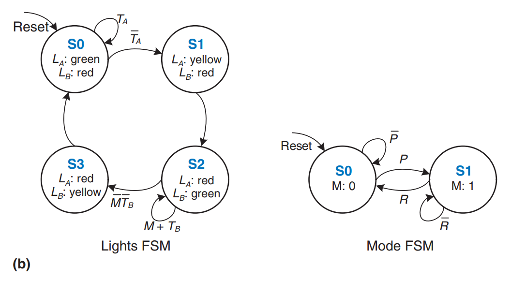<figcaption>
<strong>Figure 3.34(b)</strong> State transition diagram factored
</figcaption></figure>

## Deriving an FSM from a Schematic

Deriving the state transition diagram from a schematic follows nearly the reverse process of [FSM design](finite-state-machines.md#fsm-design-example). This process can be necessary, for example, when taking on an incompletely documented project or reverse engineering somebody else’s system.

* Examine circuit, stating **inputs**, **outputs**, and **state bits**.
* Write **next state** and **output equations**.
* Create **next state** and **output tables**.
* Reduce the next state table to eliminate unreachable states.
* Assign each valid state bit combination a name.
* Rewrite next state and output tables with state names.
* Draw **state transition diagram**.
* State in words what the FSM does.

In the final step, be careful to succinctly describe the overall purpose and function of the FSM — do not simply restate each transition of the state transition diagram.

Example: Deriving an FSM from its circuit

Alyssa P. Hacker arrives home, but her keypad lock has been rewired and her old code no longer works. A piece of paper is taped to it showing the circuit diagram in Figure 3.35. Alyssa thinks the circuit could be a finite state machine and decides to derive the state transition diagram to see whether it helps her get in the door.

<figure>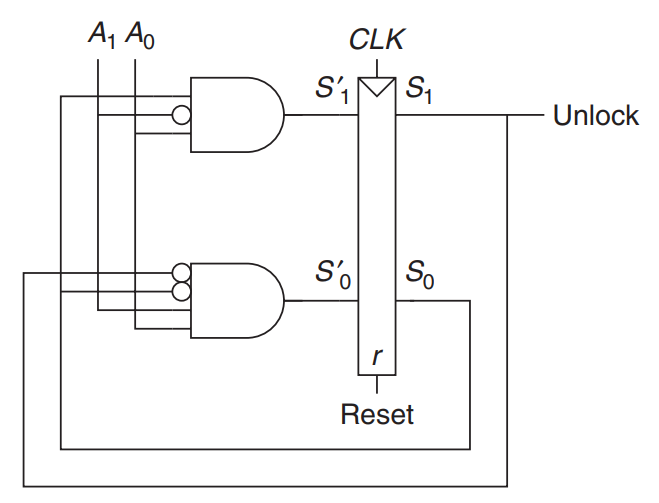<figcaption>
<strong>Figure 3.35</strong> Circuit of found FSM
</figcaption></figure>

***

**Solution**: Alyssa begins by examining the circuit. The **input** is A1:0 and the **output** is Unlock. The **state bits** are already labeled in Figure 3.35. This is a **Moore machine** because the output depends only on the state bits. From the circuit, she writes down the **next state** and **output equations** directly:

S_1'=S_0\bar{A_1}A_0\\S_0'=\bar{S_1}\bar{S_0}A_1A_0\\\text{Unlock}=S_1

Next, she writes down the **next state** and **output tables** from the equations, as shown in Tables 3.17, first placing 1’s in the tables as indicated by the equation above. She places 0’s everywhere else.

<figure>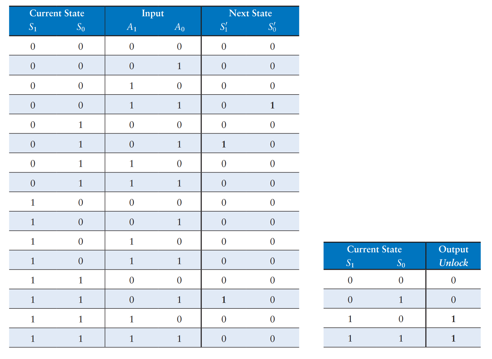<figcaption>
<strong>Table 3.17</strong> Next state table and output table derived from circuit in Figure 3.35
</figcaption></figure>

Alyssa reduces the table by removing unused states and combining rows using don’t cares. The **S****1:0****&#x20;= 11** state is never listed as a possible next state in Table 3.17, so rows with this current state are removed. For current state **S****1:0****&#x20;= 10**, the next state is always **S****1:0****&#x20;= 00**, independent of the inputs, so don’t cares are inserted for the inputs. The reduced tables are shown in Tables 3.18.

<figure>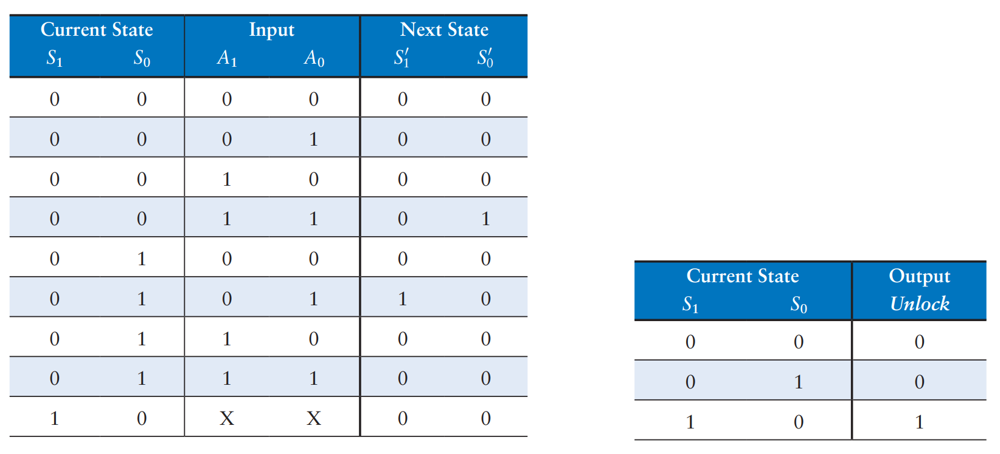<figcaption>
<strong>Table 3.18</strong> Reduced next state and output table
</figcaption></figure>

She assigns names to each **state** bit combination: **S0** is S1:0 = 00, **S1** is S1:0 = 01, and **S2** is S1:0 = 10. Tables 3.19 shows the **next state** and **output tables** (combined) with state names.

<figure>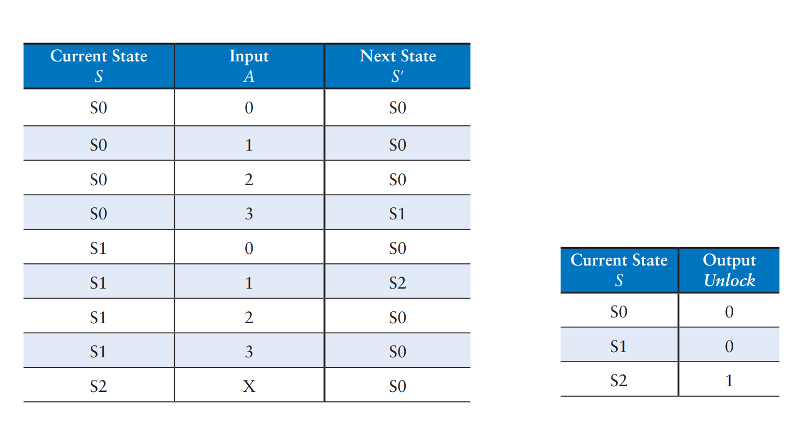<figcaption>
<strong>Table 3.19</strong> Symbolic next state and output table
</figcaption></figure>

## FSM Review

Finite State machines are a powerful way to systematically design sequential circuits from a written specification. Use the following procedure to design an FSM:

1. Identify the inputs and outputs.
2. Sketch a state transition diagram
3. For a Moore machine:
   1. Write a state transition table
   2. Write an output table
4. For a Mealy machine: Write a combined state transition and output table
5. Select state encodings — your selection affects the hardware design
6. Write Boolean equations for the next state and output logic
7. Sketch the circuit schematic
