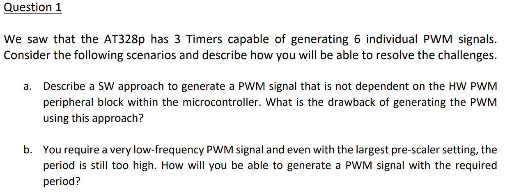
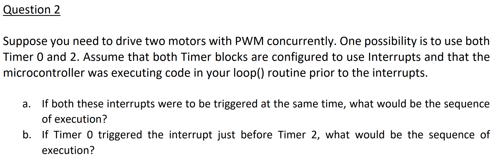
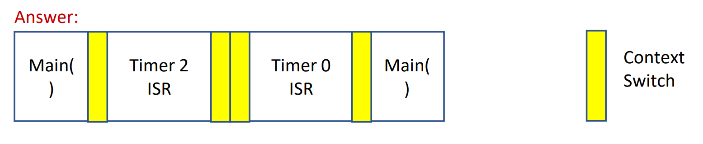
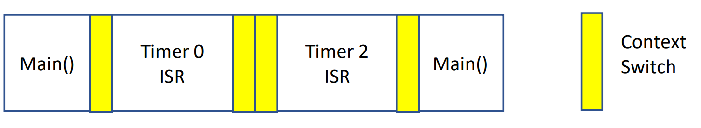
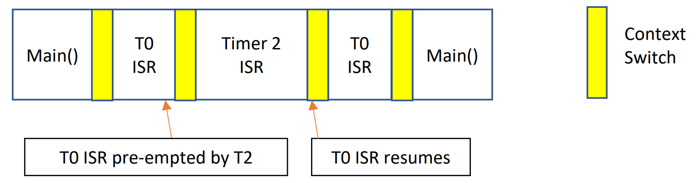
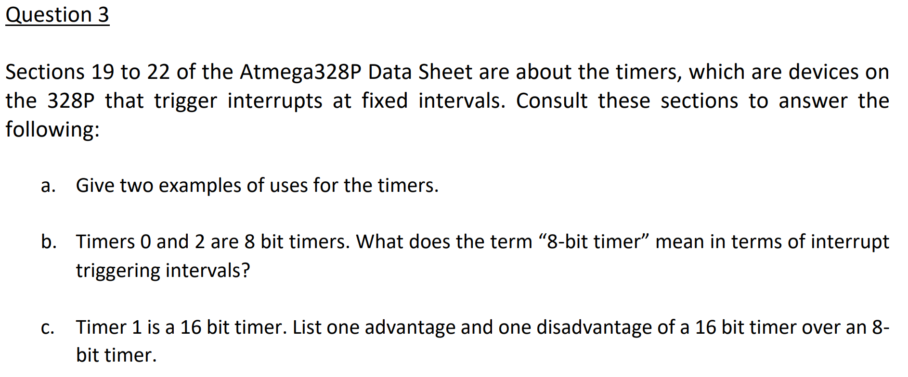
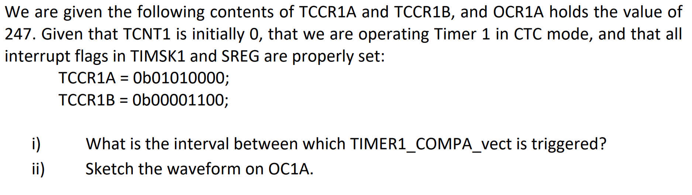
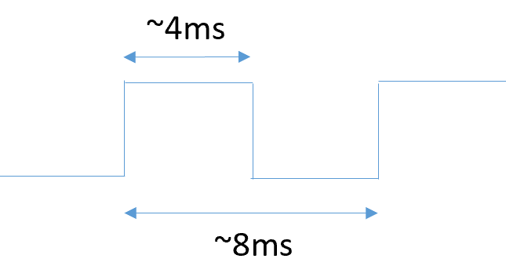
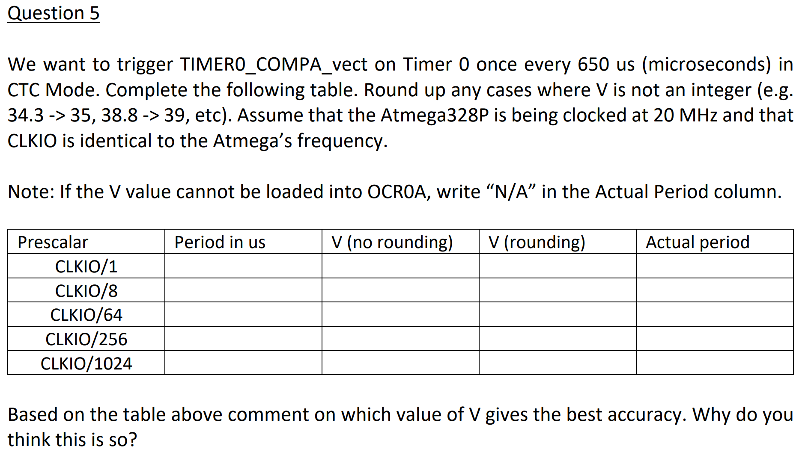

# Tut 2 - PWM and Timers

## 01. Understanding the PWM Module

### Question

<figure><figcaption></figcaption></figure>

### Solution



**SW approach to generate PWM**

The pseudo-code (or step) is shown as follows:

1. Configure Pin as output
2. Set as ‘1’
3. Delay for ‘T-on’
4. Set as ‘0’
5. Delay for ‘T-off’
6. Loop to Step 2

With this approach, the microcontroller is continuously executing the loop to generate the required PWM. As such, **it can't do anything else** more productive. Furthermore, if there are interrupts in the system, the **timing characteristics for the PWM will also be affected**.

When the peripheral block is used to generate the PWM, **only the initial setup code needs to be executed**. Subsequently, it is driven by the HW with minimal processing time in the Interrupts.



**Decrease the PWM frequency / Increase the PWM Period**

Use the ISR to keep track of the number of Interrupts and then toggle the output pin accordingly. In this approach, we **cannot** allow the Timter/Counter Module to control the pin directly. The ISR needs to handle it.


This idea actually borrows the `THRESHOLD` from [#debouncing](../studio/studio-5-timers.md#debouncing "mention")!




### Takeaway

The PWM we have learned in [studio-4-pwm-programming.md](../studio/studio-4-pwm-programming.md "mention") is actually achieved using **Hardware**. Briefly speaking, PWM is achieved by the Timer/Counter Module on ATmega328p.

## 02. Timer Interrups

### Question

<figure><figcaption></figcaption></figure>

### Solution



**Concurrent Trigger**

**Interrupt Priority**

Remember the Interrupt Vector Table? Each ISR has an address, and

> The **lower the addres**s **the higher is the priority level**.

<figure><figcaption>
Interrupt Vector Table (
</figcaption></figure>

***

So, we can see from above that Timer 2's interrupt has **higher priority** than Timer 1's interrupt. Thus, the executing flow will be as follows:

<figure><figcaption></figcaption></figure>

**Explanation**:

* **Main Loop Running:** The system (or loop()) is executing normally.
* **Timer2 Interrupt Triggers:** Timer2’s interrupt has **higher priority**. Thus it occurs first, so the controller immediately jumps to execute Timer2’s ISR.
* **Timer0 Interrupt Flag Set:** While Timer2’s ISR is running, if Timer0’s interrupt occurs, it cannot preempt Timer0. Instead, the **Interrupt Flag** is set for Timer0's interrupt.
* **ISR Completion & Context Switch:** Once Timer2’s ISR completes, the processor returns to the main loop.
* **Timer0 ISR Execution:** The pending Timer0 flag then triggers the Timer0 ISR, which is executed next.



**Sequential Trigger but in reverse priority level**

**Nested Interrupts are disabled**

<figure><figcaption></figcaption></figure>

By default, Nested Interrupts are **disabled**. When Timer 0 triggers the interrupt first, the controller will jump to Timer 0 ISR and start executing. When Timer 2 triggers, the event is captured by the **Interrupt Flag**, but the current ISR will complete execution and perform a context switch to the loop(). At this time, the flag will cause the jump to the Timer 2 ISR.

***

**Nested Interrupts enabled**

<figure><figcaption></figcaption></figure>

If **nested interrupts** are **enabled**. Then, the execution flow will flow normally as shown above.

***

**Very good explanation from ATmega328p datasheet (P32)**

> There are basically two types of interrupts:
>
> The first type is triggered by an event that sets the **Interrupt Flag**. For these interrupts, the Program Counter is vectored to the actual Interrupt Vector in order to execute the [interrupt handling routine](#user-content-fn-1)[^1], and hardware **clears the corresponding Interrupt Flag**. Interrupt Flags can also be cleared by writing a logic one to the flag bit position(s) to be cleared. If an interrupt condition occurs while the corresponding interrupt enable bit is cleared, the **Interrupt Flag will be set and remembered until the interrupt is enabled**, or the flag is cleared by software. Similarly, if one or more interrupt conditions occur while the Global Interrupt Enable bit is cleared, the corresponding Interrupt Flag(s) will be set and remembered until the Global Interrupt Enable bit is set, and will then be executed by order of priority.
>
> The second type of interrupts will trigger as long as the interrupt condition is present. These interrupts do not necessarily have Interrupt Flags. If the interrupt condition disappears before the interrupt is enabled, the interrupt will not be triggered. When the AVR exits from an interrupt, it will always return to the main program and execute one more instruction before any pending interrupt is served.



### Takeaway

1. The idea of **Context Switch** when dealing with the execution of ISR is very important and should be **remembered** and **practiced** in the future thinking!

## 03. Timers Basics

### Question

<figure><figcaption></figcaption></figure>

### Solution



**Real-world application of Timers**

* Configure to trigger once per second then write a soft real-time clock. E.g. at [https://bitbucket.org/ctank/smarttimer/src/master/](https://bitbucket.org/ctank/smarttimer/src/master/)
* Used in operating systems to switch between tasks in a multitasking environment, to simulate multiple processes running on a single CPU.

***

**Explanation for the second application - multitasking on a single CPU**

This is mainly done thanks to the **interrupts triggered by the Timer/Counter Module**.

The timer triggers interrupts at regular intervals (typically milliseconds), forcing the CPU to temporarily stop executing the current process, save its state, and transfer control to the operating system's scheduler. The scheduler then selects the next process to run, loads its saved context, and gives it control of the CPU until the next timer interrupt occurs.

This predictable, hardware-driven context switching ensures that no single process can monopolize the CPU, regardless of what it's doing. The timer interrupts effectively slice CPU time into small chunks, creating the illusion that multiple processes are running simultaneously on a single CPU core.



**Timer 0 and Timer 2 on ATmega328p**

* The main counter `TCNT0` / `TCNT2` only counts from 0 to 255.
* Based on table 19-10 in the datasheet, the largest **timer frequency** is $$\frac{\text{CLK}_{\text{I/O}}}{1024}$$
* On the Arduino $$\text{CLK}_{\text{I/O}}$$ is equal to the system clock which is 16MHz, and thus the largest timer frequency is $$16000000\div1024 = 15625 \text{ Hz}$$.
* This works out to $$\frac{1}{15625}=0.000064\text{ seconds}$$ between each increment of Timer 0 and Timer 2.&#x20;
* The [**largest interval**](#user-content-fn-2)[^2] for Timer 0 and Timer 2 is therefore 0.000064 x 255 = 0.01632 seconds. (The largest **half-period** of of the waveform generated by Timer 0 and Timer 2)



**Timer 1 on ATmega328p**

**Advantage:**

Timer 1 counter TCNT1 is 16 bits long, having a maximum value of 65535.

The largest resolution is again 0.000064 seconds (Table 20-7), giving us a maximum interval of 65535 x 0.000064 = 4.1924 seconds.

It is thus possible to **set intervals of over a second**. (We can have **longer period** for our waveform)

**Disadvantage:**

The Timer 1 registers `TCNT1`, `OCR1A` and `OCR1B` are all twice as large as those in Timers 0 and 2 (16-bit), requiring more programming to set them up (since the 328P can only set the registers up 8 bits at a time), and occupying more space on the chip.



### Takeaway

1. From the real-world application of Timers, we've seen that the **importance** of triggering Interrupts. It can achieve multitasking on one CPU.
2. From the contrast between Timer2/0 and Timer 1 on ATmega328p, we've seen the importance of **deriving the maximum period** for the waveform generated by these Timers.

## 04. Timers Setup

### Question

<figure><figcaption></figcaption></figure>

### Solution



**Interval Calculation**

> **Interval** refers to the time period between consecutive events or triggers.

In this context, the interval means **the time period between consecutive triggerings of this interrupt**. (`TIMER1_COMPA_vect`)

***

* The prescalar is `0b100` which is 256.
* At 16MHz, the **period** is $$\frac{256}{16000000}=16~\mu s$$.
* The period therefore is $$(247+1)\times 16\mu s=3.968\text{ ms}$$


Remember to +1 on the `OCRnA` value when calculating either **period** or **frequency** undert CTC Mode.




**Sketch the Waveform**

There is a match approx. once per 4ms, and the `COM1A0` and `COM1A1` bits are `0b01`, which is a “toggle on match”.

Hence we get a square wave of period of about 8ms.

<figure><figcaption></figcaption></figure>



### Takeaway

1. The concept of **interval**, which means "the time period between consecutive events or triggers" is **important!**
2. The way to deal with `OCRnA` value under CTC Mode also needs to pay attention to.
   1. When you know `OCRnA` value and want to use it to calculate **period/frequency** of the waveform you want to generate, **+1**
   2. When you know the **period/frequency** of the waveform you want to generate and want to use it to calculate the `OCRnA` value, **-1.**
3. Know how to read the information given the setup of the **registers** and **vice versa**, this will be the classic **quiz quesitions** for Quiz 1.

## 05. Timers Variant

### Question

<figure><figcaption></figcaption></figure>

### Solution

Filling in the table, we get

| Prescalar                        | Period in us (Timer Resolution)           | V (no rounding)             | V (rounding) | Actual period                |
| -------------------------------- | ----------------------------------------- | --------------------------- | ------------ | ---------------------------- |
| $$\text{CLK}_{\text{I/O}}/1$$    | $$1\div 20\text{ MHz}=0.05\mu s$$$$1\di$$ | N/A (Bigger than 255)       | N/A          | N/A                          |
| $$\text{CLK}_{\text{I/O}}/8$$    | $$8\div 20\text{ MHz}=0.4\mu s$$          | N/A (Bigger than 255)       | N/A          | N/A                          |
| $$\text{CLK}_{\text{I/O}}/64$$   | $$64\div 20\text{ MHz}=3.2\mu s$$         | $$650\div 3.2=203.125$$     | 204          | $$204\times 3.2=652.8\mu s$$ |
| $$\text{CLK}_{\text{I/O}}/256$$  | $$256\div 20\text{ MHz}=12.8\mu s$$       | $$650\div 12.8=50.78125$$   | 51           | $$12.8\times51=652.8\mu s$$  |
| $$\text{CLK}_{\text{I/O}}/1024$$ | $$1024\div 20\text{ MHz}=51.2\mu s$$      | $$650\div 51.2=12.6953125$$ | 13           | $$51.2\times 13=665.6\mu s$$ |

Prescalar of 64 and 256 give the **same accuracy** while prescalar of 1024 gives very **poor accuracy**.

In general the smaller a prescalar is, the more **accurate** the timing would be (because of the higher **timer resolution**). Of course this will also depend on the rounding error.

Thus, the prescaler of 64 is the **best choice**.

### Takeaway

1. When rounding the **V** value (which we will use it minus 1 as our `OCRnA` value), we always **round up**.

[^1]: a.k.a ISR

[^2]: The largest time interval for the Output Compare Pin to stay at  HIGH or LOW. (Given that you don't want always stay at HIGH or LOW)
