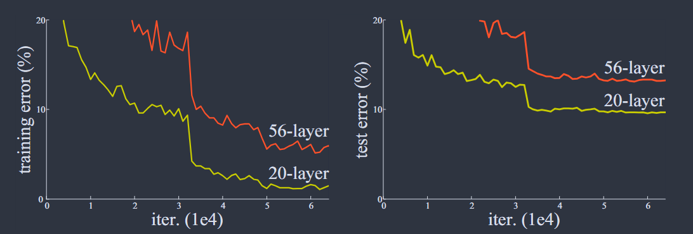
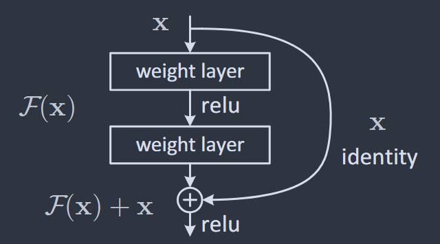

# Residual Neural Network

## Introduction


This part is mainly from He's famous paper on Deep Residual Learning for Image Recognition, feel free to go back and read the paper again at any time! It's very worth reading!


In this section, we will introduce the backbone of ResNet — _Deep Residual Learning_ framework by starting from a problem

> How can we learn better networks?

Remember that in an [MLP](multilayer-perceptron.md#why-order-neurons-into-layers), different layers can learn features at different levels of abstraction. Earlier layers tend to learn simpler patterns, while deeper layers combine these patterns into more complex, higher-level features that are more useful for producing the final output.

By stacking multiple layers, a deep neural network can learn a hierarchy of features — often described as low-, mid-, and high-level representations — in an end-to-end multilayer manner. Ideally, the "levels" of features can be enriched by the number of stacked layers (depth).

However, more and more papers and experiments show that this is **not true**! The authors of _"Deep Residual Learning for Image Recognition"_ thus come up with a very thought-provoking question:

> Is learning better networks as easy as stacking mroe layers?

This is obviously **not true** because of the problem of [_vanishing/exploding gradients_](https://en.wikipedia.org/wiki/Vanishing_gradient_problem)_,_ which can be understood as the problem of greatly diverging [gradient](https://en.wikipedia.org/wiki/Gradient) magnitudes between **earlier** and **later layers** encountered when training neural networks with backpropagation.

However, this vanishing/exploding gradient problem can be mitigated by several techniques, including:

1. **Proper Weight Initialization:** Initialize **weights** at an appropriate scale so that activations and gradients do not become extremely large or small as they pass through many layers.
2. **Normalization Layers:** Layers such as [_Batch Normalization_](https://en.wikipedia.org/wiki/Batch_normalization) normalize intermediate activations during training by adjusting the inputs to each layer — re-centering them around zero and re-scaling them to a standard size. This can make training more stable and often allows deep networks to converge faster.

When deeper networks are able to start converging, a _degradation_ problem has been exposed: with the network depth increasing, accuracy gets saturated (which might be unsurprising) and then degrades rapidly. Unexpectedly, such degradation is not caused by _overfitting_, which can be briefly understood as having low training error but high test error, and adding more layers to a suitably deep model leads to **higher training errors**. The following figure shows a typical example.

<figure><figcaption>
Training error (left) and test error (right) on CIFAR-10 with 20-layer and 56-layer "plain" networks.
</figcaption></figure>

The degradation (of training accuracy) indicates that not all systems are similarly easy to optimize. Let us consider a shallower architecture and its deeper counterpart that adds more layers onto it. There exists a solution by construction to the deeper model: the added layers are _identity mapping_, and the other layers are **copied** from the learned shallower model. The existence of this constructed solution indicates that a deeper model should produce no higher training error than its shallower counterpart. But experiments show that our current solvers on hand like stochastic gradient descent (SCD) are unable to find solutions that are comparably good or better than the constructed solution (or unable to do so in feasible time), meaning that the solutions found by the current solvers are **neither** identity maps **nor** mappings that are better than identity maps.

In He's paper, the authors address this degradation problem by introducing a _deep residual learning_ framework. Instead of hoping each few stacked layers directly fit a desired underlying mapping, we explicitly let these layers fit a **residual mapping**. Formally, denoting the desired underlying mapping as $$H(x)$$, we let the stacked nonlinear layers fit another mapping of $$F(x):=H(x)-x$$ (This is called the **residual mapping**). The original mapping is recast into $$F(x)+x$$. We hypothesize that it is easier to optimize the residual mapping than to optimize the original, unreferenced mapping.


To the extreme, if an identity mapping were optimal, it would be easier to push the **residual to zero** than to fit an identity mapping by a stack of nonlinear layers.


The formulation of $$F(x)+x$$ can be realized by feedforward neural networks with "shortcut connections" (Fig. 2). **Shortcut connections**
&#x20;are those skipping one or more layers. In our case, the shortcut connections simply perform identity mapping, and their outputs are added to the outputs of the stacked layers (Fig. 2).

<figure><figcaption>
Figure 2: Residual learning: a building block
</figcaption></figure>

Identity shortcut connections add neither extra parameter nor computational complexity. The entire network can still be trained end-to-end by SGD with backpropagation, and can be easily implemented using common libraries without modifying the solvers.

## References

1. [Deep Residual Learning for Image Recognition by Kaiming He](https://arxiv.org/abs/1512.03385).
2. [The interpretation of He's paper by Mu Li](https://www.bilibili.com/video/BV1P3411y7nn/?share_source=copy_web\&vd_source=38953bcabbabbab600e123d8740d5a8a).

