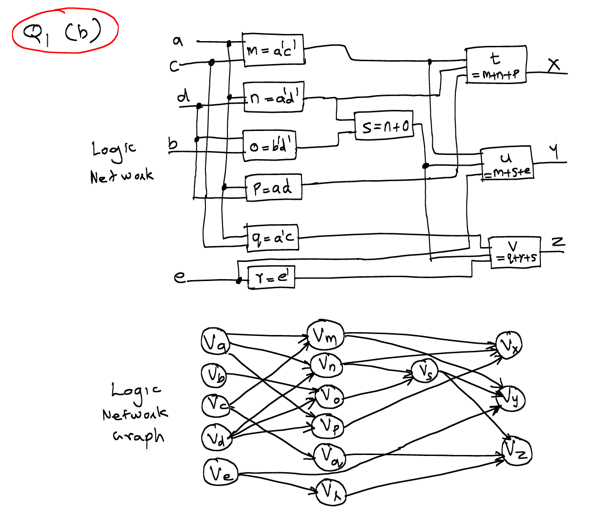
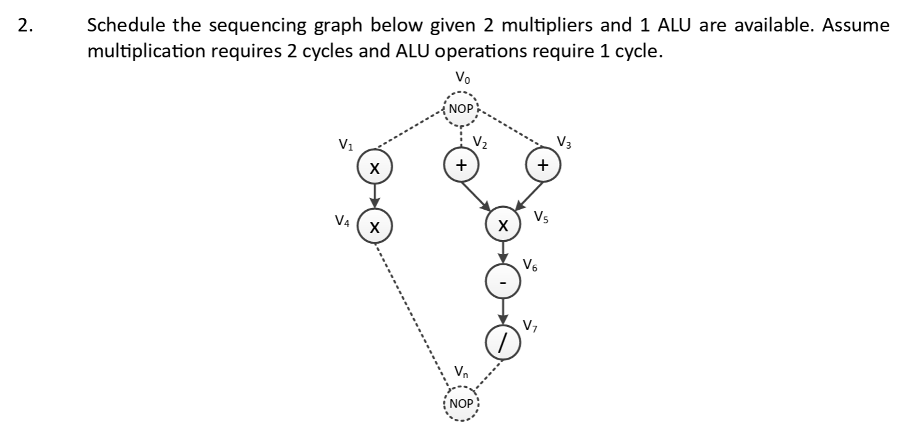
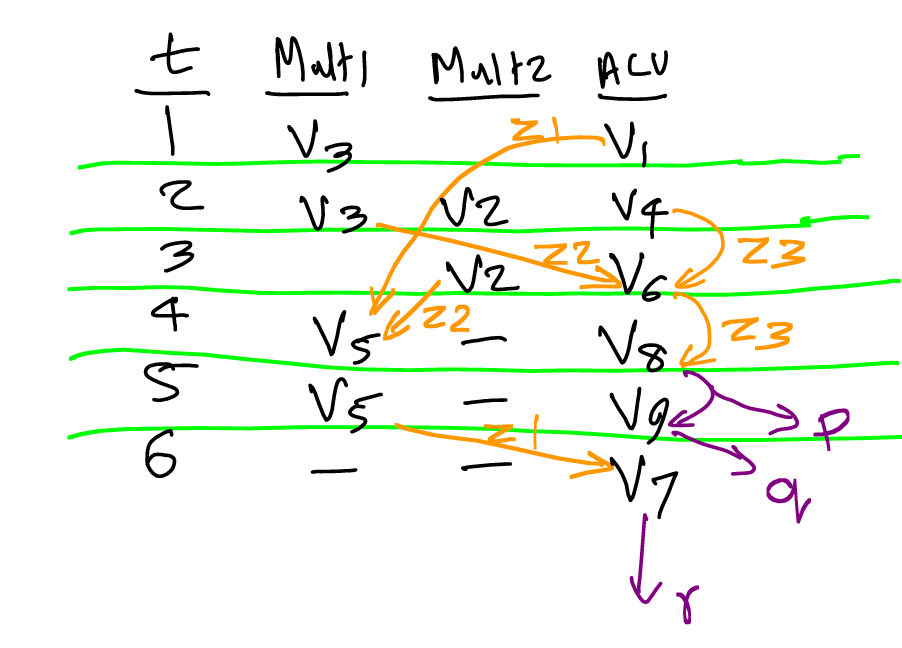

---
metaLinks:
  alternates:
    - /broken/spaces/W45nwClYZdzz9MQG1dUb/pages/Bs5pn2autAi2VruUo8aL
---

# Problem Set 1

## Problems

### 1. Netlist and Logic Network

<figure><figcaption></figcaption></figure>

#### Structural Netlist

> **Netlist** is used to represent a **structure** which is nothing but a bunch of blocks[^1] and their interconnections.

This question is a classic [**structure**](https://app.gitbook.com/s/W45nwClYZdzz9MQG1dUb/micheli/hardware-modeling/abstract-models#structure) hardware model question, where we have three choices to model the structural netlist:

1. Incidence netlist/matrix, where the netlist can have two flavors:
   1. module-oriented netlist.
   2. net-oriented netlist.
2. Hypergraph
3. Bipartite graph

#### Logic Network

> A [**logic network**](https://app.gitbook.com/s/W45nwClYZdzz9MQG1dUb/micheli/hardware-modeling/abstract-models#logic-networks) is nothing but **one block**, which has **multiple/one inputs** and **only one output**. While a **logic network graph** is to implement that **logic network** with one big block using [smaller blocks](#user-content-fn-2)[^2].
>
> * A **synchronous logic network graph** would be just to add the **registers** on the **edges** of a normal logic network graph.

The detailed logic network and logic network graph is shown as follows.

<figure><figcaption></figcaption></figure>

However, for the logic network (not logic network graph), we can just draw three big black boxes shown as follows.

<figure><figcaption></figcaption></figure>

### 2. Scheduling

<figure><figcaption></figcaption></figure>

This is a classic scheduling problem and one good way to do the scheduling problem is to draw a table whose column represents the clock cycle and the row represents the resouces. For example,

| Cycle | Multiplier1 | Multiplier2 | ALU |
| ----- | ----------- | ----------- | --- |
| 1     | V1          | —           | V2  |
| 2     | V1          | —           | V3  |
| 3     | V4          | V5          | —   |
| 4     | V4          | V5          | —   |
| 5     | —           | —           | V6  |
| 6     | V7          | —           | —   |
| 7     | V7          | —           | —   |

### 3. Binding

<figure><figcaption></figcaption></figure>

In this question, we need to do two bindings:

1. Resource Binding
2. Register Binding

#### Resource Binding

This is just to come up with a table summarizing the resource binding function $$\beta$$ to each resource type. For example, my binding for this problem is shown in the following table with the following conventions used:

* Resource type: 1 means multiplier and 2 means ALU
* Resource instance: Followed by the resource type

| Operation | Binding Function |
| --------- | ---------------- |
| V1        | (2, 1)           |
| V2        | (1, 2)           |
| V3        | (1, 1)           |
| V4        | (1, 1)           |
| V5        | (1, 1)           |
| V6        | (1, 1)           |
| V7        | (2, 1)           |

#### Register Binding

The register binding is more complex here. But as long as we get the trick, it won't be that hard. To do the register binding, we need to draw the non-register sharing diagram from the **scheduled** sequencing graph, which may look like something below:

<figure><figcaption></figcaption></figure>

The <mark style="color:red;">red</mark> vertical arrow is the key in the problem! It starts at the next cycle of the starting node and ends at the end of the cycle of the ending node! After drawing this kind of diagram, we can see easily which register can be shared.

Rationale behind this technique

The reason we are starting at the next cycle is due to the nature of the register. Let's take the register $$Z_1$$ from the graph above as an example. In cycle 1, the data is fed into the D port of the D Flip-flop/register, the register can only "broadcast" this new value at the next clock edge. That's why we start at the next cycle.

Same thing for the ending point, which is at the end of the cycle of the ending node. Similarly, this is also because the new data will only take effect at the next clock cycle!


Register binding can be thought of as **labelling** the edges in the CDFG!


### 4. Combine Everything

In short, all the things we have seen here covers most of the [lec-05-microarchitecture-design.md](../lec/lec-05-microarchitecture-design.md "mention") content. This thing can only be done either by HLS tools or by humans.

#### Draw the CDFG

In the CDFG drawing, by default we assume that there is no resource sharing! Thus, the CDFG for this question will look like as follows:

<figure><figcaption></figcaption></figure>

#### Scheduling

> When we have two vertices which we are not sure which one can be issued first, look at their distance to the sink node, whichever has a shorter distance should be issued later!
>
> In scheduling, if the constraint is resources, we should aim for **lowest latency**. If the constraint is **latency**, we should aim for **minimum resources** used.

The final scheduling table we have is shown as follows:

| t | Mult1 | Mult2 | ALU |
| - | ----- | ----- | --- |
| 1 | V3    | —     | V1  |
| 2 | V3    | V2    | V4  |
| 3 | —     | V2    | V6  |
| 4 | V5    | —     | V8  |
| 5 | V5    | —     | V9  |
| 6 | —     | —     | V7  |


The result after scheduling can be a table like above or it can be a scheduled CDFG graph! There is no difference between them! Also pay attention that the shifting by a variable amount operation needs an ALU to implement!


#### Resource Binding

Based on the scheduling table, the binding table will be very trivial and thus will be omitted here.

#### Register Binding

The ultimate goal of doing the register sharing here is that

> We are **labeling** the **edges** in the scheduled CDFG with the regsiter name!

To do the register sharing, we can use the technique we have learned in the [previous problem](problem-set-1.md#register-binding):

1. The scheduling table
2. The scheduled CDFG

There is no difference between them, so my suggestion is to use whichever you prefer and then use the other to check the correctness during the final! One example of using the scheduling table to do the register sharing is shown as follows:

<figure><figcaption></figcaption></figure>

The exact technique we've learned [previously](problem-set-1.md#register-binding) on which register is kept for how long can be used here. For example, the register $$Z_1$$ is kept from cycle 2 to cycle 4 and will be reused in cycle 6.


The output signals **automatically** has a register that can be shared with others if possible! For example, in this question, we have three outputs: $$p,q,r$$. Inherently, they are all registers, so from vertice $$V_8$$->$$V_9$$, the $$p$$ register can be used!


Tips to minimize the multiplexers at the intermediate/output registers

To minimize the multiplexers at the intermediate/output registers, we try to make the arrows coming out from a certain resource to use the **same register**!

#### Datapath Synthesis

This part is a very classic problem! And I have summarized somes steps/tips for doing this kind of question. But before that, let's look at the solution first.

<figure><figcaption></figcaption></figure>

Actually, as $$Z3$$ is duplicated, we can make the second 6-to-1 multiplexer into a 5-to-1 multiplexer.

<figure><figcaption></figcaption></figure>



**Derive the Inputs of the Resources**

In this step, our focus should be the **resources**, like Mult1, Mult2 and ALU1. To find the input to these resources, we need to look at the scheduled table after we did the [register binding](problem-set-1.md#register-binding). For example, for multiplier 1, it can do two operations:

1. $$V_3$$: Inputs are $$e$$ and $$f$$.
2. $$V_5$$: Inputs are $$Z1$$ and $$Z2$$.

Thus, there should be two 2-to-1 multiplexer at multiplier 1's inputs. A quick trick is to look at how many operations that a certain resource can do, let's say $$n$$, this will indicate the size of the 2 multiplexers at the resource's input, like $$n$$-to-1 multiplexer. Same for the rest two resources.


Note that in the ALU1, the register $$Z3$$ is reused so we duplicate it to the second and third port of the 6-to-1 multiplexer.




**Derive the outputs of the Resources**

In this step, our focus should be the **output registers and the intermediate resgiters**! We need to find out the input into these registers may come from which resource! For exampe, for the register $$Z1$$, from the scheduled table after register binding, we find out that, $$Z1$$ can actually be written by:

1. ALU1, or
2. Multiplier 1

Thus, there should be a multiplexer in front of $$Z1$$. Same for the rest 5 registers.



#### Control Unit Synthesis

This is a classic control unit synthesis question! To solve this question, we also need the **scheduled table** after doing the register binding! The steps I do this question are as follows:



**Form the Columns of the table**

The columns of the control unit table should contain

1. All the multiplexer select signals
2. Resource signals (like ALU control signals, etc)
3. Intermediate and Output register write enable signals



**Fill in the table cycle by cycle**

When filling the table, do it systemetically based on the scheduled table after register binding! By which I mean

1. First find out the arrow coming from a resource in the scheduled table, and make the write enable of that register to 1. For example, in cycle 1, $$Z1$$ is coming out from operation $$V_1$$ to operation $$V_5$$, then the $$Z1$$ write enable should be 1.
2. Find out the operations done in that cycle and decide the resource signals and multiplexer signals.


If a regsiter is not written in one cycle, its multiplexer signal is don't care (X) and its write enable is 0.




The complete control unit synthesis table is shown below, assuming that a horizontal microprogrammed controller is used.

| Cycle | M1 | M2 | M3 | M4 | M5  | M6  | p\_en | q\_en | r\_en | z1\_en | z2\_en | z3\_en | ALUctl |
| ----: | -- | -- | -- | -- | --- | --- | ----- | ----- | ----- | ------ | ------ | ------ | ------ |
|     1 | 0  | 0  | 1  | X  | 000 | 000 | 0     | 0     | 0     | 1      | 0      | 0      | 000    |
|     2 | 0  | 0  | X  | 0  | 001 | 001 | 0     | 0     | 0     | 0      | 1      | 1      | 000    |
|     3 | X  | X  | X  | 1  | 010 | 010 | 0     | 0     | 0     | 0      | 1      | 1      | 010    |
|     4 | 1  | 1  | X  | X  | 011 | 010 | 1     | 0     | 0     | 0      | 0      | 0      | 001    |
|     5 | 1  | 1  | 0  | X  | 100 | 011 | 0     | 1     | 0     | 1      | 0      | 0      | 001    |
|     6 | X  | X  | X  | X  | 101 | 100 | 0     | 0     | 1     | 0      | 0      | 0      | 001    |

#### Control Unit Optimization

Some techniques available to reduce the **row width**, a.k.a, control-store word size, of the controlled unit implemented using microprogramming are introduced as follows:



**Combine the identical columns**

In this case, the columns M1, M2 can be combined and the columns Z2\_en and Z3\_en can be combined as well.



**Combine the mutually exclusive columns**

In this case, the p\_en, q\_en and r\_en are mutually exclusive and thus we can combine them together and use a 2-bit representation for that.


The reason for using 2 bits is because 3+1 (NOP) can be represented using 2 bits. Remember to leave one space for the NOP!




**Combine the columns with an explicit shift pattern**

This can be done if we use the **unoptimized version** of the second multiplexer at the ALU, but this may cause the fact that we have two 6-to-1 multiplexers now.



**Simplify the ALU control signals**

This is purely dependant on the ALU design. If the question says we can change that, then it is okay to do so. Otherwise, just leave it untouched.



After doing all the optimizations mentioned above, the optimized control unit table is shown as follows.

| Cycle | M12 | M3 | M4 | M56 | pqr\_en | z1\_en | Z23\_en | ALUctl |
| ----: | --- | -- | -- | --- | ------- | ------ | ------- | ------ |
|     1 | 0   | X  | 1  | 000 | 00      | 1      | 0       | 000    |
|     2 | 0   | 0  | X  | 001 | 00      | 0      | 1       | 000    |
|     3 | X   | 1  | X  | 010 | 00      | 0      | 1       | 010    |
|     4 | 1   | X  | X  | 011 | 01      | 0      | 0       | 001    |
|     5 | 1   | X  | 0  | 100 | 10      | 1      | 0       | 001    |
|     6 | X   | X  | X  | 101 | 11      | 0      | 0       | 001    |

[^1]: If you think of them as **logic gates**, life will be a lot easier. But, just keep in mind, a block doesn't need to be exactly **one** logic gate. Later you will see that a **block** is nothing but an operator with **multiple/one input** and **only one output.**

[^2]: The smaller blocks can be the fundamental logic gates.
