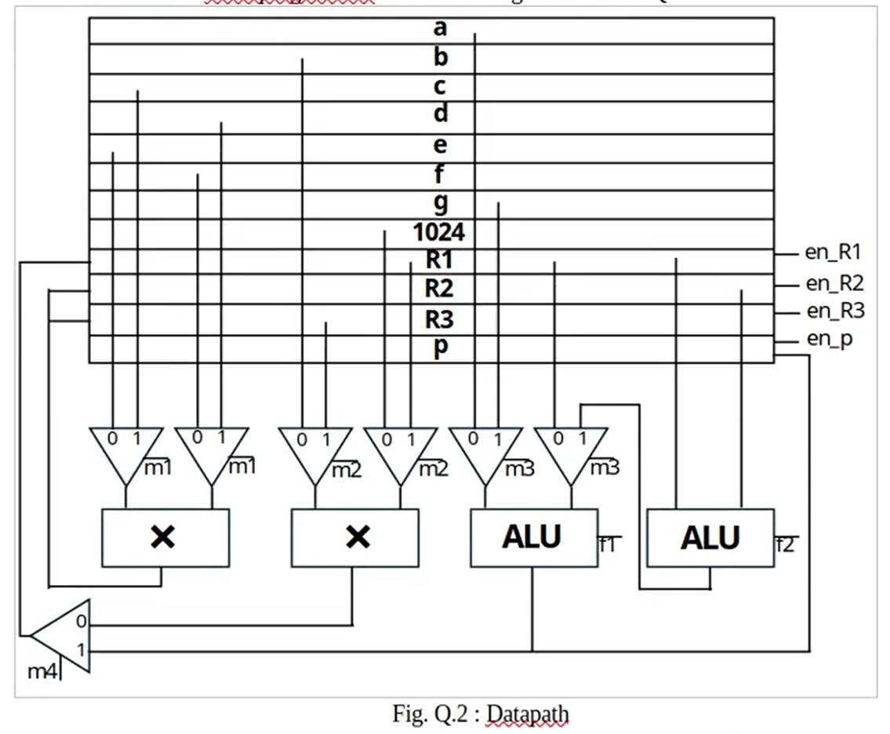

# Revision Problems

## Problems

In the last two lectures, prof. Rajesh guided us to do some very insightful pyp questions, which I think are quite useful for the finals for this sem (AY25/26 Sem2)

### 1. Reverse Engineering the CDFG

**Question:** The datapath of a hardware accelerator is given in Fig. Q.2, and the control store contents of a microprogrammed controller are given in Table Q.2.

<figure><figcaption></figcaption></figure>

| Cycle | m1 | m2 | m3 | m4 | f1        | f2        | en\_R1 | en\_R2 | en\_R3 | en\_p |
| ----- | -- | -- | -- | -- | --------- | --------- | ------ | ------ | ------ | ----- |
| 1     | 0  | 0  | x  | x  | xxx       | xxx       | 0      | 0      | 0      | 0     |
| 2     | 0  | 0  | x  | 0  | xxx       | xxx       | 1      | 1      | 0      | 0     |
| 3     | 1  | x  | 0  | 1  | 000 (add) | xxx       | 1      | 0      | 0      | 0     |
| 4     | 1  | x  | x  | x  | xxx       | xxx       | 0      | 0      | 1      | 0     |
| 5     | x  | 1  | x  | x  | xxx       | xxx       | 0      | 0      | 0      | 0     |
| 6     | x  | 1  | x  | 0  | xxx       | xxx       | 1      | 0      | 0      | 0     |
| 7     | x  | x  | 1  | x  | 000 (add) | 001 (sub) | 0      | 0      | 0      | 1     |
| 8     | x  | x  | x  | x  | xxx       | xxx       | 0      | 0      | 0      | 0     |

The following information regarding the accelerator is given.

* The functional units - multiplier (×) and ALU are available.
* The respective areas are 90 µm² and 20 µm², and the combinational delays are 90 ns and 20 ns, respectively.
* The multiplier can perform only multiplication. The ALU can perform addition, subtraction, reverse subtraction (same as subtraction, but with operands reversed), comparisons ('=' / '>'), and shifts (left / arithmetic right / logical right). Assume suitable 3-bit controls for each of the above ALU operations.
* The circuit is resource-dominated. Nevertheless, where possible, reduce the cost associated with non-functional resources.
* All the inputs and constants (as necessary) are available in registers, and the result `p` must be stored in a register.

**Sub-question a:** Optimize the accelerator systematically such that the new circuit

* has the same functionality and clock frequency as the original circuit,
* uses only one functional unit of each type while minimizing the latency,
* prioritizes reduction in the number and complexity of multiplexers over control logic complexity.

Sketch the new circuit, including datapath and control, clearly detailing all the steps in the design process, as well as a rationale for all your choices. Also, include the control store contents if a microprogrammed control unit is used.

Hint: Recover the CDFG from the datapath and control, and optimize it.

**Sub-question b**:

1. If you are allowed to vary the clock frequency, and the primary figure of merit is throughput rather than cost or latency, how will your design in Q.2(a) above change? Assume that there are a large number of `a[i]`'s, `b[i]`'s,… Provide the schedule and binding information for the new design, including register binding, if any. Datapath and control synthesis are not expected.\
   \
   Alternatively (in case you do not know how to solve the problem in Q.2(a)), you could use the original design in Fig. Q.2 and Table. Q.2 as the starting point.
2. How many multipliers and ALUs are required for this design?
3. What is the throughput (number of input vectors processed per second, where an input vector refers to the vector formed by one value each of `a[i]`, `b[i]`, `c[i]`…`g[i]`)?

**Sub-question c**: What is/are the timing constraints to be used for the designs in Q.2(a) and Q.2(b)? Explain why the timing constraint(s) is/are required.

***

#### Sub-question a

To solve this question, we must follow the following steps systemetically



**Recover the CDFG**

My tip here is that, we should focus on the control-store table and don't care about the scheduling in the CDFG first. So, to draw the CDFG:

1. Identify which operation is done in a certain cycle
2. Construct the node with the register information labelled at the **output edge**.

Following the two steps above, the recovered CDFG will look like as follows:

<figure><figcaption></figcaption></figure>

This can give us the expression that the circuit is trying to achieve:

$$
e\times f-(1024\times b+a)\times c\times d+g
$$


This sign of this expression might be reversed, but it doesn't matter.




**Optimize the recovered CDFG**

Using the optimization techniques we have used a lot in problem set 1 and quiz 1 question 9. We can quickly observe that the expression $$1024\times b$$ can be easily replaced by $$b >>10$$, which we can just denote as `bs` and it is immediately available to us. Thus, the optimized CDFG will look like as follows:

<figure><figcaption></figcaption></figure>


The numbering is a bit unintuitive because I want to match what prof did in the class so that the correctness can be guaranteed.




**Scheduling and Binding**

The next job is to do scheduling and binding. This is the same as what we've practiced previously.

| Cycle | Mult | ALU |
| ----- | ---- | --- |
| 1     | 2    | 1   |
| 2     | 2    | —   |
| 3     | 3    | —   |
| 4     | 3    | —   |
| 5     | 4    | —   |
| 6     | 4    | —   |
| 7     | —    | 5   |
| 8     | —    | 6   |


Chaining is not possible here because chaining the ALUs requires at least 2 ALUs but we are only allowed to have only 1 ALU.




**Register Binding**

After we get the scheduled table, the next step is to do the register binding. And the optimal one I get should look like as follows:

<figure><figcaption></figcaption></figure>



**Datapath Synthesis**

The next step is the classic datapath synthesis, which is shown as follows.

<figure><figcaption></figcaption></figure>



**Control Unit Synthesis**

It suffices to just to do the horizontal microprogrammed control unit synthesis. I will leave it to the interested readers to do this.



#### Sub-qeustion b

This is indeed the design style that I prefer, which is also used in my project — VNN. The idea here is to use the true **pipelining**. So, using the similar convention, the microarchitecture for this pipelined design can be shown as follows.

<figure><figcaption></figcaption></figure>

The latency is obviously 6 clock cycles and the number of multipliers and ALUs needed are both 3. The initiation interval for the pipelined design is 2 because the multiplier takes 2 cycles to complete one calculation! Thus, the throughput is limited by the multiplier's delay, which is $$1\div90\text{ns}$$.

#### Sub-question c

The timing constraints for the two designs above are:

1. Create the clock, which has a clock period of 45ns.
2. Set multicycle path for the multiplier because it needs 2 clock cycles to be done.

### 2. FSM Design

**Question**: A sequence detector has to be designed to detect the pattern `1001` or `1101` in a stream of data. The input data is available one bit at a time through a serial input pin `DIN`. If the new incoming bit results in the completion of the pattern, a 1-bit output signal `DOUT` is asserted asynchronously (immediately, i.e., without waiting for the next system clock edge), and remains asserted until the next edge of the system clock. The value of `DOUT` doesn’t matter (i.e., `DOUT` can be asserted or deasserted) when the pattern is `0111`. The circuit is capable of continuous operation, so if the stream of data is `00100110101...` (the left most bit is the first bit to enter the system), `DOUT` will be asserted immediately after the arrival of the 6th and 9th data bits. You can assume that exactly one bit arrives at `DIN` during a clock period such that the setup and hold times of the flip-flops used in the system are not violated. Using a systematic procedure, find the least number of flipflops required to implement the sequence detector. A complete design is not expected.

***

**Sol**. This is a very classic FSM design question and it tests the knowledge of our digital design skill! The trivial design is to use the idea of a [**shift regsiter**](https://app.gitbook.com/s/jTJFBPtKk6NwweAooH53/textbook/digital-building-blocks/sequential-building-blocks#shift-registers)! And the microarchitecture can be shown as follows:

<figure><figcaption></figcaption></figure>

However, the idea of this problem is to test our skill to formulate it as a state machine. The point of formulating it as a state machine is to try to do the **state minimization** so that we can minimize the number of FFs used in this design and then compare it with the trivial design!

The most important idea here is to formulate the **state**. As the question says, the output `Dout` will change **immediately** after the arrival of the correct 4th bit. This means that the FSM we are going to design is a mealy machine. And, we can use the state bits as the first 3 bits of the number!


**History-based State Formulation**

This kind of state formulation technique we have seen is considered to be the trivial or brute-force state formulation when we design a FSM. It should be enough to tackle the finals but in the real-world design, we might want to see if there exists bette state formulations.


Using this knowledge, we can build our state transition table as follows:

| State | DIN | Next State | DOUT |
| ----- | --- | ---------- | ---- |
| 000   | 0   | 000        | 0    |
| 000   | 1   | 001        | 0    |
| 001   | 0   | 010        | 0    |
| 001   | 1   | 011        | 0    |
| 010   | 0   | 100        | 0    |
| 010   | 1   | 101        | 0    |
| 011   | 0   | 110        | 0    |
| 011   | 1   | 111        | x    |
| 100   | 0   | 000        | 0    |
| 100   | 1   | 001        | 1    |
| 101   | 0   | 010        | 0    |
| 101   | 1   | 011        | 0    |
| 110   | 0   | 100        | 0    |
| 110   | 1   | 101        | 1    |
| 111   | 0   | 110        | 0    |
| 111   | 1   | 111        | 0    |

Now, our job is to do the state minimization we have practiced in the problem set 2. I will omit this and leave it to the interested readers to finish it.


As long as we find out that the number of blocks is bigger than 4, we can stop and state that the trivial solution is better than the FSM solution.


### 3. True or False

**Question**:

1. The preliminary estimates obtained from the dataflow graph is that of best-case performance and worst-case cost.
2. Pipelining increases throughput and reduces the cost of the hardware.
3. A complete array partitioning essentially requires the array to be implemented using registers rather than memory.
4. A Boolean signature match is a necessary and sufficient condition for two functions to have a Boolean match.
5. It is important for FPGA routing algorithms to be delay-aware.

***

**Sol**.

1. **True**. This is exactly what we've seen in the [lecture](https://app.gitbook.com/s/W45nwClYZdzz9MQG1dUb/micheli/hardware-modeling/abstract-models#vertex-attributes-and-estimates)!
2. **False**. Pipelining will increase the hardware as well.
3. **True**.
4. **False.** Boolean match is the same as functional match. If there is no boolean signature match, there is no boolean/functional match. But a boolean signature match doesn't guarantee a boolean/function match.
5. **True**.

### 4. Short Explanation

**Question**:

1. Explain clearly one scenario where `set_max_delay()` constraint should be used, and detail the issue if the constraint is not used in that scenario.
2. Provide scenarios where HLS tool is likely to yield good results, and where it is not, with examples.
3. Give an example of a scenario during physical synthesis where area vs. cycle time trade-off manifests.
4. Assume you are fabricating a large number of microprocessor ICs. Some of the IC chips are found not to meet setup time requirements, and some others are found not to meet hold time requirements. Clearly explain, with reasons, how you will deal with the faulty chips?
5. Give examples for cluster functions and pattern functions which, (i) may match, and (ii) do not match based on the number of unate and binate variables.

***

**Sol**.



**Q1**

This is the same example we've seen in the [lecture notes](../lec/lec-07-timing.md#cdc-issue). Skip it here.



**Q2**

We've also seen this in one of the quizes. HLS is good when the data processed in loops has a data-independent exit conditions because the HLS can do the unrolling, pipelining etc easily.


HLS is good at resource-dominated circuits (like DSPs) but not good at non-resource dominated circuits (like microprocessors)




**Q3**

The word "manifest" as a verb means to show, display, or demonstrate something clearly through actions, signs, or appearance. We've seen this question in our [lecture notes](https://app.gitbook.com/s/W45nwClYZdzz9MQG1dUb/micheli/architectural-synthesis/strategies-for-architectural-optimization) as well, and the example is **retiming**.



**Q4**

This is the **binning** we have seen in both EE4415 and EE4218.

* For the setup time failure, we clocked those cores at a slower clock and sell them as some inferior types, like Core i3, etc.
* For the hold time failure, we cannot do anything except that we can **disable** that core totally.



**Q5**

One example is:

1. Cluster function: $$\bar{a}b+ac$$ , $$a$$ is binate but $$b,c$$ are unate.
2. Pattern function: $$a+bc$$, all of $$a,b,c$$ are unate.

According to the basic knowledge of discrete mathematics, the cluster and pattern function above match but they have different number of unate/binate variable.



### 5. Logic Synthesis

**Question**: How many adders will be inferred by the following Verilog code.


```verilog
module report_adders (
    input  [7:0] a,
    output [7:0] y1,
    output [7:0] y2,
    output [7:0] y3
);

localparam A = 4'd6;
localparam B = 4'd9;

assign y1 = a + (A + B);
assign y2 = a & ((1 << 3) - 1);
assign y3 = a * 2;

endmodule
```


***

**Sol**. The answer is **1**. The reasons are:

1. When we dealing with constant expressions, the computations are done at **compile** time.
2. The literal `(1<<3)-1` will also be computed at the compile time.

### 6. Vitis HLS

**Question**: The Initiation Interval for the following code is how many?


```cpp
#define N 2048

void sum_halves(int a[N], int out[1024]) {
#pragma HLS INTERFACE bram port=a
#pragma HLS INTERFACE bram port=out
//#pragma HLS ARRAY_PARTITION variable=a ? factor=?

    for (int i = 0; i < 1024; i++) {
#pragma HLS PIPELINE
        out[i] = (a[i] + a[i + 1024]) / 2;
        //out[i] = (a[i] + a[i + 512] + a[i + 1024]) / 3;
    }
}
```


Now, if we uncomment Line 11, how will II change? To get II=1, how are we going to partition the array?

***

**Sol**. For the code snippet, the II is 1. It is because the vitis will automatically enable the **true dual port** block rams.


The true dual port for two read memory accesses can only be done in BRAM/URAM, the LUTRAM doesn't support the true dual port feature!


<details>

<summary>What if we implement the array <code>a</code> using LUTRAM?</summary>

The code snippet will be changed to as follows:


```cpp
#define N 2048

void test(int a[N], int out[1024]) {
#pragma HLS INTERFACE ap_memory port=a
#pragma HLS INTERFACE ap_memory port=out

// Only specify the implementation (LUTRAM), let HLS figure out the ports needed
#pragma HLS BIND_STORAGE variable=a impl=lutram

    for (int i = 0; i < 1024; i++) {
#pragma HLS PIPELINE
        // HLS will synthesize a Dual-Port LUTRAM here (II=1)
        out[i] = (a[i] + a[i + 1024]) / 2; 
        
        // Test this later: HLS will synthesize a Quad-Port LUTRAM here (II=1)
        // out[i] = (a[i] + a[i + 512] + a[i + 1024]) / 3; 
    }
}
```


Based on my testing,

1. Line 13 will give out the II to be 1.
2. Line 16 will give out the II to be 2.

The conclusion is that, as the array `a` is not written in the code, the HLS tool optimizes it to use 2 ports for reading. Thus, the II for Line 13 is 2. Same will apply for Line 16. If we add some write to array `a`, the II will immediately become 2! Below is the code snippet I use to test this!


```cpp
#define N 2048

void sum_halves(int a[N], int out[1024]) {
#pragma HLS INTERFACE ap_memory port=a
#pragma HLS INTERFACE ap_memory port=out

// Bind 'a' to LUTRAM. 
// Physically limits us to a maximum of ONE write per clock cycle.
#pragma HLS BIND_STORAGE variable=a impl=lutram

    for (int i = 0; i < 1024; i++) {
#pragma HLS PIPELINE
        
        // 2 Reads (This is fine, LUTRAM can do multiple reads)
        int temp = (a[i] + a[i + 1024]) / 2; 
        out[i] = temp;
        
        // Attempt 2 Writes to array 'a'. 
        // LUTRAM physically cannot do this in one cycle.
        // This forces the compiler to stretch the loop over 2 cycles -> II=2.
        a[i] = temp;
        a[i + 1024] = temp + 1; 
    }
}
```


</details>

<details>

<summary>What if we use the AMD recommendation to read BRAM at the third cycle?</summary>

If our design of VNN, we use the AMD recommendation to read the data from BRAM at the third cycle, providing us with a true high-performance AI accelerator design. In this case, the II is still 1, not 3!

</details>

If we uncomment line 11, II will become 2. Now the II is bottlenecked by the memory. To fix this, we need to use **array partitioning**. The possible partitioning we can do is:

1. Complete partitioning.
2. Cyclical partitioning by a factor of 3. This utilizes the fact that $$0\bmod 3=0, 512\bmod3=2,1024\bmod3=1$$.
3. Block partitioning by a factor of 2. Split into two block RAMs, at any point of time, two memory accesses per block is okay.

<details>

<summary>II is bottlenecked by what?</summary>

In the previous [question](revision-problems.md#sub-qeustion-b), we've seen that II can be bottlenecked by the multicycle operator like the multiplier in the pipelined design. Besides that, II can also be bottlenecked by the **memory access**.

If we only have one BRAM and we want to read more than 2 values, we need to use more than 1 cycles to do that. Thus, II will be affected by the memory access!


The manifests the **memory wall** bottleneck in the AI accelerator design!


</details>
