# Lec 4 - Layout & Parasitics

## Layout

In this section, we will introduce two layout techniques for logic gates:

1. Standard cell approach
2. Macro Cell

Then we will see how the layout can be represented by a stick diagram and how we can use our discrete maths knowledge: consistent euler path to minimize the area in a certain layout.

### Standard Cell

The standard cell approach is basically to put the standard cells (logic gates) with **same height** but varying width on a blanket. In this approach, the basic unit is the **standard cell**. One example can be shown below.

<figure>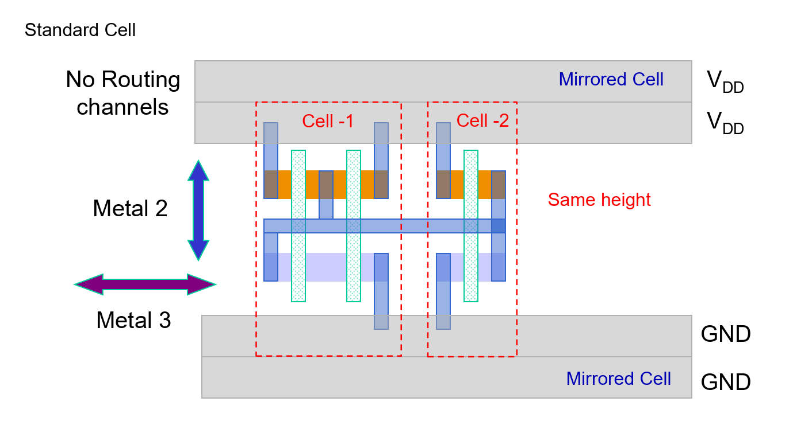<figcaption></figcaption></figure>

Intuitively, we can think of laying as the **breadboard** we've used in EPP1. We have two $$V_{\text{DD}}$$ rows and two $$\text{GND}$$ rows. In between these rows is the region where we put our logic, in this case, the standard cells.


**Mirrored Cell**

The mirrored cells in the top and bottom rows are flipped vertically to share the N-well


For example, the following image is the top-down layout for a static CMOS inverter.

<figure><figcaption></figcaption></figure>

The context is used to allow the **metal** to be connected.

Macro Cell Design

In the macro cell design approach, we use the macro cells, which are also known as the IPs, as the unit.

### Stick Diagram

As the CMOS diagram might be a bit too complex, we have the so-called **stick diagrams** to make our life easier. Stick diagrams are nothing but a simplifed layout diagram with the most important information captured. Stick diagrams contain no dimensions and represent relative positions of transistors.

<figure>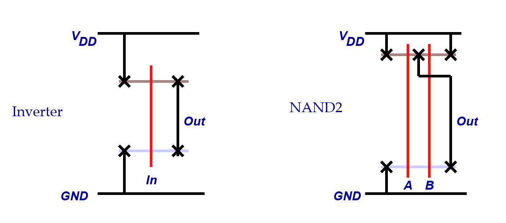<figcaption></figcaption></figure>

#### Stick Layout

Similarly, as the real layout is quite complex, we usually draw the **stick layout** to make our life simpler. The steps to draw a stick layout are as follows:

1. Make sure you have or draw the static CMOS circuit with the labeling of transistors, like A, B, C, D, etc.
2. Draw the long vertical line to represent the gates and label them as A, B, C, D, etc, exactly match with the number of labelled transistors in the first step.
3. Draw the transistor diffusion stripes (the horizontal N-type and P-type stripes).
4. Draw the $$V_{\text{DD}}$$ and $$\text{GND}$$
5. Draw the wirings **according** to the circuits
   1. Whichever transistor is connected to $$V_{\text{DD}}$$ should be connected to $$V_{\text{DD}}$$ in the layout, same for $$\text{GND}$$ and the output.
   2. If two transistors are in **parallel**, short-circuit them.

For example,

<figure><figcaption></figcaption></figure>

The first red dashed circle is to denote that transistor A and B are short circuit but are not connected with the metal coming from the $$V_{\text{DD}}$$ to PMOS A and C.

#### Logic Graph

To graphically show the transistor location, we can use the **undirected** logic graph which utilises the following definitions:

1. The **nodes/vertices** in the graph is either $$V_{\text{DD}}$$, $$\text{GND}$$, output, or the intermediate point between the **serial connection** transistors.
2. The **edges** represent the transistors in between the nodes.

For example, with the same static CMOS diagram, its logic graph is shown below.

<figure>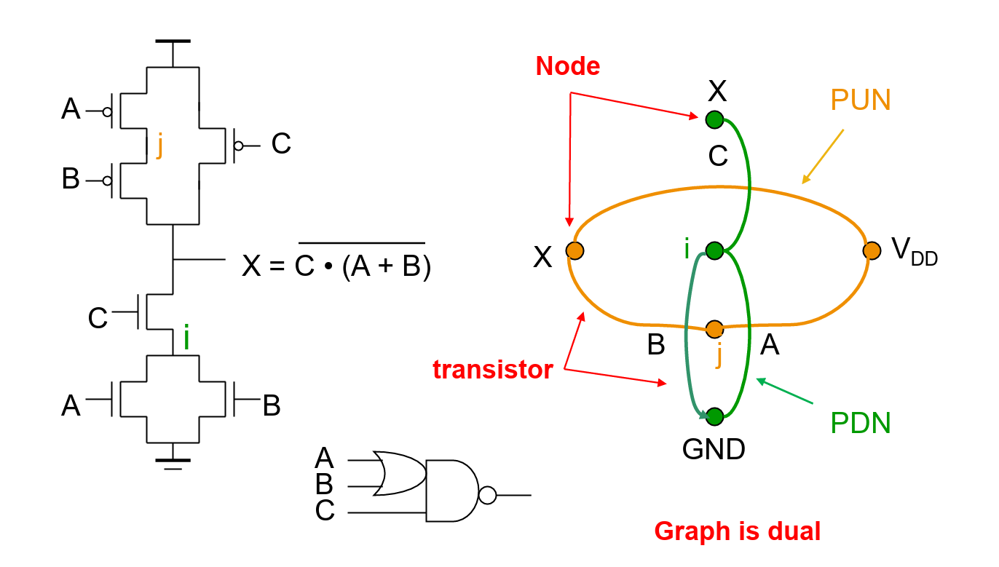<figcaption></figcaption></figure>

### Euler Path

Actually, the example we've seen [above](lec-4-layout-and-parasitics.md#stick-layout) is not optimal, we can further reduce the metal used by changing the order of the **input gate** so tha we can have uninterrupted diffusion strips and thus having less area used.

<figure><figcaption></figcaption></figure>

To achive this **uninterrupted diffusion stripe**, we need to use the concept of Euler path with the help of the [#logic-graph](lec-4-layout-and-parasitics.md#logic-graph "mention") we've seen above.

> A **Euler path** is a path that passes through all nodes in the graph such that each **edge** is visited **once** and **only once**.

An uninterrupted diffusion strip is possible only if there exists a **consistant** Euler path.

Consistent Euler Path

More specifically, the Euler paths in the PUN and PDN must be **consistent**, which means sharing the **same ordering**.

<figure>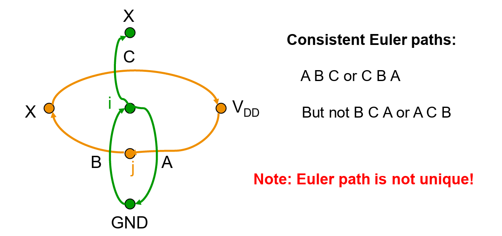<figcaption></figcaption></figure>

The Euler path will determine how we order the input gates. For example,

<figure>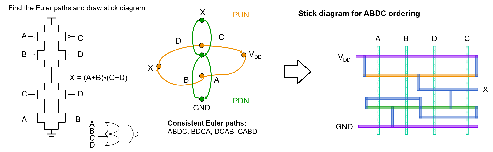<figcaption></figcaption></figure>


The [logic2stick](https://logic2stick.vercel.app/) website is very useful and can help you with Q2 in HW2!


## Parasitics

In this part, we will look where the load capacitances come from, basically we will talk about the following two parts:

* MOS Capacitance
* The interconnect (wiring)

### MOS Capacitance

Usually, the intrinsic capacitance from the MOS transistor comes from the following three parts:

1. Structure capacitances (overlap capacitance)
2. Channel capacitances
3. Depletion Region capacitances of the reverse-biased pn-junctions of the drain and source. Also called diffusion capacitances.

After that, we will see how these three capacitances are put together to give us the MOS capacitance model as well as the parasitic capacitances in CMOS inverter.

#### MOS Structure Capacitance

If we see from the top-down view of our CMOS gate, we will see the diagram below

<figure>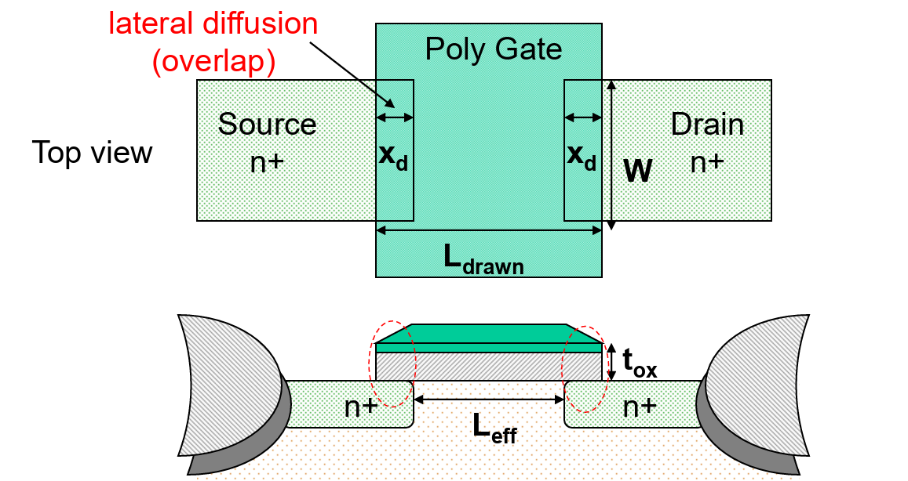<figcaption></figcaption></figure>

There is some overlapped region between tthe gate and two doped active regions and this is where the MOS structure capacitances come from. This overlap capacitance is denoted as $$C_{\text{GSO}}/C_{\text{GDO}}$$ and it can be calculated by

$$
C_{\text{GSO}}=C_{\text{GDO}}=C_{\text{OX}}\cdot x_d\cdot W
$$

The term $$x_d$$ is the length of the overlapped region as shown above and it is dependent on the **process** used to make that CMOS gate. Thus, sometimes we can treat $$x_d$$ as 1 and get the **overlap capacitance per channel width**.

$$
C_{\text{GSO}}=C_{\text{GDO}}=C_{\text{OX}}\cdot W
$$

#### MOS Channel Capacitance

<figure>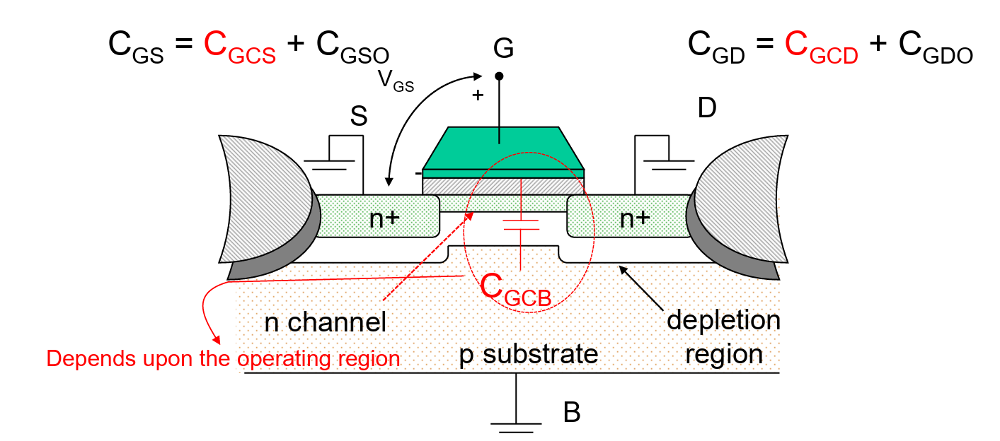<figcaption></figcaption></figure>

In the diagram above, we can see four types of capacitances:

1. $$C_{\text{GCS}}$$: Gate-to-channel capacitance on the **source** side
2. $$C_{\text{GCD}}$$: Gate-to-channel capacitance on the **drain** side
3. $$C_{\text{GCB}}$$: Gate-to-substrate capacitance. It depends upon the operating region and the terminal voltages.
4. $$C_{\text{GSO}}$$ and $$C_{\text{GDO}}$$ are the overlap capacitances.

The total gate-to-channel capacitance $$C_{\text{GC}}$$ is

$$
C_{\text{GC}}=C_{\text{GCS}}+C_{\text{GCD}}+C_{\text{GCB}}
$$

Average Distribution of Channel Capacitance

This information is very useful and can be shown in the following table:

<figure>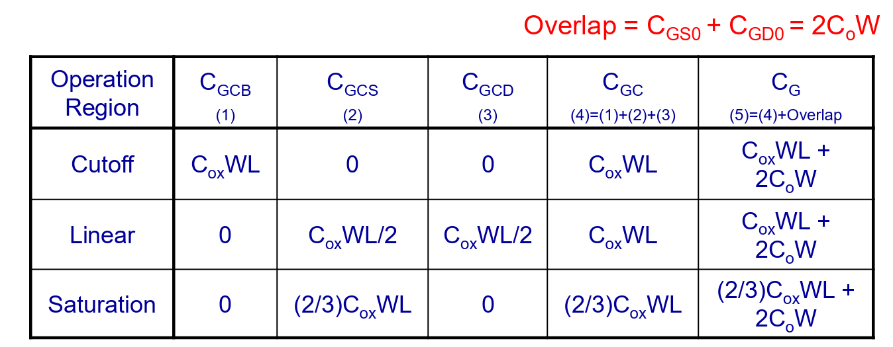<figcaption></figcaption></figure>

* $$C_{\text{GC}}$$: Gate-to-channel capacitance
* $$C_{\text{G}}$$: Total gate capacitance ($$C_{\text{GC}}$$ + Overlap capacitances)

An interesting fact is that the $$C_{\text{GC}}$$ is same in the cutoff and linear region, but becomes a little bit smaller when operating in the saturation region. This is because of the pinch-off effect/[channel length modulation](lec-1-mosfet-and-cmos-process.md#channel-length-modulation) and this will make the inversion layer non-linear.

#### MOS Diffusion Capacitances

This junction or diffusion capacitance comes from the reverse-biased source-body and drain-body pn-junctions.

<figure>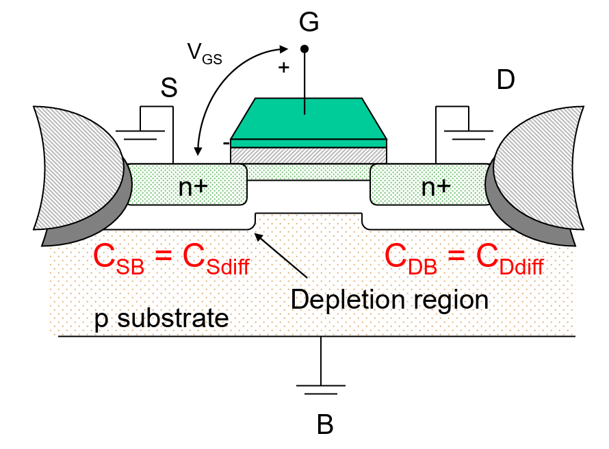<figcaption></figcaption></figure>

#### MOS Capacitance Model

To incorporate all the three types of capacitances we have mentioned above, we will see the MOS capacitance model shown as follows:

<figure>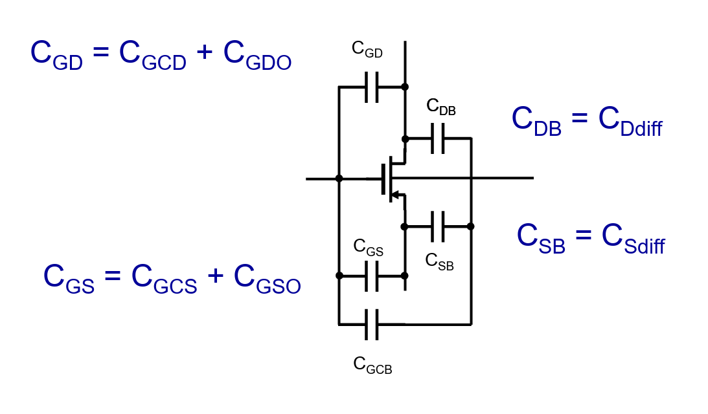<figcaption></figcaption></figure>

And to put it together in the the CMOS inverter we've seen, these capacitances are shown as below.

<figure>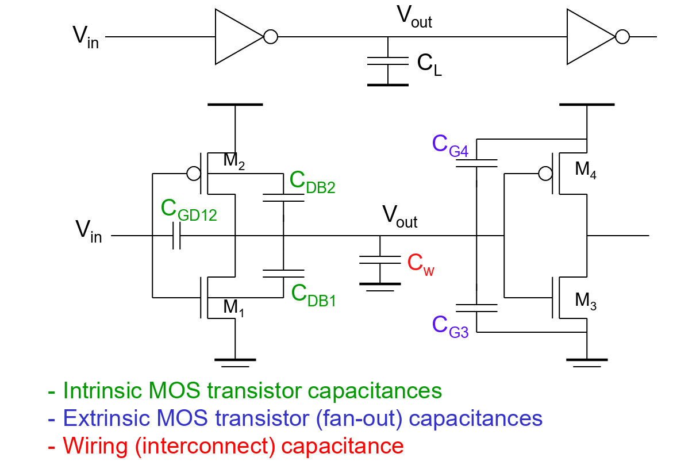<figcaption></figcaption></figure>

### Wire

The wire in the schematic is quite different from the real physical wires in the circuit.

<figure>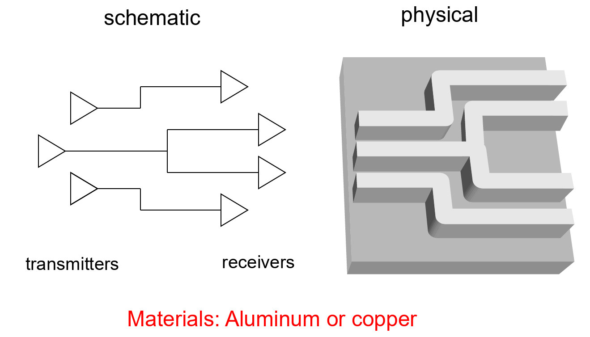<figcaption></figcaption></figure>

And the wire with parasitics will look like below

<figure>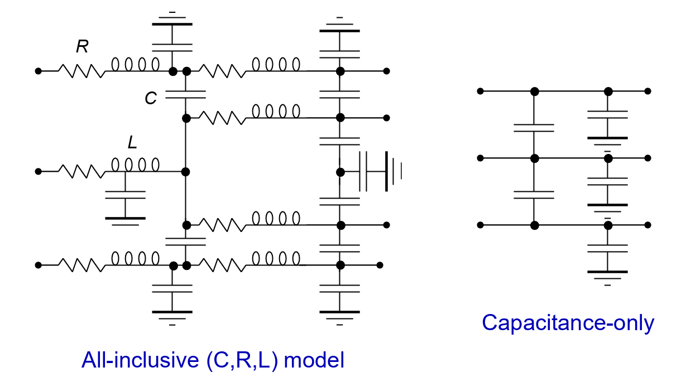<figcaption></figcaption></figure>

However, depending on the use cases, we can sometimes simplify the wire model

1. Inductive effects can be ignored if
   1. the resistance of the wire is substantially large enough
   2. the rise and fall times of the applied signals are not extremely fast
2. A capacitance-only model can be used when
   1. the wire is short, or the cross-section is large, or the interconnect material has low resistivity
3. Inter-wire capacitance can be ignored when
   1. the separation between neighboring wires is large, or when the wires run together for only a short distance. In this case, all the parasitic capacitance are between the interconnect and ground.
