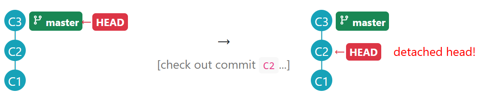

# Week 3

## Important Points



**Object-Oriented Basics**

1. **Every object** has both **state** (data) and **behavior** (operations on data)**.**
2. Objects usually match nouns in the description.



**Naming Convention**

Use **nouns for classes/variables** and **verbs for methods/functions**.



**Git Check out**

**When you check out a commit, Git:**

1. **Updates your working directory to match the snapshot in that commit**, overwriting current files as needed.
2. **Moves the** `HEAD` **ref to that commit**, marking it as the current state you’re viewing.

<figure><figcaption></figcaption></figure>



## Classic Questions



**Object-Oriented Property**

> OO is a higher level mechanism than the procedural paradigm.

This is **true**.



**Encapsulation vs. Abstraction**

1. An object is an **encapsulation** because it packages data and behavior into one bundle.
2. An object is an **abstraction** because it lets us think in terms of higher level concepts such as Students rather than student-related functions and data separately.



**API**

> **An&#x20;**_**Application Programming Interface (API)**_**&#x20;specifies the interface through which other programs can interact with a software component.** It is a contract between the component and its clients.

&#x20;For  example, a class has an API (e.g., [API of the Java `String` class](https://docs.oracle.com/javase/9/docs/api/java/lang/String.html), [API of the Python `str` class](https://docs.python.org/3/library/stdtypes.html#text-sequence-type-str)) which is a collection of public methods that you can invoke to make use of the class.

***

Choose the correct statements.

* [x] &#x20;a. A software component can have an API.
* [ ] &#x20;b. Any method of a class is part of its API.
* [x] &#x20;c. Private methods of a class are not part of its API.
* [x] &#x20;d. The API forms the contract between the component developer and the component user.
* [x] &#x20;e. Sequence diagrams can be used to show how components interact with each other via APIs.


Private methods **cannot** be a part of the API.



